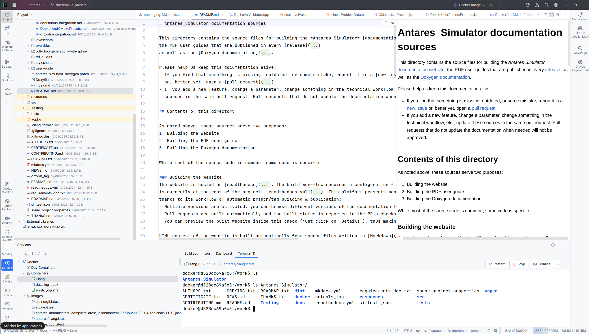
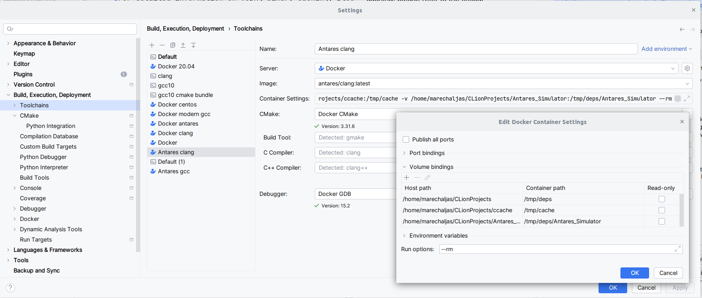

# Docker and CMake Presets in Antares Simulator

This page explains how to use Docker to build the project and how to use CMake Presets to simplify build configuration.
It covers command line usage and integration with the CLion IDE.

## 1. Introduction

This guide helps you set up a reproducible and efficient development environment for Antares Simulator using Docker and
CMake Presets.

---

## 2. Docker: Quick Start

### 2.1. Build the Docker image (example: clang)

From the project root:

```sh
cd docker/clang
docker build -t antares/clang:latest .
```

### 2.2. Start a container and follow the developer guide as usual

```sh
docker run -it antares/clang:latest bash
```

**Drawbacks:**

- You need to download the source and dependencies inside the container.
- You lose your work when exiting the container (unless you commit the container or copy files out).

### 2.3. Mount a volume to use local source code and dependencies

To work with your local (host) source code and dependencies, mount them as volumes. This way, changes made in your IDE
are immediately visible in the container.

**Example:**

```sh
sudo docker run -it \
  -v "$PWD:/work/Antares_Simulator" \
  -v /path/to/ortools:/work/ortools \
  antares/clang:latest bash
```

- Replace `/path/to/ortools` with the path to your local ortools directory.
- Now, `/work/Antares_Simulator` and `/work/ortools` in the container point to your host files.
- You can configure and build as always just point CMAKE_PREFIX_PATH to `/work/ortools`.

**Local** = on your host (your computer).  
**Remote** = inside the Docker container.

### 2.4. Drawbacks and advantages

- **Advantage:** You keep your work and dependencies persistent, and can use your favorite editor on the host.
- **Drawback:** File permissions and line endings may differ between host and container.

---

## 3. Using Docker Service with CLion

- See the [official JetBrains documentation](https://www.jetbrains.com/help/clion/docker.html).
- Start the Docker service.
- In CLion, configure a Docker toolchain and set up a container with the correct mount points.
- Start the container from CLion or manually, and work in the container terminal while editing files in the IDE.
- See the illustration below:



## 3.1. Setting up a Docker Toolchain in CLion (with Presets and Caching)

To fully integrate building Antares Simulator in the IDE using Docker, you can set up a Docker toolchain in CLion. This
allows you to configure, build, and run your project inside a Docker container directly from the IDE, leveraging CMake
presets and build caching.

### Step 1: Create a Docker Toolchain

Follow the official JetBrains
documentation: [Create a Docker toolchain](https://www.jetbrains.com/help/clion/clion-toolchains-in-docker.html#create-docker-toolchain)

- Go to **File > Settings > Build, Execution, Deployment > Toolchains**.
- Click the **+** button and select **Docker**.
- Choose the Docker image you want to use (e.g., `antares/clang:latest`).
- Set up the CMake, C, and C++ compilers as detected in the container.
- Set the Make/Ninja executable if needed.



### Step 2: Set Up Mounting Points

To persist build output and caches across container runs, configure volume mounts:

- Mount your project source directory (e.g., `/work/Antares_Simulator`).
- Mount a directory for build output (e.g., `/tmp/build`).
- Mount a directory for ccache and vcpkg cache (e.g., `/tmp/deps`).

In the Docker toolchain settings, add these as **Bind mounts**. Example:

- Host: `/path/to/Antares_Simulator` → Container: `/work/Antares_Simulator`
- Host: `/path/to/_build` → Container: `/tmp/build`
- Host: `/path/to/ccache` → Container: `/tmp/deps/ccache`
- Host: `/path/to/vcpkg_cache` → Container: `/tmp/deps/vcpkg_cache`

This ensures that your build artifacts and caches are preserved between sessions and container restarts.

### Step 3: Use CMake Presets

- In CLion, go to **File > Settings > Build, Execution, Deployment > CMake**.
- Select the desired CMake preset (e.g., `default` or `with_ccache`).
- Make sure the `sourceDir` and `buildDir` in the preset match the mount points in your Docker toolchain.

With this setup, you can configure, build, and run Antares Simulator entirely within CLion, using Docker for a
reproducible environment and leveraging build caching for fast iteration.

---


> **Note:** CLion requires the build directory to be inside the source folder. While it is cleaner to keep build output
> outside (e.g., `/tmp/build`), you must ensure the build directory is within the source tree for full IDE integration.

---

## 4. CMake Presets

CMake Presets are a convenient way to save and share configuration and build parameters for CMake. They are especially
useful in command line workflows to avoid repeating options, and to centralize default parameters across developers. For
more information, see the [official documentation](https://cmake.org/cmake/help/latest/manual/cmake-presets.7.html).

- The default presets are available in `CMakePresets.json` (versioned, shared).
- Custom presets should be placed in `CMakeUserPresets.json` (not versioned, user-specific). Example configurations are
  provided in `CMakeUserPresetsExample.json`.

Presets allow you to quickly configure and build the project with consistent options. In CLion, presets substitute for
manually filling the CMake options and build options in the CMake Settings window.

Presets are useful in CLI to save the parameters of the configure and build commands, and to centralize default
parameters across developers. They also allow you to easily switch between different build configurations or
environments.

### 4.1. Simple command line usage

The project provides `CMakePresets.json` and `CMakeUserPresets.json` in the `src/` folder. To configure the project with
a preset:

```sh
cmake --preset=default
```

To list available presets:

```sh
cmake --list-presets
```

### 4.2. Using CMake Presets in CLion

- Open the project in CLion.
- Go to _File > Settings > Build, Execution, Deployment > CMake_.
- Select the desired preset.
- See the [CLion CMake Presets documentation](https://www.jetbrains.com/help/clion/cmake-presets.html) for more details.

### 4.3. Presets and docker

When using Docker, ensure that paths in the presets match the container's filesystem. For example, if your source code
is mounted at `/work/Antares_Simulator`, update the `sourceDir` in your preset accordingly.

---

## 5. VCPKG

For information on installing and using vcpkg with Antares Simulator, please refer to:

- [Dependencies install](2-Dependencies-install.md)
- [Build instructions](3-Build.md)

---

## 6. Build Output Caching

To speed up rebuilds and avoid unnecessary recompilation, you can use two complementary strategies:

### 6.1. Persisting Build Output with Docker Volumes

By mounting a host directory as a volume in your Docker container, you can persist build artifacts (such as the CMake
build directory, ccache, and vcpkg cache) across different container lifetimes. This avoids losing build output when the
container is removed.

**Example:**

```sh
docker run -it \
  -v "$PWD:/work/Antares_Simulator" \
  -v "$PWD/_build":/tmp/build \
  antares/clang:latest bash
```

```sh
cmake --preset=default --build-dir=/tmp/build
```

### 6.2. Using ccache

`ccache` is a compiler cache that stores previously compiled object files to speed up subsequent builds.

- Set the following varible at configure time or in a preset to use `ccache`:
    - Variable: `CMAKE_CXX_COMPILER_LAUNCHER=ccache`
    - Cache directory: `CCACHE_DIR=/tmp/deps/ccache`
- Make sure the cache directory is persistent (see above) to benefit from caching across container runs.

```sh
docker run -it \
  -v "$PWD:/work/Antares_Simulator" \
  -v "$PWD/_build":/tmp/build \
  -v "path/to/a/folder/ccache":/tmp/deps/ccache \
  antares/clang:latest bash
```

```sh
export CCACHE_DIR=/tmp/deps/ccache
cmake --preset=with_ccache --build-dir=/tmp/build
```

### 6.3. vcpkg caching

For detailed information on vcpkg binary caching, please refer to the official documentation:

- [Binary Caching (Local)](https://learn.microsoft.com/en-us/vcpkg/consume/binary-caching-local?pivots=shell-bash)
- [Common vcpkg command options](https://learn.microsoft.com/en-us/vcpkg/commands/common-options)

In this project, vcpkg binaries are typically stored in `/tmp/deps/vcpkg_cache/binary-cache` and caching is configured
via the `VCPKG_BINARY_SOURCES` and `VCPKG_INSTALL_OPTIONS` environment variables in your CMake presets or Docker
environment. This allows reuse of binaries and avoids unnecessary recompilations. See the links above for advanced usage
and troubleshooting.

See example presets in `CMakeUserPresetsExample.json`.

---

## 7. Combining Docker Toolchains in CLion with CMakePresets for Seamless IDE Builds

CLion allows you to fully integrate Docker toolchains with CMakePresets, enabling you to configure and build your
project directly inside the IDE, without relying on command line workflows. This approach ensures reproducibility,
leverages build caching, and keeps your development environment isolated.

### Example: Docker Toolchain in CLion


### How CMakeUserPresetsExample.json is Used

The `configurePresets` section in `CMakeUserPresetsExample.json` sets up environment variables and cache paths to
optimize builds inside Docker:

- **ortools** and **sirius** dependencies are mounted in `/tmp/deps/` and referenced via `CMAKE_PREFIX_PATH`.
- **ccache** is stored in `/tmp/deps/ccache` and enabled with `CMAKE_CXX_COMPILER_LAUNCHER=ccache` and `CCACHE_DIR`.
- **vcpkg** cache is stored in `/tmp/deps/vcpkg_cache/` and configured with `VCPKG_BINARY_SOURCES` and
  `VCPKG_INSTALL_OPTIONS`.

Example from the preset:

```json
"environment": {
"VCPKG_ROOT": "../vcpkg",
"VCPKG_BINARY_SOURCES": "clear;files,/tmp/deps/vcpkg_cache/binary-cache,readwrite",
"CCACHE_DIR": "/tmp/deps/ccache",
"VCPKG_INSTALL_OPTIONS": "--x-buildtrees-root=/tmp/deps/vcpkg_cache/buildtrees;--x-packages-root=/tmp/deps/vcpkg_cache/packages"
},
"cacheVariables": {
"CMAKE_PREFIX_PATH": "/tmp/deps/ortools_9.13-rte1.1_cxx_ubuntu-22.04_static_sirius;/tmp/deps/sirius",
"CMAKE_CXX_COMPILER_LAUNCHER": "ccache"
}
```

These paths must be mounted as Docker volumes in your toolchain configuration to persist build output and caches across
sessions.

### CLion Limitation

> **Note:** CLion has a technical limitation that requires the build directory to be inside the source folder. While it
> is cleaner to keep build output outside (e.g., `/tmp/build`), you must ensure the build directory is within the source
> tree for full IDE integration.

---

## 8. Tips and Best Practices

- Modify or add your own presets in `CMakeUserPresets.json` (not versioned).
- For reproducible builds, use the shared presets in `CMakePresets.json`.
- Ensure cache paths are persistent if you use Docker.

For any questions or issues, consult the official documentation or contact the project maintainers.
