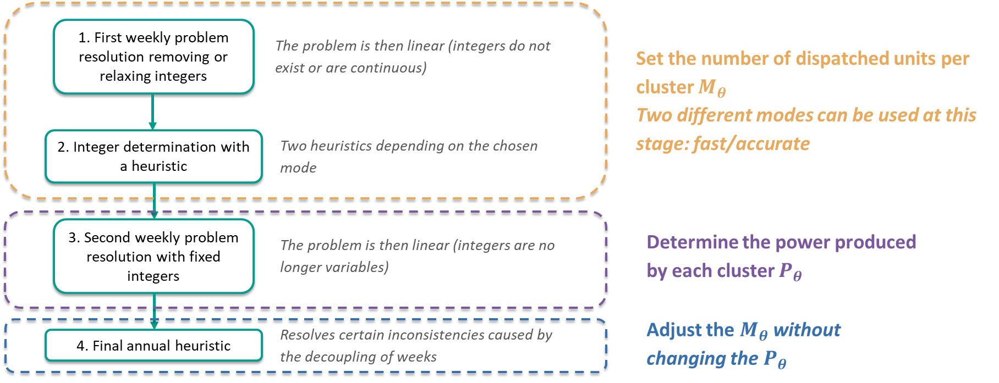
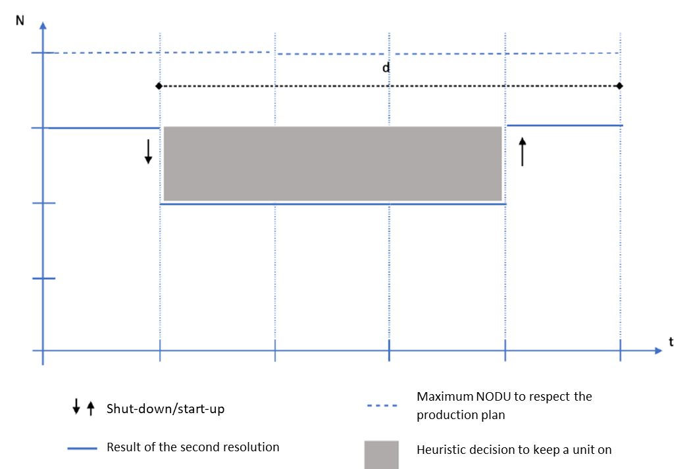

# Description of the thermal heuristic

## Introduction

By default, Antares-Simulator performs a linear resolution of the adequacy problem. This involves a special treatment of the integer variables, which are the number of dispatched units (NODU) for each thermal cluster.

The purpose of this section is to describe the heuristic treatment of these integer variables in order to allow the linearisation of the weekly optimisation problem.

Please note that this content is only relevant in case the user chooses a linear resolution of the Antares problem. If the MILP resolution of the adequacy problem is chosen by the user, no heuristic is applied, the problem is solved directly considering integer variables. 

## General presentation of the resolution steps

The linearised resolution of the weekly adequacy problem[^1] is summarized in the diagram below:

The general principle of the linear resolution is that two iterations of the weekly optimisation problem will be solved:
- A first resolution in which integer variables are either linearised, or completely removed, depending on the "unit commitment mode" chosen (step 1).
- A second resolution in which the NODU per cluster is fixed, and only the production level of each thermal cluster is set (step 3).

Between these two steps, a heuristic is used to fix the values of the integer variables which will be used in the second resolution (step 2).

Finally, a final annual heuristic is applied on the NODUs of the whole year to resolve potential inconsistencies caused by the decoupling of weeks. Economic variables (e.g. OV. COST and OP. COST) are also computed at that stage.

The way steps 1 and 2 are performed depends on a parameter set by the user in the "Advanced parameters" section, which is the "unit-commitment mode". This parameter can take three values:

- The "fast" unit-commitment mode uses simplified methods to accelerate the weekly problem solving, while providing a consistent approximated solution.
- The "accurate" unit-commitment mode embeds a more complex approach, which provides solutions which are closer to the optimum, at the cost of longer calculation times.
- The "MILP" commitment mode involves an exact weekly resolution of the weekly problems, at the expense of longer and more variables computation times. If the MILP resolution of the adequacy problem is chosen by the user, no heuristic is applied, the problem is solved directly considering integer variables. This section is therefore not applicable for the MILP mode.

**IMPORTANT:** As explained in the following parts of this section, the fast mode implies that startup and fixed costs are not considered in the optimisation problem. It should then be discarded in studies involving significant thermal clusters startup and fixed costs. Additionally, the fast mode implies that minimum on and off durations are approximated to be of the same duration (the maximum of the two).

## First resolution, integer-determination heuristic, and second resolution (steps 1, 2, 3)

### Fast mode
#### Step 1: first problem resolution
The general idea of the fast mode is to completely remove the constraints and costs involving integers (the \\(M_\theta\\), \\(M_\theta^+\\) and \\(M_\theta^-\\) variables) in step 1. This means that the first resolution of the weekly problem does not consider constraints (17) to (23) in the [optimisation problem formulation](01-modeling.md). Constraint (16) related to the minimum/maximum output of the thermal cluster is kept. In addition, costs related to integer variables (start-up and hourly fixed costs) are not included in the objective function.

The first resolution of the problem is then run, and provides hourly power outputs for each thermal cluster \\(P_{\theta,t}^{optim1}\\). At each hour, an initial value of the NODU of each cluster in then calculated: \\(M_\{\theta, t}^{guide} = ceil(\frac{P_{\theta,t}^{optim1}}{\overline{P_{\theta}}})\\).

#### Step 2: fast mode heuristic
In step 2, for each cluster, a parameter \\(\Delta_{adjust,\theta} = max(\Delta_\theta^+, \Delta_\theta^-)\\) is then calculated, which is the maximum of the minimum on and off durations. Hence, they are approximated to be of the same duration. For each week and each thermal cluster, the week is then divided in intervals of length \\(\Delta_{adjust,\theta}\\). The week is supposed to be cyclic (hour 1 is the timestep followin hour 168), just like in the weekly optimization problem solved by Antares. Within each interval, the NODU of the cluster is increased to the maximum value of \\(M_\{\theta, t}^{guide}\\) during this period. This process is run several time by shifting the intervals timestep by timestep until all the possible week splits have been performed. Finally, the solution which minimizes the number of adjustments of the NODU is used as the solution of step 2 \\(M_{\theta,t}^{heuristic}\\).

<em>Illustration of step 2 of the fast mode, with $\Delta_{adjust,\theta}$ equal to 2. Here, both solutions are acceptable as they involve 3 NODU adjustments.</em>

#### Step 3: second resolution
Finally, the result of the heuristic \\(M_{\theta,t}^{heuristic}\\) is converted into a lower bound of the power output of each thermal cluster in step 3: \\(P_{\theta,t}^{min}=\underline{P_\theta}*M_{\theta,t}^{heuristic}\\). The second resolution of the problem is then run considering this lower bound, and still excluding integer variables and constraints (17) to (23) of the [optimisation problem formulation](01-modeling.md). In particular, this means that startup and fixed costs are not considered in the formulation of the optimisation problem in any of the two resolutions. However, they are added ex-post and visible in the output variables.

### Accurate mode

#### Step 1: first problem resolution
The accurate mode aims at taking into account integer variables in both resolutions of the optimisation problem (steps 1 and 3), but considering them as continuous variables in step 1, and fixing them as parameters in step 3. Contrary to the fast mode, constraints (17) to (23) of the [optimisation problem formulation](01-modeling.md) are taken into account in both resolutions, as well as the start-up and fixed costs in the objective function, but the integer variables \\(M_\theta\\) are considered continuous.

The first resolution of the problem is then run. As an output, the integer NODU for each thermal cluster is calculed by rounding up the continuous NODUs which are the output of this resolution: \\(M_{\theta,t}^{guide}=ceil(M_{\theta,t}^{optim1})\\). The variables counting the number of units being started-up or shut-down at any time step \\(M_{\theta,t}^{+}\\) and \\(M_{\theta,t}^{-}\\) are also calculated at that stage.

#### Step 2: accurate mode heuristic
Step 2 of the accurate mode starts by checking for each cluster and for each week whether any constraint of minimum time up or down (constraints (22) and (23) of the [weekly optimisation problem](01-modeling.md)) is violated. If no constraint is violated for a given thermal cluster at a given week, no further action is performed and the output variable of this step \\(M_{\theta,t}^{heuristic}=M_{\theta,t}^{guide}\\).

For a given cluster and a given week, if any of these constraints is violated, a small optimisation problem is run, which aims at minimizing the changes to the NODU of the cluster while respecting constraints (22) and (23). The output of this optimisation problem is then \\(M_{\theta,t}^{heuristic}\\).

#### Step 3: second resolution
Finally, the output of step 2 \\(M_{\theta,t}^{heuristic}\\) is converted into a lower bound of the NODU of each thermal cluster for the second resolution: \\(M_{\theta,t} \geq M_{\theta,t}^{heuristic}\\). The second resolution of the problem is then run considering this lower bound, and still including integer variables (as continuous variables) and constraints (17) to (23) of the [optimisation problem formulation](01-modeling.md), and start-up and fixed costs in the objective function.

## Annual smoothing heuristic (step 4)

As a final step of the resolution of a Monte-Carlo year, an annual smoothing heuristic is run on the whole year. It addresses two situations:
- Non-optimal stops/starts around week changes
- Failure to take account of fixed and start-up costs in fast mode.

The general principle of this heuristic is that while respecting the production plan determined at the end of the second resolution and the minimum power output of each unit, we calculate a minimum duration below which it is more economically interesting to leave a group on rather than shutting it down and restarting it at a later stage. This duration is defined as follows:

$$𝑑=\frac{\sigma_\theta^+}{\tau_\theta}$$
with \\(\sigma_\theta^+\\) the startup cost of a unit of cluster \\(\theta\\), and \\({\tau_\theta}\\) the fixed cost of a unit of cluster \\(\theta\\) when it is on. 

The smoothing heuristic may then choose to increase the NODU in certain clusters when it identifies that a shut-down/start-up sequence lasted shorter than duration d. The new NODU cannot exceed the maximum accepted NODU to respect the production plan, which is equal to \\(floor(\frac{P_\theta}{\underline{P_\theta}})\\).

.

[^1]: The formulation of the weekly optimization problem is described in the ["Formulation of the optimisation problems"](01-modeling.md) section.