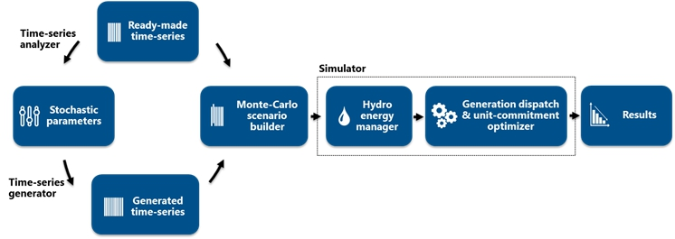

This document describes all the main features of the *Antares Simulator*[^1] package.
[^1]: For simplicity's sake, the *Antares Simulator* application will be simply denoted *Antares*.

It gives useful general information regarding the way data are handled and processed,
as well as how the Graphic User Interface (GUI) works. To keep this documentation
as compact as possible, many redundant details (how to mouse-select, etc.) are omitted.

Real-life use of the software involves a learning curve process that cannot be supported by a
simple reference guide. In order to be able to address this basic issue, two kinds of resources may be used:

- The ["examples"](https://github.com/AntaresSimulatorTeam/Antares_Simulator_Examples) ?? TODO library, which is meant as a self-teaching way to learn how to use the software.
It is regularly enriched with the software's new features.
The contents of this library depend on the installation package it comes from
(public version vs. users' club version).

- The [https://antares-simulator.org](https://antares-simulator.org/) website

If you notice an issue in the documentation, please report it on [github.com](https://github.com/AntaresSimulatorTeam/Antares_Simulator/issues/new/choose).

## Applications

In terms of power studies, the fields of application *Antares* has been designed for are:  

- **Generation adequacy problems**
- **Transmission project profitability**  

### Generation adequacy problems
**Adequacy** problems aim to study the need for new generating plants to keep the security of
supply above a given critical threshold.

What is most important in these studies is to survey a great number of scenarios that represent well enough
the random factors that may affect the balance between load and generation. Economic parameters do not play
as much a critical role as they do in the other kinds of studies since the stakes are mainly to know if and
when supply security is likely to be jeopardized (detailed costs incurred in more ordinary conditions are of
comparatively lower importance). In these studies, the default *Antares* option to use is the
[`adequacy`](18-parameters.md#mode) simulation mode.

### Transmission project profitability
**Transmission project profitability** studies the savings brought by a specific reinforcement of the grid,
in terms of decrease of the overall system generation cost (using an assumption of a [fair and perfect market](TODO))
and/or improvement of the security of supply (reduction of the loss-of-load expectation).

In these studies, economic parameters and the physical modeling of the dynamic constraints bearing on
the generating units are of paramount importance. Though a thorough survey of many "Monte-Carlo years"
is still required, the number of scenarios to simulate is not as large as in generation adequacy studies.
In these studies, the default *Antares* option to use is the [`economy`](18-parameters.md#mode) simulation mode.

## General content of an *Antares* session

A typical *Antares* session involves different steps that are usually run in sequence,
either automatically or with some degree of man-in-the-loop control, depending on the kind of study to perform.

These steps most often involve:

1. One GUI session dedicated to the initialization or to the updating of input data
(time-series, grid topology, fleet description, etc.)

2. One GUI session dedicated to the definition of simulation contexts
(definition of the "Monte-Carlo years" to simulate)

3. One autonomous simulation session producing actual numeric scenarios following the directives defined in (2)

4. One autonomous optimization session aiming at solving all the optimization problems associated with
each of the scenarios produced in (3)

5. One GUI session dedicated to the exploitation of the detailed results yielded by (4)

The scope of this document is to give a detailed description of the software involved in
steps (1) to (5) mostly based on a functional approach, leaving thereby aside a significant
part of the mathematical content[^2] involved in several of these steps.  
The following picture gives a functional view of all that is involved in steps (1) to (5).

[^2]: A detailed expression of the basic mathematical problem solved in the red box of the following figure can be found in the document ["Optimization problems formulation"](TODO).

## Performance considerations
Typically, *Antares* has to solve a least-cost hydro-thermal power schedule and unit commitment problem, with an hourly 
resolution and throughout a week, over a large interconnected system.  
The large number and the size of the individual problems to solve often make optimization sessions computer-intensive.

Depending on user-defined results accuracy requirements, various practical options[^3] allow to simplify either
the formulation of the problems, or their resolution.
[^3]: see [hydro-pricing-mode](18-parameters.md#hydro-pricing-mode), [unit-commitment-mode](18-parameters.md#unit-commitment-mode), TODO

*Antares* has been designed to handle [adequacy and profitability problems](#applications). 

The common rationale of the modeling used in all of these studies is, whenever it is possible,
to divide the overall problem (representation of the system behavior throughout many years,
with a time step of one hour) into a series of standardized, smaller problems.

In *Antares*, the "elementary" optimization problem resulting from this approach is that of the minimization of
the **whole power system**'s operational cost over **one week**, taking into account all proportional and
non-proportional generation costs, as well as transmission charges and "external" costs such as
that of the un-supplied energy (generation shortage) or, conversely, that of the spilled energy (generation excess).  
In other words, adequacy and profitability studies are carried out by solving a series of a large number of week-long 
operation problems (one for each week of each Monte-Carlo year), assumed to be independent to some extent.  
Note that, however, dependency issues such as the management of hydro stock (or any other kind of energy storage
facility) may bring a significant coupling between the successive problems, which needs to be addressed properly[^4].

[^4] See how stock dependency between successive problems is addressed [here](TODO).
