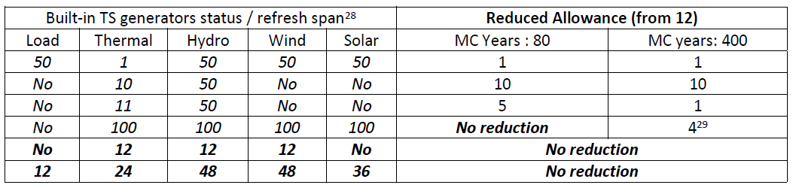

# System requirements

## Operating system

Antares\_Simulator code is cross-platform (Windows/Linux/Unix) and installation packages for various versions of these OS are available at: [_https://antares-simulator.org_](https://antares-simulator.org/)

## Hard drive disk

Installed alone, the Antares simulator does not require a lot of HDD space (less than 1 GB). Installation packages including companion tools (study manager, graph editor) are however significantly heavier. The proper storage of data (i.e. both Input and Output folders of Antares studies) may require a large amount of space. The disk footprint of any individual study mainly depends on:

- The size of the power system modeled (number of Areas, Links, Thermal clusters, etc.)
- The number of ready-made Time-Series and the number of Time-Series to be generated at runtime and stored afterwards
- The activation of output filters (Geographic Trimming and / or Thematic Trimming)
- The number of Monte-Carlo years involved in the simulation session (if the storage of detailed year-by-year results is requested)
- The status of the "export mps" optimization preference

At any moment, the amount of disk resources required for a simulation is accessible through the Tools/resources monitor menu.

## Memory

The amount of RAM required for a simulation depends on:

- The size of the power system modeled (number of Areas, Links, Thermal clusters, etc.)
- The number of ready-made Time-Series and that of Time-Series to be generated at runtime
- The simulation mode (draft, adequacy, economy with "fast" or "accurate" unit commitment)
- The execution mode (swap, default, parallel)

At any moment, the amount of RAM resources required for a simulation is accessible through the Tools/resources monitor menu.

## Multi-threading

The GUI of Antares and all I/O operations on Input / Output files automatically benefit from full multi-threading on the local machine's CPU cores. Multi-threading is also available on the proper calculation side, on a user-defined basis.

Provided that hardware resources are large enough, this mode may reduce significantly the overall runtime of heavy simulations.

To benefit from multi-threading, the simulation must be run in the following context:

- In the "run" window, the option "parallel" must be selected
  [^21]
- The simulation mode must be either "Adequacy" or "Economy"
  [^22]

When the "parallel" solver option is used, each Monte-Carlo year is dispatched as an individual process on the available CPU cores.  
The number of such individual processes depends on the characteristics of the local hardware and on the value given to the study-dependent " **simulation cores**" advanced parameter. This parameter can take five different values (Minimum, Low, Medium, High, Maximum). The number of independent processes resulting from the combination (local hardware + study settings) is given in the following table, which shows the CPU allowances granted in the different configurations.

**<ins>Simulation Cores:</ins>**

| _Machine_   _Size [^23]_ | _Minimum_ | _Low_ | _Medium_ | _Large_ | _Maximum_ |
|:---:|:---:|:---:|:---:|:---:|:---:|
| _1_ | 1 | 1 | 1 | 1 | 1 |
| _2_ | 1 | 1 | 1 | 2 | 2 |
| _3_ | 1 | 2 | 2 | 2 | 3 |
| _4_ | 1 | 2 | 2 | 3 | 4 |
| _5_ | 1 | 2 | 3 | 4 | 5 |
| _6_ | 1 | 2 | 3 | 4 | 6 |
| _7_ | 1 | 2 | 3 | 5 | 7 |
| _8_ | 1 | 2 | 4 | 6 | 8 |
| _9_ | 1 | 3 | 5 | 7 | 8 |
| _10_ | 1 | 3 | 5 | 8 | 9 |
| _11_ | 1 | 3 | 6 | 8 | 10 |
| _12_ | 1 | 3 | 6 | 9 | 11 |
| _S &gt; 12_ | 1 | Ceil(S/4) | Ceil(S/2) | Ceil(3S/4) | S-1 |
**
CPU allowances in parallel mode
**

**Note**: The number of independent threads actually launched by Antares in parallel mode may appear smaller than that shown in the table above. In this case, the resources monitor menu and the dashboard displayed on starting the simulation indicates:

simulation cores: **nn** reduced to **pp**

**nn** is the regular allowance and **pp** is the practical value that the solver has to work with. Allowance reduction may occur if the built-in Time-Series generators are activated, their "refresh" status is set to "Yes" and the values given to the "refresh span" parameters are not appropriate (parallel execution demand that refresh operations do not take place within a bundle of parallel years). Optimal use of the "parallel" execution mode is obtained when all activated built-in time –series generators are set up in either of the two following ways:
- Refresh status : **No**
- Refresh status : **Yes**, refresh span = **Ki \* (CPU allowance)** , with **Ki &gt;= 1**

Examples of reduction from an initial allowance of 12 cores are given hereafter. The reduced allowance is the size of the **smallest** bundle of parallel years between two consecutive "refresh" (it indicates the slowest point of the simulation [^24]). Note that RAM requirements displayed in the resources monitor are, contrariwise, assessed on the basis on the **largest** bundle of parallel years encountered in the simulation).

The Table indicates either the refresh status (No) or the refresh span (the associated refresh status "yes" is implicit).

[^21]: Options « default » and « swap » do not perform multi-threaded optimizations

[^22]: The « draft » mode is not multi-threaded

[^23]: This hardware characteristic, independent from Antares general parameters and from study parameters, can be checked with the Resources monitor tool ([Commands](03-commands.md))

[^24]: When the number of MC years to run is smaller than the allowance, the parallel run includes all of these years in a single bundle and there is no "reduced allowance" message

[^26]:
    The smallest bundle in this case is the ninth (year number 97 to year number 100).The first 8 bundles involve 12 MC years each.

