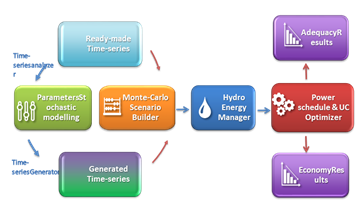
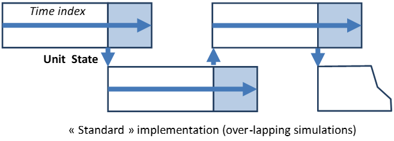
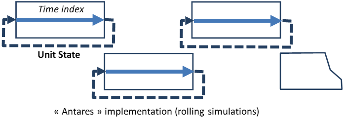

# General reference guide v8.1.0

## 1 Introduction

This document describes all the main features of the **Antares\_Simulator** package, version 8.1.0.

It gives useful general information regarding the way data are handled and processed, as well as how the Graphic User Interface (GUI) works. So as to keep this documentation as compact as possible, many redundant details (how to mouse-select, etc.) are omitted.

Some features described in this guide are not fully operational in 8.1.0 version. Features not yet available appear in grey in the GUI.

Real-life use of the software involves a learning curve process that cannot be supported by a simple reference guide. In order to be able to address this basic issue, two kinds of resources may be used:

- The examples library, which is meant as a self-teaching way to learn how to use the software. It is enhanced in parallel to the development of new features. The content of this library may depend on the type of installation package it comes from (general public or members of the users&#39; club).

- The [https://antares-simulator.org](https://antares-simulator.org/) website

Please report misprints or other errors to:

[support@antares-simulator.org](mailto:support@antares-simulator.org)

## General content of Antares\_Simulator sessions

A typical **Antares\_Simulator** [1] session involves different steps that are usually run in sequence, either automatically or with some degree of man-in-the-loop control, depending on the kind of study to perform.

These steps most often involve:

1. GUI session dedicated to the initialization or to the updating of various input data sections (time-series of many kinds, grid topology, generating fleet description, etc.)

2. GUI session dedicated to the definition of simulation contexts (definition of the number and consistency of the &quot;Monte-Carlo years&quot; to simulate)

3. Simulation session producing actual numeric scenarios following the directives defined in (b)

4. Optimization session aiming at solving all of the optimization problems associated with each of the scenarios produced in (c)

5. GUI session dedicated to the exploitation of the detailed results yielded by (d)

The scope of this document is to give a detailed description of the software involved in step (a) to (e) mostly based on a functional approach, leaving thereby aside a significant part of the mathematical content involved in several of these steps. [2] The following picture gives a functional view of all that is involved in steps (a) to (e).

The number and the size of the individual problems to solve (typically, a least-cost hydro-thermal power schedule and unit commitment, with an hourly resolution and throughout a week, over a large interconnected system) make optimization sessions often computer-intensive.

Depending on user-defined results accuracy requirements, various practical options allow to simplify either the formulation of the problems or their resolution.

In terms of power studies, the different fields of application Antares has been designed for are the following:

- **Generation adequacy problems:** assessment of the need for new generating plants so as to keep the security of supply above a given critical threshold

What is most important in these studies is to survey a great number of scenarios that represent well enough the random factors that may affect the balance between load and generation. Economic parameters do not play as much a critical role as they do in the other kinds of studies since the stakes are mainly to know if and when supply security is likely to be jeopardized (detailed costs incurred in more ordinary conditions are of comparatively lower importance). In these studies, the default Antares option to use is the &quot;Adequacy&quot; simulation mode, or the &quot;Draft&quot; simulation mode (which is extremely fast but which produces crude results).

- **Transmission project profitability:** assessment of the savings brought by a specific reinforcement of the grid, in terms of decrease of the overall system generation cost (using an assumption of fair and perfect market) and/or improvement of the security of supply (reduction of the loss-of-load expectation).

In these studies, economic parameters and the physical modeling of the dynamic constraints bearing on the generating units are of paramount importance. Though a thorough survey of many &quot;Monte-Carlo years&quot; is still required, the number of scenarios to simulate is not as large as in generation adequacy studies. In these studies, the default Antares option to use is the &quot;Economy&quot; simulation mode.

The common rationale of the modeling used in all of these studies is, whenever it is possible, to decompose the general issue (representation of the system behavior throughout many years, with a time step of one hour) into a series of standardized smaller problems.

In Antares, the &quot;elementary&quot; optimization problem resulting from this approach is that of the minimization of the overall system operation cost over a week, taking into account all proportional and non-proportional generation costs, as well as transmission charges and &quot;external&quot; costs such as that of the unsupplied energy (generation shortage) or, conversely, that of the spilled energy (generation excess). In this light, carrying out generation adequacy studies or transmission projects studies means formulating and solving a series of a great many week-long operation problems (one for each week of each Monte-Carlo year), assumed to be independent to some extent (note that, however, issues such as the management of hydro resources –or possibly other kinds of energy storage facilities– may bring a significant coupling between the successive problems, which needs to be addressed properly).

## 2 Data organization

In Antares, all input and output data regarding a given study are located within a folder named after the study and which should preferably be stored within a dedicated library of studies (for instance: `C/.../A\_name\_for\_an\_Antares\_lib/Study-number-one`).

The software has been designed so that all input data may be handled (initialized, updated, deleted) through the simulator&#39;s GUI. Likewise, all results in the output data can be displayed and analyzed within the simulator: its standard GUI is actually meant to be able to provide, on a stand-alone basis, all the features required to access input and output in a user-friendly way.

In addition to that, the Antares simulator may come [3] with or without functional extensions that provide additional ways to handle input and output data.

These extensions take the form of companion applications whose documentation is independent from that of the main simulator. For information regarding these tools (*Antares Data Organizer*, *AntaresViz* R packages, …) please refer to the specific relevant documents.

Besides, a point of notice is that most of Antares files belong to either &quot;.txt&quot; or &quot;.csv&quot; type: as an alternative to the standard GUI, they can therefore be viewed and updated by many applications (Windows Notepad, Excel, etc.). However, this is not recommended since handling data this way may result in fatal data corruption (e.g. as a consequence of accidental insertion of special characters).

Direct access to input or output data files should therefore be reserved to experienced users.

The input data contained in the study folder describe the whole state of development of the interconnected power system (namely: grid, load and generating plants of every kind) for a given future year.

As already stated, all of these data may be reviewed, updated, deleted through the GUI, whose commands and windows are described in Sections 3 and 4.

Once the input data is ready for calculation purposes, an Antares session may start and involve any or all of the following steps: historical time-series analysis, stochastic times-series generation, (draft) adequacy simulation, (full) adequacy simulation and economic simulation.

The results of the session are stored within the output section of the study folder. The results obtained in the different sessions are stored side by side and tagged. The identification tag has two components: a user-defined session name and the time at which the session was launched.

Particular cases are:

1. The outputs of the Antares time-series analyzer are not printed in the general output files but kept within the input files structure (the reason being that they are input data for the Antares time - series generators). The associated data may nonetheless be accessed to be reviewed, updated and deleted at any time through the GUI.

1. Some specific input data may be located outside the study folder: this is the case for the historical times-series to be processed by the time-series analyzer, which may be stored either within the &quot;user&quot; subfolder of the study or anywhere else (for instance, on a remote &quot;historical data&quot; or &quot;Meteorological data&quot; server).

1. The study folder contains a specific subfolder named &quot;user&quot;, whose status is particular: Antares is not allowed to delete any files within it (yet files may be updated on the user&#39;s requirement). As a consequence, the &quot;user&quot; subfolder is unaffected by the &quot;clean study&quot; command (see Section 3). This subfolder is therefore a &quot;private&quot; user space, where all kinds of information can be stored without any kind of interference with Antares. Note that on using the &quot;save as&quot; command (described further below), the choice is given to make or not a copy of this subfolder.

1. The times-series analyzer requires the use of a temporary directory in which intermediate files are created in the course of the analysis and deleted in the end, unless the user wishes to keep them for further examination. Its location is user-defined and should usually be the &quot;user&quot; subfolder if files are to be kept, otherwise any proper temporary space such as &quot;C..../Temp&quot;.

1. If the interconnected system to study is large and/or if the computer is low on RAM, it is possible to run the Monte-Carlo adequacy simulator as well as the Monte-Carlo economic simulator in &quot;Swap&quot; mode. Swap is not handled by the computer&#39;s OS but by an Antares specific swap manager, whose operation requires the definition of a space where the software can store temporary files. This location is user-defined but should never be chosen within the study folder. C/.../Temp may typically be used but an external drive may be preferred if the computer is low on HDD.

1. The outputs of the Antares Kirchhoff&#39;s constraints generator are not printed in the general output files but kept within the input files structure, the reason being that they are input data for the proper Antares simulation. The associated data (so-called binding constraints bearing in their name the prefix &quot;@UTO-&quot;) may nonetheless be accessed to be reviewed, updated and deleted at any time through the GUI.

## 3 Commands

The Antares GUI gives access to a general menu of commands whose name and meanings are described hereafter.

### File

- **New** _Create a new empty study to be defined entirely from scratch (network topology, interconnections ratings, thermal power plants list, fuel costs, hydro inflows stats, wind speed stats, load profiles ,etc.)_

- **Open** _Load in memory data located in a specified Antares study folder. Once loaded, these data may be reviewed, updated, deleted, and simulations may be performed. If &quot;open&quot; is performed while a study was already opened, the former study will be automatically closed._

- **Quick Open** _Same action as open, with a direct access to the recently opened studies_

- **Save** _Save the current state of the study, if necessary by replacing original files by updated ones. After using this command the original study is no longer available, though some original files may be kept until the &quot;clean&quot; command is used (see &quot;clean&quot; command )_

- **Save as** _Save the current state of the study under a different name and / or location. Using this command does not affect the original study. When &quot;saving as&quot;, the user may choose whether he prefers to save input and output data or only input data. Note that Antares does not perform &quot;autosave&quot;: Therefore, the actions performed on the input data during an Antares session (adding an interconnection, removing a plant, etc.) will have no effect until either &quot;save&quot; or &quot;save as&quot; have been used_

- **Export Map** _Save a picture of the current map as a PNG, JPEG or SVG file. Default background color and storage location can be changed_

- **Open in Windows Explorer** _Open the folder containing the study in a standard Windows Explorer window_

- **Clean** _Remove all junk files that may remain in the study folder if the Antares session has involved lots of sequences such as &quot;create area – add plant –save –rename area – save - rename plant ...&quot; (Antares performs only low level auto-clean for the sake of GUI&#39;s efficiency)_

- **Close** _Close the study folder. If no &quot;save&quot; or &quot;save as&quot; commands have been performed, all the modifications made on the input data during the Antares session will be ignored_

- **Quit** _Exit from Antares_

### Edit

- **Copy** _Prepare a copy of elements selected on the current system map. The command is available only if the current active tab (whose name appears at the top line of the subcommand menu) is actually that of the System maps._

- **Paste** _Paste elements previously prepared for copy. The command is available only if the current active tab (whose name appears at the top line of the subcommand menu) is actually that of the System maps. Note that copy/paste may be performed either within the same map or between two different maps, attached to the same study or to different studies. To achieve that, launch one instance of Antares to open the &quot;origin&quot; study, select elements on the map and perform copy, launch another instance of Antares to open the destination study, perform paste. Copied elements are stored in an Antares clipboard that remains available for subsequent (multiple) paste as long as the system map is used as active window._

- **Paste Special** _Same as Paste, with a comprehensive set of parameterized actions (skip, merge, update, import) that can be defined for each data cluster copied in the clipboard. This gives a high level of flexibility for carrying out complex copy/paste actions._

- **Reverse** _The elements currently selected on the system map are no longer selected and are replaced by those not selected beforehand._

- **Unselect All** _Unselect all elements currently selected on the system map._

- **Select All** _Select all elements on the system map._

### Input

- **Name of the study** _Give a reference name to the study. The default name is identical to that of the study&#39;s folder but the user may modify it. The default name of a new study is &quot;no title&quot;_

- **Author(s)** _Set the study&#39;s author(s) name. Default value is &quot;memory&quot;_ 

The other &quot;input&quot; subcommands here below are used to move from one active window to another. Note that the availability of the __Wind__, __Solar__, and __Renewable__ subcommands depend on the advanced parameter *"Renewable Generation modeling"* described in section 8.

- **System Maps**
- **Simulation**
- **User&#39;s Notes**
- **Load**
- **Solar**
- **Wind**
- **Renewable**
- **Hydro**
- **Thermal**
- **Misc. Gen.**
- **Reserves/DSM**
- **Links**
- **Binding constraints**
- **Economic opt.**

### Output

**&lt;Simulation type&gt; &lt;simulation tag&gt;**

_For each simulation run for which results have been generated, open a GUI for displaying results. Results may be viewed by multiple selections made on a number of parameters. Note that, since all simulations do not include all kinds of results (depending on user&#39;s choices), some parameters are not always visible. Parameters stand as follows:_

- _Antares area (node)_
- _Antares interconnection (link)_
- _Class of Monte-Carlo results :_
    - _Monte-Carlo synthesis (throughout all years simulated)_
    - _Year-by-Year (detailed results for one specific year)_
- _Category of Monte-Carlo results :_
    - _General values (operating cost, generation breakdown, ...)_
    - _Thermal plants (detailed thermal generation breakdown)_
    - _Renewable generation (per cluster)_
    - _Record years (for each Antares variable, identification of the Monte-Carlo year for which lowest and highest values were encountered)_

- _Span of Monte-Carlo results :_
    - _Hourly_
    - _Daily_
    - _Weekly_
    - _Monthly_
    - _Annual_

_The interface provides a user-friendly way for the comparison of results between multiple simulations (e.g. &quot;before&quot; and &quot;after&quot; commissioning of a new plant or interconnection):_

- _Use &quot;new tab&quot; button and choose a first set of simulation results_
- _Use again &quot;new tab&quot; and choose a second set of simulation results_

_The results window will be automatically split so as to show the two series of results in parallel. To the right of the &quot;new tab&quot; button, a symbolic (icon) button gives further means to compare results on a split window (average, differences, minimum, maximum and sum)._

_Besides, when the simulation results contain the &quot;year-by-year&quot; class, it is possible to carry out an extraction query on any given specific variable (e.g. &quot;monthly amounts of CO2 tons emitted&quot;) throughout all available years of simulation._

_The results of such queries are automatically stored within the output file structures, so as to be available at very short notice if they have to be examined later in another session (extractions may require a significant computer time when there are many Monte-Carlo years to process)._

- **Open in Windows Explorer** _This command displays the list of available simulation results and allows browsing through the output files structure. The content of these files may be reviewed by tools such as Xcel. File structures are detailed in Section 5._

### Run

- **Monte Carlo Simulation** _Runs either an economy simulation, an adequacy simulation, or a &quot;draft&quot; simulation, depending on the values of the parameters set in the &quot;simulation&quot; active window (see Section 4). If hardware resources and simulation settings allow it, simulations benefit from full multi-threading (see Section 9)_

- **Time-series Generators** _Runs any or all of the Antares stochastic time-series generators, depending on the values of the parameters set in the &quot;simulation&quot; active window (see Section 4)_

- **Time-series Analyzer** _Runs the Antares historical time-series analyzer. The parameters of this module are defined by a specific active window, available only on launching the analyzer (see Section 6)_

- **Kirchhoff&#39;s Constraints Generator** _Runs the Antares Kirchhoff&#39;s Constraints Generator. The parameters of this module are defined by a specific active window, available only on launching the KCG (see Section 7)_

### Configure

- **Thematic Trimming** _Opens a window in which a choice can be made regarding the individual output status of the variables defined in Section 5. Each computed variable can either be stored as part of the Output data to produce at the end of the simulation, or trimmed from it. In the latter case, the variable is regularly computed but the printing stage is skipped. Thematic Trimming does not reduce computation time but can bring some benefits on total runtime (smaller files to write). Thematic Trimming can save large amounts of storage space in simulations where only a handful of variables are of interest._

- **Geographic Trimming** _Opens an auxiliary window that allows multiple selection of the results to store at the end of a simulation: Choice of areas, interconnections, temporal aggregations (hourly, daily, etc.). Note that in addition to this feature, an alternative access to the function is available (see Section 4, &quot;output profile&quot;). Geographic Trimming does not reduce actual computation time but can bring some benefits on total runtime (fewer files to write). Geographic Trimming can save large amounts of storage space in simulations where only a few Areas and Links are of interest._

- **Regional Districts** _Allows selecting a set of areas so as to bundle them together in a &quot;district&quot;. These are used in the course of simulations to aggregate results over several areas. They can be given almost any name (a &quot;@&quot; prefix is automatically added by Antares). Bypassing the GUI is possible (see Section 8)._

- **MC Scenario builder** _For each Monte-Carlo year of the simulation defined in the &quot;Simulation&quot; window, this command allows to state, for each kind of time-series, whether it should be randomly drawn from the available set (be it ready-made or Antares-generated)_ _ **OR** _ _should take a user-defined value (in the former case, the default &quot;rand&quot; value should be kept; in the latter, the value should be the reference number of the time-series to use). Multiple simulation profiles can be defined and archived. The default active profile gives the &quot;rand&quot; status for all time-series in all areas (full probabilistic simulation)._

- **MC Scenario playlist** _For each Monte-Carlo year of the simulation defined in the &quot;Simulation&quot; active window, this command allows to state whether a MC year prepared for the simulation should be actually simulated or not. This feature allows, for instance, to refine a previous simulation by excluding a small number of &quot;raw&quot; MC years whose detailed analysis may have shown that they were not physically realistic. A different typical use consists in replaying only a small number of years of specific interest (for instance, years in the course of which Min or Max values of a given variable were encountered in a previous simulation)._

- **Optimization preferences** _Defines a set of options related to the optimization core used in the simulations. The set of preferences is study-specific; it can be changed at any time and saved along with study data. Options refer to objects (binding constraints, etc.) that are presented in subsequent sections of this document._    _The values set in this menu overlay the local parameters but do not change their value: for instance, if the LOCAL parameter &quot;set to infinite&quot; is activated for some interconnections, and if the GLOBAL preference regarding transmission capacities is &quot;set to null&quot;, the simulation will be carried out as if there were no longer any grid BUT the local values will remain untouched. If the preference is afterwards set to &quot;local values&quot;, the interconnections will be given back their regular capacities (infinite for those being set on &quot;set to infinite&quot;)._

    - _Binding constraints (include / ignore)_
    - _Hurdle costs (include / ignore)_
    - _Transmission capacities (local values / set to null / set to infinite)_
    - _Min Up/down time of thermal plants (include / ignore)_
    - _Day-ahead reserve (include / ignore)_
    - _Primary reserve (include / ignore)_
    - _Strategic reserve (include / ignore)_
    - _Spinning reserve (include / ignore)_
    - _Export mps (false/true)_
    - _Simplex optimization range # 4_ _(day / week)_
    - _Unfeasible problems behavior (Error Dry/ Error Verbose/ Warning Dry/ Warning Verbose_

- **Advanced parameters** _Advanced Parameters allow to adjust the simulation behavior regarding issues that are more numerical than physical. The set of parameters is study-specific and can be updated at any time._

    - Seeds for random number generation
      - Time-series draws (MC scenario builder)
      - Wind time-series generation
      - Solar time-series generation
      - Hydro time - series generation
      - Load time - series generation
      - Thermal time-series generation
      - Noise on thermal plants costs
      - Noise on unsupplied  energy  costs
      - Noise on spilled energy costs
      - Noise on virtual hydro cost
      - Initial hydro reservoir levels
    - Spatial time-series correlation
      - Numeric Quality : load [standard | high]
      - Numeric Quality : wind[standard | high]
      - Numeric Quality : solar[standard | high]
    - Other preferences
      - Reservoir Level Initialization [cold start | hot start]
      - Hydro Pricing mode [fast|accurate]
      - Power fluctuations [free modulations | minimize excursions | minimize ramping]
      - Shedding policy [shave peaks | minimize duration]
      - District marginal prices : [average | weighed]
      - Day-ahead reserve management [global | local]
      - Unit commitment mode [fast | accurate]
      - Simulation cores [minimum | low | medium | high | maximum]
      - Renewable Generation modeling [aggregated | cluster]

### Tools

- **Study manager** _Launches the &quot;study manager&quot; external package (Please refer to dedicated documentation for this package)_

- **Resources monitor** _Indicates the amounts of RAM and disk space currently used and those required for a simulation in the available modes (see Section 9). Note that the &quot;disk requirement&quot; amount does not include the footprint of the specific &quot;mps&quot; files that may have to be written aside from the regular output (see previous § &quot;optimization preferences&quot;). Besides, the resources monitor shows the number of CPU cores available on the machine Antares is running on._

- **Configure the swap folder** _Defines the location that will be used by Antares to store the temporary files of the MC simulators when the swap mode is activated (this location may also be used by Antares GUI when handling large studies). The default setting is the system temporary folder_

### Window

- **Toggle full window** _Uses the whole window for display_

- **Inspector** _Opens a window that gives general information on the study and allow quick browsing through various area- or interconnection-related parameters. The Inspector window displays the content of the Antares clipboard, e.g. areas and interconnections selected on the current study map. If the &quot;Geographic Trimming&quot; option of the general simulation dashboard has the value &quot;custom&quot;, the filtering parameters can be defined within the Inspector window. Besides, areas currently selected, displayed in the Inspector window, can be bundled into an &quot;output district&quot; by using the Configure/district command previously described_

- **Log viewer** _Displays the log files regarding every Antares session performed on the study_

## 4 Active windows

Data can be reviewed, updated, deleted by selecting different possible active windows whose list and content are described hereafter. On launching Antares, the default active window is &quot;System Maps&quot;.

### System Maps

_This window is used to define the general structure of the system, i.e. the list of areas and that of the interconnections. Only the area&#39;s names, location and the topology of the grid are defined at this stage. Different colors may be assigned to different areas. These colors may later be used as sorting options in most windows. They are useful to edit data in a fashion that has a geographic meaning (which the lexicographic order may not have). This window displays copy/paste/select all icons equivalent to the relevant EDIT menu commands._

_The top left side of the window shows a &quot;mouse status&quot; field with three icons. These icons (one for nodes, one for links and one for binding constraints) indicate whether a selection made on the map with the mouse will involve or not the related elements. When a copy/paste action is considered, this allows for instance to copy any combination of nodes, links and binding constraints. Status can be changed by toggling the icons. Default is &quot;on&quot; for the three icons. Two other purely graphic icons/buttons (no action on data) allow respectively to center the map on a given set of (x , y) coordinates, and to prune the &quot;empty&quot; space around the current map. Multiple additional maps may be defined by using the cross-shaped button located top right. A detailed presentation of all system map editor features can be found in the document &quot;System Map Editor Reference Guide&quot;._

### Simulation

_The main simulation window is divided up in two parts. On the left side are the general parameters while the right side is devoted to the time-series management._

_These two parts are detailed hereafter._

#### <ins>__LEFT PART: General parameters__</ins>

- **Simulation**

    - _Mode:_ Economy, Adequacy, Draft [5]
    - _First day:_ First day of the simulation (e.g. 8 for a simulation beginning on the second week of the first month of the year)
    - _Last day:_ Last day of the simulation (e.g. 28 for a simulation ending on the fourth week of the first month of the year) [6]

- **Calendar**

    - _Horizon:_ Reference year (static tag, not used in the calculations)

    - _Year:_ Actual month by which the Time-series begin (Jan to Dec, Oct to Sep, etc.)

    - _Leap Year:_ (Yes/No) indicates whether February has 28 or 29 days

    - _Week:_ In economy or adequacy simulations, indicates the frame (Mon- Sun, Sat-Fri, etc.) to use for the edition of weekly results

     - _1st January:_ First day of the year (Mon, Tue, etc.)

- **Monte-Carlo scenarios**

     - _Number:_ Number of MC years that should be prepared for the simulation (not always the same as the Number of MC years actually simulated, see &quot;selection mode&quot; below)

    - _Building mode_:
        - **Automatic** For all years to simulate, all time-series will be drawn at random
        - **Custom** The simulation will be carried out on a mix of deterministic and probabilistic conditions, with some time-series randomly drawn and others set to user-defined values. This option allows setting up detailed &quot;what if&quot; simulations that may help to understand the phenomena at work and quantify various kinds of risk indicators. To set up the simulation profile, choose in the main menu: Configure/ MC scenario builder
        - **Derated** All time-series will be replaced by their general average and the number of MC years is set to 1. If the TS are ready-made or Antares-generated but are not to be stored in the INPUT folder, no time-series will be written over the original ones (if any). If the time-series are built by Antares and if it is specified that they should be stored in the INPUT, a single average-out time series will be stored instead of the whole set.

    - _Selection mode_:
        - **Automatic** All prepared MC years will actually be simulated.

        - **Custom** The years to simulate are defined in a list. To set up this list, choose in the main menu: Configure/ MC scenario playlist [7].

- **Output profile**

    - Simulation synthesis:
        - **True** Synthetic results will be stored in a directory: `Study_name/OUTPUT/simu_tag/Economy/mc-all`
        - **False** No general synthesis will be printed out

    - Year-by-Year: 
        - **False** No individual results will be printed out
        - **True** For each simulated year, detailed results will be printed out in an individual directory [8]:   `Study_name/OUTPUT/simu_tag/Economy/mc-i-number

    - Geographic Trimming:
        - **None** Storage of results for all areas, geographic districts, interconnections as well as all time spans (hourly, daily, etc.)
        - **Custom** Storage of the results selected with the &quot;Geographic Trimming&quot; command of the &quot;Configure&quot; option available in the main menu. Filters on areas, interconnections and time spans may also be defined as follows:
            - On the map, select area(s) and/or interconnection(s)
            - Open the inspector module (Main menu, Windows)
            - Set adequate parameters in the &quot;output print status&quot; group

    - Thematic Trimming:
        - **None** Storage, for the geographic selection defined previously, of all variables defined in Section 5 for Areas and Links.
        - **Custom** Storage, for the geographic selection defined previously, of the variables selected with the &quot;Thematic Trimming&quot; command of the &quot;Configure&quot; option available in the main menu.

    - MC Scenarios:
        - **False** No storage of the time-series numbers (either randomly drawn or user-defined) used to set up the simulation
        - **True** A specific OUTPUT folder will be created to store all of the time-series numbers drawn when preparing the MC years.

##### RIGHT PART: Time-series management

For the different kinds of time-series that Antares manages in a non-deterministic way (load, thermal generation, hydro power, wind power, solar power or renewable depending on the option chosen):

1. **Choice of the kind of time-series to use**  Either « ready-made » or «stochastic » (i.e. Antares-generated), defined by setting the value to either &quot;on&quot; or &quot;off&quot;

2. **For stochastic TS only**:
    - **Number** Number of TS to generate

    - **Refresh** (Yes /No) ndicates whether a periodic renewal of TS should be performed or not

    - **Refresh span** Number of MC years at the end of which the renewal will be performed (if so required)

    - **Seasonal correlation** (&quot;monthly&quot; or &quot;annual&quot;) Indicates whether the spatial correlation matrices to use are defined month by month or if a single annual matrix for the whole year should rather be used (see Section 6)

    - **Store in input**
        - **Yes** the generated time-series will be stored in the INPUT in replacement of the original ones (wherever they may come from)
        - No: the original time-series will be kept as they were

    - **Store in output**
        - **Yes**: the generated times-series will be stored as part of the simulation results
        - **No**: no storage of the generated time-series in the results directories

3. **General rules for building up the MC years**
    - **Intra-modal**:
        - **Yes** For each mode, the same number should be used for all locations (or 1 where there is only one TS), but this number may differ from one mode to another. For instance, solar power TS = 12 for all areas, while wind power TS number = 7 for all areas.
        - **No** Independent draws
    - **Inter-modal**:
           - **Yes** For all modes, the same number should be used but may depend on the location (for instance, solar and wind power TS = 3 for area 1, 8 for area 2, 4 for area 3, etc.)
           - **No** Independent draws

A full meteorological correlation (for each MC year, one single number for all modes and areas) is, from a theoretical standpoint, accessible by activating &quot;intra-modal&quot; and &quot; inter-modal&quot; for all but the &quot;thermal&quot; kind of time-series. The availability of an underlying comprehensive multi-dimensional Meteorological data base of ready-made time-series is the crux of the matter when it comes to using this configuration.

### User&#39;s Notes

_A built-in notepad for recording comments regarding the study. Such comments typically help to track successive input data updates (upgrading such interconnection, removing such plant, etc.). Another simple use is to register what has been stored in the &quot;user&quot; subfolder and why. Such notes may prove useful to sort and interpret the results of multiple simulations carried out at different times on various configurations of the power system._

### Load

_This window is used to handle all input data regarding load. In Antares load should include transmission losses. It should preferably not include the power absorbed by pumped storage power plants. If it does, the user should neither use the &quot;PSP&quot; array (see window &quot;Misc. Gen&quot;) nor the explicit modeling of PSP plants_

_The user may pick any area appearing in the list and is then given access to different tabs:_

- _The &quot;time-series&quot; tab display the &quot;ready-made&quot; 8760-hour time-series available for simulation purposes. These data may come from any origin outside Antares, or be data formerly generated by the Antares time-series stochastic generator, stored as input data on the user&#39;s request. Different ways to update data are :_

    - _direct typing_

    - _copy/paste a selected field to/from the clipboard_

    - _load/save all the time-series from/to a file (usually located in the &quot;user&quot; subfolder)_

     - _Apply different functions (+,-, \*, /,etc.) to the existing (possibly filtered) values (e.g. simulate a 2% growth rate by choosing &quot;multiply-all-by-1.02&quot;)_

    - _Handle the whole (unfiltered) existing dataset to either_

        - _Change the number of columns (function name: resize)_
        - _Adjust the values associated with the current first day of the year (function name: shift rows)_

    _Versatile &quot;Filter&quot; functions allow quick access to user-specified sections of data (e.g. display only the load expected in the Wednesdays of January, at 09:00, for time-series #12 to #19). Hourly load is expressed in round numbers and in MW. If a smaller unit has to be used, the user should define accordingly ALL the data of the study (size of thermal plants, interconnection capacities, etc.)_

    - Note that:
    
        - _If the "intra-modal correlated draw" option has not been selected in the_ **simulation** _window, MC adequacy or economy simulations can take place even if the number of time-series is not the same in all areas (e.g. 2 , 5 , 1 , 45 ,...)_
        - _If the &quot;intra-modal correlated draws&quot; option has been selected in the_ **simulation** _window, every area should have either one single time-series or the same given number (e.g. 25 , 25 , 1 , 25...)_
        
        - _The &quot;spatial correlation&quot; tab gives access to the inter-area correlation matrices that will be used by the stochastic generator if it is activated. Different sub-tabs are available for the definition of 12 monthly correlation matrices and of an overall annual correlation matrix._

            A matrix A must meet three conditions to be a valid correlation matrix:

            $$\forall i,\ \forall j,\ {A_{ii} = 100; -100 \le A_{ij} \le 100}; A\ symmetric; A\ positive\ semi\mbox{-}definite$$
      
            When given invalid matrices, the TS generator emits an infeasibility diagnosis

        - _The &quot;local data&quot; tab is used to set the parameters of the stochastic generator. These parameters are presented in four sub-tabs whose content is presented in Section 6._

        - _The &quot;digest&quot; tab displays for all areas a short account of the local data_

### Thermal

_This window is used to handle all input data regarding thermal dispatchable power._

_The user may pick any area appearing in the area list and is then given access to the list of thermal plants clusters defined for the area (e.g. &quot;CCG 300 MW&quot;, &quot;coal 600&quot;, etc.). Once a given cluster has been selected, a choice can be made between different tabs:_

- _The &quot;time-series&quot; tab displays the &quot;ready-made&quot; 8760-hour time-series available for simulation purposes. These data may come from any origin outside Antares, or be data formerly generated by the Antares time-series stochastic generator, stored as input data on the user&#39;s request. Different ways to update data are :_

    - _direct typing_
    - _copy/paste a selected field to/from the clipboard_
    - _load/save all the time-series from/to a file (usually located in the &quot;user&quot; subfolder)_
    - _Apply different functions (+,-, \*, /,etc.) to the existing (possibly filtered) values (e.g. simulate a 2% growth rate by choosing &quot;multiply-all-by-1.02&quot;)_
     - _Handle the whole (unfiltered) existing dataset to either_

        - _Change the number of columns (function name: resize)_
        - _Adjust the values associated with the current first day of the year (function name: shift rows)_

    _Versatile &quot;Filter&quot; functions allow quick access to user-specified sections of data (e.g. display only the generation expected on Sundays at midnight, for all time-series)._

    _Hourly thermal generation is expressed in round numbers and in MW. If a smaller unit has to be used, the user should define accordingly ALL the data of the study (Wind generation, interconnection capacities, load, hydro generation, solar, etc.)_

    - _Note that:_

        - _If the &quot;intra-modal correlated draws&quot; option has not been selected in the_ **simulation** _window, MC adequacy or economy simulations can take place even if the number of time-series is not the same in all areas (e.g. 2, 5, 1, 45,etc.)_

        - _If the &quot;intra-modal correlated draws&quot; option has been selected in the_ **simulation** _window, every area should have either one single time-series or the same given number (e.g. 25, 25, 1, 25, etc.). Note that, unlike the other time-series (load, hydro, etc.), which depend on meteorological conditions and are therefore inter-area-correlated, the thermal plants time-series should usually be considered as uncorrelated. Using the &quot;correlated draws&quot; feature makes sense only in the event of having to play predefined scenarios (outside regular MC scope)_

 

- _The &quot;TS generator&quot; tab is used to set the parameters of the stochastic generator. These parameters are defined at the daily scale and are namely, for each day: the average duration of forced outages (beginning on that day), the forced outage rate, the duration of planned outages (beginning on that day), the planned outage rate, planned outages minimum and maximum numbers. Durations are expressed in days and rates belong to [0 , 1]._

 

- _The &quot;Common&quot; tab is used to define the cluster&#39;s techno-economic characteristics :_

    - _Name_
    - _Fuel used_
    - _Location (Area)_
    - _Activity status_
        - _false: not yet commissioned, moth-balled, etc._
        - _true : the plant may generate_
    - _Number of units_
    - _Nominal capacity_
    - _Full Must-run status_
        - _false: above a partial &quot;must-run level&quot; (that may exist or not, see infra) plants will be dispatched on the basis of their market bids._
        - _true: plants will generate at their maximum capacity, regardless of market conditions_
    - _Minimum stable power (MW)_
    - _Minimum Up time (hours)_
    - _Minimum Down time (hours)_
    - _Default contribution to the spinning reserve (% of nominal capacity)_
    - _CO2 tons emitted per electric MWh_
    - _Marginal operating cost (€/MWh)_
    - _Fixed cost (No-Load heat cost) (€ / hour of operation )_
    - _Start-up cost (€/start-up)_
    - _Market bid (€/MWh)_
    - _Random spread on the market bid (€/MWh)_
    - _Seasonal marginal cost variations (gas more expensive in winter, ...)_
    - _Seasonal market bid modulations (assets costs charging strategy )_
    - _Nominal capacity modulations (seasonal thermodynamic efficiencies, special over-generation allowances, etc.). These modulations are taken into account during the generation of available power time-series_
    - _Minimal generation commitment (partial must-run level) set for the cluster_

    - _Note that:_

        - _The_ **optimal dispatch plan** _as well as_ **locational marginal prices** _are based on_ **market bids** _, while the assessment of the_ **operating costs** _associated with this optimum are based on_ **cost parameters** _. (In standard &quot;perfect&quot; market modeling, there is no difference of approaches because market bids are equal to marginal costs)_

### Hydro

_This section of the GUI is meant to handle all input data regarding hydro power, as well as any other kind of energy storage system of any size (from a small battery to a large conventional hydro-storage reservoir with or without pumping facilities, etc.): Hydro power being historically the first and largest form of power storage, it stood to reason that it should play in Antares the role of a &quot;generic template&quot; for all forms of storable power. This versatility, however, comes at the price of a comparatively more complex data organization than for other objects, which explains the comparatively long length of this chapter._

_In the main Window, the user may pick any area appearing in the list and is then given access to different tabs:_

- _The &quot;time-series&quot; tab displays the &quot;ready-made&quot; time-series already available for simulation purposes. There are two categories of time-series (displayed in two different subtabs): the Run of River (ROR) time-series on the one hand and the Storage power (SP) time-series on the other hand._

    _ROR time-series are defined at the hourly scale; each of the 8760 values represents the ROR power expected at a given hour, expressed in round number and in MW. The SP time-series are defined at the daily scale; each of the 365 values represents an overall SP energy expected in the day, expressed in round number and in MWh. These natural inflows are considered to be storable into a reservoir for later use._

    _Both types of data may come from any origin outside Antares, or may have been formerly generated by the Antares time-series stochastic generator and stored as input data on the user&#39;s request. Different ways to update data are:_

    - _direct typing_
    - _copy/paste a selected field to/from the clipboard_
    - _load/save all the time-series from/to a file (usually located in the &quot;user&quot; subfolder)_
    - _Apply different functions (+,-, \*, /,etc.) to the existing (possibly filtered) values (e.g. simulate a 2% growth rate by choosing &quot;multiply-all-by-1.02&quot;)_
    - _Handle the whole (unfiltered) existing dataset to either_

        - _Change the number of columns (function name: resize)_
        - _Adjust the values associated with the current first day of the year (function name: shift rows)_

    - _Note that:_

        - _For a given area, the number of ROR time-series and SP times-series_ **must** _be identical_
        - _If the &quot;intra-modal correlated draws&quot; option was not selected in the_ **simulation** _window, MC adequacy or economy simulations can take place even if the number of hydro time-series is not the same in all areas (e.g. 2 , 5 , 1 , 45 ,...)_
        - _If the &quot;intra-modal correlated draws&quot; option was selected in the_ **simulation** _window, every area should have either one single time-series or the same given number (e.g. 25 , 25 , 1 , 25...)_

 

- _The &quot;spatial correlation&quot; tab gives access to an annual inter-area correlation matrix that will be used by the stochastic generator if it is activated. Correlations are expressed in percentages, hence to be valid this matrix must be symmetric, p.s.d, with a main diagonal of 100s and all terms lying between (-100 ,+100)_

- _The &quot;Allocation&quot; tab gives access to an annual inter-area allocation matrix A(i,j) that may be used during a heuristic hydro pre-allocation process, regardless of whether the stochastic time-series generator is used or not. This matrix describes the weights that are given to the loads of areas (i) in the definition of the monthly and weekly hydro storage generation profiles of areas (j). The way this is done in detailed in Section 8._

- _The &quot;local data&quot; tab is used to set up the parameters of the stochastic generator_ **AND** _to define techno-economic characteristics of the hydro system that are used in Economy and Adequacy optimizations. For the purpose of versatility (use of the hydro section to model storage facilities quite different in size and nature), this &quot;local tab&quot; is itself divided up into four different subtabs whose list follows and which are further described:_

    - _Inflow Structure_
    - _Reservoir Levels and water value_
    - _Daily Power and Energy Credits_
    - _Management options_

_**Inflow Structure**_

_This tab contains all of the local parameters used for the stochastic generation of hydro time-series. These are namely:_

- _The expectations, standard deviations, minimum and maximum values of monthly energies (expressed in MWh), monthly shares of Run of River within the overall hydro monthly inflow._
- _The average correlation between the energy of a month and that of the next month (inter-monthly correlation)._
- _The average daily pattern of inflows within each month. Each day is given a relative &quot;weight&quot; in the month. If all days are given the same weight, daily energy time-series will be obtained by dividing the monthly energy in equal days. If not, the ratio between two daily energies will be equal to that of the daily weights in the pattern array._

_Overall hydro energy is broken down into two parts: Run of River- ROR and storage -STOR_

_ROR energy has to be used on the spot, as it belongs to the general &quot;must-run&quot; energy category._

_STOR energy can be stored for use at a later time. The way how stored energy may actually be used depends on the options chosen in the &quot;management options&quot; Tab and of the values of the parameters defined in the other Tabs._

_**Reservoir Levels and Water Values**_

_Reservoir levels (left side)_

_On the left side are defined 365 values for the minimum, average and maximum levels set for the reservoir at the beginning of each day, expressed in percentage of the overall reservoir volume. The lower and upper level time-series form a pair of so-called lower and upper &quot;reservoir rule curves&quot;_

_Depending of the set of parameters chosen in the &quot;management options&quot; Tab, these rule curves may be used in different ways in the course of both heuristic seasonal hydro pre-allocation process and subsequent weekly optimal hydro-thermal unit-commitment and dispatch process._

_Water values (right side)_

_On the right side is a table of marginal values for the stored energy, which depends on the date (365 days) and of the reservoir level (101 round percentage values ranging from 0% to 100%). These values may have different origins; they theoretically should be obtained by a comprehensive (dual) stochastic dynamic programming study carried out over the whole dataset and dealing simultaneously with all reservoirs._

_Depending of the set options chosen in the &quot;management options&quot; Tab, these values may be used or not in the course of the weekly optimal hydro-thermal unit-commitment and dispatch process._

_**Daily Power and Energy Credits**_

_Standard credits (Bottom part)_

_The bottom part displays two daily time-series (365 values) defined for energy generation/storage (hydro turbines or hydro pumps). In each case, the first array defines the maximum power (generated or absorbed), and the second defines the maximum daily energy (either generated or stored)._

_For the sake of clarity, maximum daily energies are expressed as a number of hours at maximum power._

_Credit modulation (Upper part)_

_The upper part displays two level-dependent (101 round percentage values ranging from 0% to 100%) time-series of modulation coefficients defined for either generating or storing (pumping)._

_These modulations, which can take any positive value, may (depending of the options chosen in the management options Tab) be used to increase (value &gt;1) or to decrease (value &lt;1) the standard credits defined previously for the maximum daily power and energies._

_**Management Options**_

_This Tab is a general dashboard for the definition of how storage units, whatever their size or nature, should be managed. It includes 15 parameters (out of which 7 are booleans) presented hereafter:_

- &quot;_Follow load&quot; (y|n): defines whether an &quot;ideal&quot; seasonal generation profile should somehow follow the load OR an &quot;ideal&quot; seasonal generation profile should remain as close as possible to the natural inflows (i.e. instant generation whenever possible)_

- &quot;_Inter-daily breakdown&quot; and &quot;Inter-monthly breakdown&quot; : parameters used in the assessment, through a heuristic process, of an &quot;ideal&quot; seasonal generation profile, if the use of such a profile is required (the heuristic itself is presented in Section 8)_

- &quot;_Intra-daily modulation&quot;: parameter which represents, for the storage power, the maximum authorized value for the ratio of the daily peak to the average power generated throughout the day. This parameter is meant to allow to simulate different hydro management strategies. Extreme cases are : 1 : generated power should be constant throughout the day 24 : use of the whole daily energy in one single hour is allowed_

- &quot;_Reservoir management&quot; (y|n): defines whether the storage should be explicitly modeled or not._

    _Choosing &quot;No&quot; implies that available data allow or require that, regardless of the reservoir characteristics: \* The whole amount of STOR energy of each month MUST be used during this month (no long-term storage) \* The actual daily generation should follow, during the month, an &quot;ideal&quot; profile defined by the heuristic defined in Section 8_

    _Choosing &quot;Yes&quot; implies that available data allow or require explicit modeling of the storage facility, regardless of whether a pre-allocation heuristic is used or not._

- &quot;_Reservoir capacity&quot;: size of the storage facility, in MWh_

- &quot;_Initialize reservoir level on the 1st_ _of&quot;: date at which the reservoir level should be initialized by a random draw. The &quot;initial level&quot; is assumed to follow a &quot;beta&quot; variable with expectation &quot;average level&quot;, upper bound U=max level, lower bound L= min level, standard deviation = (1/3) (U-L)_

- &quot;_Use Heuristic Target&quot; (y|n): defines whether an &quot;ideal&quot; seasonal generation profile should be heuristically determined or not._

    _Choosing &quot;No&quot; implies that available data allow or require that full confidence should be put in water values determined upstream (through [dual] stochastic dynamic programming) OR that there are no &quot;natural inflows&quot; to the storage facility (battery or PSP, etc.)_

    _Choosing &quot;Yes&quot; implies that available data allow or require the definition of an &quot;ideal&quot; generation profile, that can be used to complement –or replace– the economic signal given by water values AND that there are &quot;natural inflows&quot; on which a generation heuristic can be based._

- &quot;_Power-to-Level modulations (y|n)&quot;: defines whether the standard maximum daily energy and power credit should be or not multiplied by level-dependent modulation coefficients._

- &quot;_Hard bounds on rule curves (y|n)&quot;: states whether, beyond the preliminary heuristic stage (if any), lower and upper reservoir rule curves should still be taken into account as constraints in the hydro-thermal unit commitment and dispatch problems._

- &quot;_Use leeway (y|n)&quot;, lower bound L, upper bound U: states whether the heuristic hydro ideal target (**HIT**) should be followed exactly or not._

    _Choosing &quot;No&quot; implies that, in optimization problems, the hydro energy generated throughout the time interval will be subject to an equality constraint, which may include short-term pumping cycles independent from water value: sum{ 1,t,T} (hydro(t)) – sum{1,t,T} (r. pump(t))=_ **HIT**

    _Choosing &quot;Yes&quot;, with bounds L and U, implies that, in optimization problems, the hydro energy generated throughout the time span will be subject to inequality constraints: L_*__HIT__ _&lt;=sum{1,t,T} (hydro(t)) &lt;= U\*_**HIT**

    _Independently, short- or long-term pumping may also take place if deemed profitable in the light of water values._

  - _&quot;Use Water Value (y|n)&quot;: states whether the energy taken from / stored into the reservoir should be given the reference value defined in the ad hoc table OR should be given a zero value._

  - _&quot;Pumping Efficiency Ratio&quot;: setting the value to r means that, for the purpose of storing 1 gravitational MWh, pumps will have to use (1/r) electrical MWh._

### Wind

_This window is used to handle all input data regarding Wind power._  
_This window is only accessible when the advanced parameter Renewable Generation modeling is set to &quot;Aggregated&quot;._

_The user may pick any area appearing in the list and is then given access to different tabs:_

- _The &quot;time-series&quot; tab display the &quot;ready-made&quot; 8760-hour time-series already available for simulation purposes. These data may come from any origin outside Antares, or be data formerly generated by the Antares time-series stochastic generator, stored as input data on user&#39;s request. Different ways to update data are :_

    - _direct typing_
    - _copy/paste a selected field to/from the clipboard_
    - _load/save all the time-series from/to a file (usually located in the &quot;user&quot; subfolder)_
    - _Apply different functions (+,-, \*, /,etc.) to the existing (possibly filtered) values (e.g. simulate a 2% growth rate by choosing &quot;multiply-all-by-1.02&quot;)_
    - _Handle the whole (unfiltered) existing dataset to either_
        - _Change the number of columns (function name: resize)_
        - _Adjust the values associated with the current first day of the year (function name: shift rows)_

    _Versatile &quot;Filter&quot; functions allow quick access to user-specified sections of data (e.g. display only the wind generation expected between 17:00 and 21:00 in February, for time-series 1 to 100)._

    _Hourly wind generation is expressed in round numbers and in MW. If a smaller unit has to be used, the user should define accordingly ALL the data of the study (size of thermal plants, interconnection capacities, load, etc.)_

    - _Note that:_

        - _If the &quot;intra-modal correlated draws&quot; option has not been selected in the_ **simulation** _window, MC adequacy or economy simulations can take place even if the number of time-series is not the same in all areas (e.g. 2, 5, 1,45, ...)_

        - _If the &quot;intra-modal correlated draws&quot; option has been selected in the_ **simulation** _window, every area should have either one single time-series or the same given number (e.g. 25, 25, 1, 25, ...)_

- _The &quot;spatial correlation&quot; tab gives access to the inter-area correlation matrices that will be used by the stochastic generator if it is activated. Different sub-tabs are available for the definition of 12 monthly correlation matrices and an overall annual correlation matrix._

    A matrix A must meet three conditions to be a valid correlation matrix:

    $$\forall i,\ \forall j,\ {A_{ii} = 100; -100 \le A_{ij} \le 100}; A\ symmetric; A\ positive\ semi\mbox{-}definite$$

    When given invalid matrices, the TS generator emits an infeasibility diagnosis

- _The &quot;local data&quot; tab is used to set the parameters of the stochastic generator. These parameters are presented in four subtabs whose content is presented in Section 6._

- _The &quot;digest&quot; tab displays for all areas a short account of the local data_

### Solar

_This window is used to handle all input data regarding Solar power. Both thermal solar generation and PV solar generation are assumed to be bundled in this data section._  
_This window is only accessible when the advanced parameter Renewable Generation modeling is set to "aggregated”._

_The user may pick any area appearing in the list and is then given access to different tabs:_

- _The &quot;time-series&quot; tab display the &quot;ready-made&quot; 8760-hour time-series available for simulation purposes. These data may come from any origin outside Antares, or be data formerly generated by the Antares time-series stochastic generator, stored as input data on the user&#39;s request. Different ways to update data are :_

    - _direct typing_
    - _copy/paste a selected field to/from the clipboard_
    - _load/save all the time-series from/to a file (usually located in the &quot;user&quot; subfolder)_
    - _Apply different functions (+,-, \*, /,etc.) to the existing (possibly filtered) values (e.g. simulate a 2% growth rate by choosing &quot;multiply-all-by-1.02&quot;)_
    - _Handle the whole (unfiltered) existing dataset to either_

        - _Change the number of columns (function name: resize)_
        - _Adjust the values associated with the current first day of the year (function name: shift rows)_

    _Versatile &quot;Filter&quot; functions allow quick access to user-specified sections of data (e.g. display only the solar power expected in August at noon, for all time-series)._

    _Hourly solar power is expressed in round numbers and in MW. If a smaller unit has to be used, the user should define accordingly ALL the data of the study (size of thermal plants, interconnection capacities, etc.)_

    - _Note that:_

        - _If the &quot;intra-modal correlated draws&quot; option was not selected in the_ **simulation** _window, MC adequacy or economy simulations can take place even if the number of time-series is not the same in all areas (e.g. 2 , 5 , 1 , 45 ,...)_

        - _If the &quot;intra-modal correlated draws&quot; option was selected in the_ **simulation** _window, every area should have either one single time-series or the same given number (e.g. 25 , 25 , 1 , 25...)_

- _The &quot;spatial correlation&quot; tab gives access to the inter-area correlation matrices that will be used by the stochastic generator if it is activated. Different sub-tabs are available for the definition of 12 monthly correlation matrices and of an overall annual correlation matrix._

    A matrix A must meet three conditions to be a valid correlation matrix:

  $$\forall i,\ \forall j,\ {A_{ii} = 100; -100 \le A_{ij} \le 100}; A\ symmetric; A\ positive\ semi\mbox{-}definite$$

    When given invalid matrices, the TS generator emits an infeasibility diagnosis

- _The &quot;local data&quot; tab is used to set the parameters of the stochastic generator. These parameters are presented in four subtabs whose content is presented in Section 6._

- _The &quot;digest&quot; tab displays for all areas a short account of the local data_

### Renewable

_This window is used to handle all input data regarding renewable generation._  
_This window is only accessible when the advanced parameter Renewable Generation modeling is set to "cluster” (default value)._

_The user may pick any area appearing in the area list and is then given access to the list of renewable clusters defined for the area (e.g. &quot;Onshore Wind Farm 200MW&quot;, &quot;Solar Rooftop 50MW&quot;, etc.). Once a given cluster has been selected, a choice can be made between different tabs:_

- _The &quot;time-series&quot; tab displays the &quot;ready-made&quot; 8760-hour time-series available for simulation purposes. These data may come from any origin outside Antares, or be data formerly generated by the Antares time-series stochastic generator, stored as input data on the user&#39;s request. Different ways to update data are :_

    - _direct typing_
    - _copy/paste a selected field to/from the clipboard_
    - _load/save all the time-series from/to a file (usually located in the &quot;user&quot; subfolder)_
    - _Apply different functions (+,-, \*, /,etc.) to the existing (possibly filtered) values (e.g. simulate a 2% growth rate by choosing &quot;multiply-all-by-1.02&quot;)_
    - _Handle the whole (unfiltered) existing dataset to either_

        - _Change the number of columns (function name: resize)_
        - _Adjust the values associated with the current first day of the year (function name: shift rows)_

  _Versatile &quot;Filter&quot; functions allow quick access to user-specified sections of data (e.g. display only the generation expected on Sundays at midnight, for all time-series)._

  _Hourly thermal generation is expressed in round numbers and in MW. If a smaller unit has to be used, the user should define accordingly ALL the data of the study (Wind generation, interconnection capacities, load, hydro generation, solar, etc.)_

    - _Note that:_

        - _If the &quot;intra-modal correlated draws&quot; option has not been selected in the_ **simulation** _window, MC adequacy or economy simulations can take place even if the number of time-series is not the same in all areas (e.g. 2, 5, 1, 45,etc.)_

        - _If the &quot;intra-modal correlated draws&quot; option has been selected in the_ **simulation** _window, every area should have either one single time-series or the same given number (e.g. 25, 25, 1, 25, etc.). Note that, unlike the other time-series (load, hydro, etc.), which depend on meteorological conditions and are therefore inter-area-correlated, the thermal plants time-series should usually be considered as uncorrelated. Using the &quot;correlated draws&quot; feature makes sense only in the event of having to play predefined scenarios (outside regular MC scope)_

- _The &quot;TS generator&quot; tab is not accessible for this version._

- _The &quot;Common&quot; tab is used to define the cluster&#39;s techno-economic characteristics :_

    - _Name_
    - _Group: The group can be any one of the following: Wind Onshore, Wind Offshore, Solar Thermal, Solar PV, Solar Rooftop, Other RES 1, Other RES 2, Other RES 3, or Other RES 4. If not specified, the renewable cluster will be part of the group Other RES 1._
    - _Location (Area)_
    - _Timeseries mode:_
        - _Power generation means that the unit of the timeseries is in MW_
        - _Production factor means that the unit of the timeseries is in p.u. (between 0 and 1, 1 meaning the full installed capacity)_
    - _Activity status_
        - _false: not yet commissioned, moth-balled, etc._
        - _true: the cluster may generate_
    - _Number of units_
    - _Nominal capacity (in MW per unit)_

### Misc. Gen.

_This window is used to handle all input data regarding miscellaneous non dispatchable generation._

_On picking any area in the primary list, the user gets direct access to all data regarding the area, which amount to_ **8** _ready-made 8760-hour time-series (expressed in MW):_

- _CHP generation_

- _Bio Mass generation_

- _Bio-gas generation_

- _Waste generation_

- _Geothermal generation_

- _Any other kind of non-dispatchable generation_

- _A predefined time-series for the operation of Pumped Storage Power plants, if they are not explicitly modeled. A positive value is considered as an output (generating) to the grid, a negative value is an input (pumping) to the station._

    _Note that the sum of the 8760 values must be negative, since the pumping to generating efficiency is lower than 1. The user may also use only the negative values (prescribed pumping), while transferring at the same time the matching generating credit on the regular hydro storage energy credit._

- _ROW balance: the balance with the rest of the world. A negative value is an export to ROW, a positive value is an import from ROW. These values acts as boundary conditions for the model. Different ways to update data are:_

    - _direct typing_
    - _copy/paste a selected field to/from the clipboard_
    - _load/save all the time-series from/to a file (usually located in the &quot;user&quot; subfolder)_
    - _Apply different functions (+,-, \*, /,etc.) to the existing (possibly filtered) values (e.g. simulate a 2% growth rate by choosing &quot;multiply-all-by-1.02&quot;)_
    - _Handle the whole (unfiltered) existing dataset to either_

        - _Change the number of columns (function name: resize)_
        - _Adjust the values associated with the current first day of the year (function name: shift rows)_

### Reserves / DSM

_This window is used to handle all input data regarding reserves and the potential of &quot;smart&quot; load management (when not modeled using &quot;fake&quot; thermal dispatchable plants). On picking any area in the primary list, the user gets direct access to all data regarding the area, which amount to_ **four** _ready-made 8760-hour time-series (expressed in MW). The first two are used only in &quot;draft&quot; simulations, while the last two are available in either &quot;adequacy&quot; or &quot;economy&quot; simulations:_

- _Primary reserve: must be provided whatever the circumstances, even at the price of some unsupplied energy (Draft simulations only)_

- _Strategic reserve: sets a limit on the backup power that an area is supposed to be able to export to its neighbors. This reserve may represent an actual generation reserve, an energy constraint too complex to model by standard means (e.g. energy policy regarding special reservoirs) or can also be justified by simplifications made in grid modeling. (Draft simulations only)._

- _Day-ahead reserve: power accounted for in setting up the optimal unit-commitment and schedule of the following day(s), which must consider possible forecasting errors or last-minute incidents. If the optimization range is of one day, the reserve will be actually seen as &quot;day-ahead&quot;. If the optimization range is of one week, the need for reserve will be interpreted as &quot;week-ahead&quot;. (Adequacy and Economy simulations)_

- _DSM: power (decrease or increase) to add to the load. A negative value is a load decrease, a positive value is a load increase. Note that an efficient demand side management scheme may result in a negative overall sum (All simulation modes)._

### Links

_This window is used to handle all input data regarding the interconnections. On picking any interconnection in the primary list, the user gets direct access to all data regarding the link, which are five annual parameters and a set of eight ready-made 8760-hour time-series_

_The five parameters, used in economy or adequacy simulations (not in draft), are namely:_

 - &quot;_Hurdle cost&quot;: set by the user to state whether (linear) transmission fees should be taken into account or not in economy and adequacy simulations_
 - &quot;_Transmission capacities&quot;: set by the user to state whether the capacities to consider are those indicated in 8760-hour arrays or if zero or infinite values should be used instead (actual values / set to zero / set to infinite)_
 - &quot;_Asset type&quot;: set by the user to state whether the link is either an AC component (subject to Kirchhoff&#39;s laws), a DC component, or another type of asset_
 - &quot;_Account for loop flows&quot;: set by the KCG9 to include (or not) passive loop flows in the formulation of the constraints enforcing Kirchhoff&#39;s laws_
 - &quot;_Account for PST&quot;: set by the KCG to include (or not) the settings of phase-shifting transformers in the formulation of the constraints enforcing Kirchhoff&#39;s laws_

_The eight 8760-hour times-series are:_

- _NTC direct: the upstream-to-downstream capacity, in MW_

- _NTC indirect: the downstream-to-upstream capacity, in MW_

- _Hurdle cost direct: an upstream-to-downstream transmission fee, in €/MWh_

- _Hurdle cost indirect: a downstream-to-upstream transmission fee, in €/MWh_

- _Impedances: used in economy simulations to give a physical meaning to raw outputs, when no binding constraints have been defined to enforce Kirchhoff&#39;s laws (see &quot;Output&quot; section, variable &quot;Flow Quad&quot;) OR used by the Kirchhoff&#39;s constraint generator to build up proper flow constraints (AC flow computed with the classical &quot;DC approximation&quot;). Since voltage levels are not explicitly defined and handled within Antares, all impedances are assumed to be scaled to some reference_ $$U_{ref}$$

- _Loop flow: amount of power flowing circularly though the grid when all &quot;nodes&quot; are perfectly balanced (no import and no export). Such loop flows may be expected on any &quot;simplified&quot; grid in which large regions (or even countries) are modeled by a small number of &quot;macro&quot; nodes, and should accordingly be accounted for._

- _PST min (denoted $$Y^-$$ in Section 7): lower bound of phase-shifting that can be reached by a PST installed on the link, if any (note : the effect of the active loop flow generated by the PST may be superimposed to that of the passive loop flow)_

- _PST max (denoted $$Y^+$$ in Section 7): upper bound of phase-shifting that can be reached by a PST installed on the link, if any (note : the effect of the active loop flow generated by the PST may be superimposed to that of the passive loop flow)_

_For the sake of simplicity and homogeneity with the convention used for impedance, PST settings are assumed to be expressed in_ $$rad/U^2_{ref}$$

### Binding constraints

_This section of the GUI is used to handle all data regarding special constraints that one may wish to include in the formulation of the optimization problems to solve._

_The set of tabs described hereafter provides for that purpose all the means required to define arbitrary linear constraints on any subset of continuous variables involved in the modeling of the power system._

_Since no limitation is set on the number and content of the constraints that may be defined that way, it is the user&#39;s sole responsibility to make sure that these so-called &quot;binding constraints&quot; are realistic and meaningful, be it from a technical or economic standpoint._

_A typical situation in which this feature proves useful is, for instance, encountered when data at hand regarding the grid include an estimate of the impedances of the interconnections._

_In such cases, assuming that:_

- \\(Z_l\\) denotes the impedance of interconnections \\(l=1, L\\)
- _A preliminary study of the graph modeling the grid has shown that it can be described by a set of independent meshes_ \\(c=1, C\\)_(cycle basis of the graph)_

_Then the DC flow approximation may be implemented, for each time-step of the simulation, by a set of C binding constraints between AC flows \\(F_l\\):_

$$ c= 1, ..., C : \sum_{i \in C}{sign(l,c)F_lZ_l = 0}$$

_Note that such specific binding constraints can be automatically generated within Antares by using the auxiliary module &quot;Kirchhoff&#39;s Constraints Generator&quot; further described in Section 7._

_Aside from such sets of constraints, which may help to give realistic geographic patterns to the flows, completely different sets of constraints may be also defined, such as those set up by the market organization, which may define precise perimeters for valid commercial flows # 10._

_More generally, Antares allows to define three categories of binding constraints between transmission flows and/or power generated from generating units:_

- &quot;_hourly&quot; binding constraints, which are applied to instant power (transmitted and/or generated)_

- &quot;_daily&quot; binding constraints, that are applied to daily energies. This class makes more sense for commercial modeling (say: imports and exports from/to such and such area should be comprised between such and such lower bound and upper bound). Daily binding constraints are also commonly used to model specific facilities, such as pumped storage units operated on a daily cycle_

- &quot;_weekly&quot; binding constraints, that are applied to weekly energies. Like the previous ones, these constraints may be used to model commercial contracts or various phenomena, such as the operation of a pumped storage power plant operated on a weekly cycle._

_The Binding Constraints section of the GUI involves six main tabs described hereafter:_

- **TAB &quot;summary&quot;** _Creation, edition or removal of a binding constraint. A binding constraint is here defined by four macroscopic attributes that can be set by the edit command:_

    - _Name (caption)_
    - _Time-range (hourly, daily, weekly)_
    - _Numerical type (equality, bounded above, below, on both sides)_
    - _Status (active /enabled or inactive/disabled)_

- **TAB &quot;weights&quot;** _Definition of the coefficients given to each flow variable or generation variable in the formulation of the constraints. Two sub-tabs make it possible to handle the coefficients associated with transmission assets (links) and those associated with generation assets (thermal clusters). In both cases:_

    - _The lines of the tables show only the components (links or clusters) that are visible on the current map_
    - _The columns of the tables show only the constraints that do not have non-zero weights attached to components that are nor visible on the current map_

- **TAB &quot;offsets&quot;** _Definition of the time-lag (in hours) assigned to each flow variable or generation variable in the formulation of the constraints. Two sub-tabs make it possible to handle the offsets associated with transmission assets (links) and those associated with generation assets (thermal clusters). In both cases:_

    - _The lines of the tables show only the components (links or clusters) that are visible on the current map_
    - _The columns of the tables show only the constraints that do not have non-zero weights attached to components that are nor visible on the current map_

- **TAB &quot;=&quot;** _Definition of the right-hand side of equality constraints. This RHS has either 8760 values (hourly constraints) or 365 values (daily or weekly constraints). Depending on the range actually chosen for the simplex optimization (see section_ **Configure** _of the main menu), the weekly constraints RHS will either be represented by the sum of seven daily terms or by a set of seven daily terms (weekly constraint downgraded to daily status)._

- **TAB &quot;&gt;&quot;** _Definition of the right-hand side of &quot;bounded below&quot; and &quot;bounded on both sides&quot; inequality constraints. This RHS has either 8760 values (hourly constraints) or 365 values (daily or weekly constraints). Depending on the range actually chosen for the simplex optimization (see section_ **Configure** _of the main menu), the weekly constraints RHS will either be represented by the sum of seven daily terms or by a set of seven daily terms (weekly constraint downgraded to daily status)._

- **TAB &quot;&lt;&quot;** _Definition of the right-hand side of &quot;bounded above&quot; and &quot;bounded on both sides&quot; inequality constraints. This RHS has either 8760 values (hourly constraints) or 365 values (daily or weekly constraints). Depending on the range actually chosen for the simplex optimization (see section_ **Configure** _of the main menu), the weekly constraints RHS will either be represented by the sum of seven daily terms or by a set of seven daily terms (weekly constraint downgraded to daily status)._

_When defining binding constraints between (hourly) power, daily or weekly (energy) flows, special attention should be paid to potential conflicts between them or with the &quot;basic&quot; problem constraints. Lack of caution may result in situations for which the optimization has no solution. Consider for instance a case in which three variables X1, X2, X3 (whatever they physical meaning) are involved in the following binding constraints:_

$$X1 + X2 > 5$$

$$X2 < -3$$

$$X3 > 0$$

$$X1 + X3 < 7$$

_These commitments are obviously impossible to meet and, if the economic simulator is run on a dataset including such a set of constraints, it will produce an infeasibility diagnosis._

_The advanced preference &quot;Unfeasible Problems Behavior&quot; gives to the user the ability to choose between four different strategies regarding these situations._

### Economic Opt.

_This window is used to set the value of a number of area-related parameters that, aside from the costs of each generating plant, define the optimal solution that Antares has to find in economic simulations. These parameters are namely, for each area of the system:_

- _The value of the unsupplied energy (also commonly denoted Value Of Lost Load,VOLL) , in €/MWh. This value should usually be set much higher than the cost of the most expensive generating plant of the area_

- _The random spread within which the nominal unsupplied energy value is assumed to vary_

- _The value of the spilled energy, in € /MWh. This value reflects the specific penalty that should be added to the economic function for each wasted MWh, if any. Note that even if this value is set to zero no energy will be shed needlessly_

- _The random spread within which the nominal unsupplied energy value is assumed to vary_

- _Three parameters named &quot;shedding status&quot; and related to different kinds of generation. If the system cannot be balanced without shedding some generation, these parameters give control on how each kind of generation (&quot;Non dispatchable power&quot;,&quot;Dispatchable hydropower&quot; and &quot;Other dispatchable generating plants&quot;) should contribute to the shedding. Depending on the value chosen for the status, the generation can or cannot be shed to find a solution to the load/generation balance problem. Note that enforcing a negative status for all types of plants may lead to simulations scenarios for which there are no mathematical solutions._

_On running the economic simulator, such situations produce an infeasibility diagnosis._

### Miscellaneous

_In all previous windows showing Input data, the content can be filtered so as to reflect only items that are associated with Areas and Links defined as &quot;visible&quot; in a particular map. In that regard, binding constraints are considered as visible if and only if all of their non-zero weight associated objects are visible on the map._

## 5 Output files

_The general file organization is the same for Economy, Adequacy and Draft simulations._

- _Economy and Adequacy results may be displayed in the GUI ( &quot;Output&quot; in main menu)_
- _Draft results are available only as flat .txt files. They can be viewed with &quot;Tool /csv viewer&quot; in the main menu (As well as any other files, they can also be accessed by Excel or suchlike)_

**Economy:**

| OUTPUT/Simu id/economy/mc-all/   |               |                 |                                       |
|----------------------------------|---------------|-----------------|---------------------------------------|
|                                  |/grid/...         |                 | contains a summary file "digest.txt"  |
|                                  |/areas/name/...|                 | contains area-related results         |
|                                  |/links / name/...|               | contains interconnection-related results |
|                                  |/mc-ind /year_number|  | |
|                                  |                    |/areas/name/...| contains area-related results|
|                                  |                    |/links/name/...| contains interconnection-related results|

_(&quot;mc-all&quot; files contain synthetic results over all years, &quot;year-number&quot; files contain results for a single year)_
_The variables present in each file are detailed in the following sections._
_In &quot;Economy&quot; simulations, all variables have a techno-economic meaning._

**Adequacy:**

| OUTPUT/Simu id/adequacy/mc-all/   |               |                 |                                       |
|----------------------------------|---------------|-----------------|---------------------------------------|
|                                  |/grid/...         |                 | contains a summary file "digest.txt"  |
|                                  |/areas/name/...|                 | contains area-related results         |
|                                  |/links / name/...|               | contains interconnection-related results |
|                                  |/mc-ind /year_number|  | |
|                                  |                    |/areas/name/...| contains area-related results|
|                                  |                    |/links/name/...| contains interconnection-related results|

_(&quot;mc-all&quot; files contain synthetic results over all years, &quot;year-number&quot; files contain results for a single year)_
_The variables present in each file bear exactly the same name as in Economy simulations but do not have the same values._
_The only variables that have a techno-economic meaning are the &quot;Adequacy&quot; indicators (unsupplied energy,LOLD,LOLP)_

**Draft:**

| OUTPUT/Simu id/adequacy-draft/mc-all/   |             |                                         |
|----------------------------------|-------------------|-----------------------------------|
|                                  |/grid/...         | contains a summary file "digest.txt"  |
|                                  |/areas/name/...| contains area-related results         |

_(&quot;mc-all&quot; files contains mostly synthetic results over all years; However, there is (for each area) a &quot;mc-annual.txt&quot; file that gives a short view of local results for each simulated year)_

**IMPORTANT** _Adequacy and Economy files look the same but their content are specific_

_In &quot;Economy&quot; and &quot;Adequacy&quot; simulations, the optimization ignores the &quot;primary&quot; and &quot;strategic&quot; reserves (however, it may include the [other] spinning and day-ahead reserves, depending on the settings made in &quot;optimization preferences&quot;)._

_In &quot;Adequacy&quot; simulations, all dispatchable thermal units are given the &quot;must-run&quot; status (hence, they will generate at Pmax, regardless of the demand). As a consequence the only variables that are actually meaningful are the adequacy indicators (unsupplied energy, LOLD,LOLP), that may depend on assumptions made regarding the economic values of Unsupplied and spilled energies, and on hurdle costs on interconnections._

_As a consequence, both &quot;Adequacy&quot; and &quot;Economy&quot; simulations yield the same values for the adequacy indicators under the following conditions: if hurdle costs on interconnections are higher than the difference between the maximum VOLL and the minimum VOLL assigned to the different areas of the system._

_The files and their content are hereafter described._

### Economy and Adequacy, area results [11]

**15** _files resulting from the combination of the following attributes:_
**[values | id | details] X [hourly | daily | weekly | monthly | annual]**

- _The second attribute defines the time span over which the results are assessed: hourly detail, daily bundle, weekly bundle, monthly bundle, annual bundle._

- _The first attribute defines the nature of the results presented in the file :_

**Values** _Values of different variables (price, load, overall generation issued from coal, etc.), the list of which is common to all areas of the interconnected system. Files of type &quot;values&quot; have therefore the same size for all areas._  
_These results appear under the label &quot;general values&quot; in the output GUI_

**details** _Values regarding the different dispatchable thermal generating plants of each area (e.g. &quot;older 300 MW coal from the south coast&quot;). The sizes of these files differ from one area to another._  
_These results appear under the label &quot;thermal plants&quot; in the output GUI_

**id** _Identifier (number) of the Monte-Carlo years for which were observed the extreme values of the different variables presented in the « values » files_  
_These results appear under the label &quot;record years&quot; in the output GUI_

_The area files that belong to the « values » class display_ **122** _fields corresponding to the expectation, standard deviation, minimal and maximal values of the variables whose list is given hereafter._

| variables | description |
|-----------|-------------|
| OV.COST | Overall cost = operating cost + unsupplied cost+ spilled cost+ hydro cost |
| OP.COST | Operating cost = Proportional costs + Non- proportional costs |
| MRG. PRICE | LMP : overall economic effect of a local 1MW load increase |
| CO2 EMIS. | Amount of CO2 emitted by all dispatchable thermal plants |
| BALANCE | Overall Import/export balance of the area (positive value : export) |
| ROW BAL | Import/export with areas outside the modeled system (positive value: import)12 |
| PSP | User-defined settings for pumping and subsequent generating |
| MISC. NDG | Miscellaneous non dispatchable generation |
| LOAD | Demand (including DSM potential if relevant) |
| H.ROR | Hydro generation, Run-of-river share |
| WIND | Wind generation (only when using aggregated _Renewable generation modeling_)|
| SOLAR | Solar generation (thermal and PV) (only when using aggregated _Renewable generation modeling_)|
| NUCLEAR | Overall generation of nuclear clusters |
| LIGNITE | Overall generation of dispatchable thermal clusters burning brown coal |
| COAL | Overall generation of dispatchable thermal clusters burning hard coal |
| GAS | Overall generation of dispatchable thermal clusters burning gas |
| OIL | Overall generation of dispatchable thermal clusters using petroleum products |
| MIX.FUEL | Overall gen. of disp. thermal clusters using a mix of the previous fuels |
| MISC.DTG | Overall gen. of disp. thermal clusters using other fuels |
| MISC.DTG 2 | Overall gen. of disp. thermal clusters using other fuels |
| MISC.DTG 3 | Overall gen. of disp. thermal clusters using other fuels |
| MISC.DTG 4 | Overall gen. of disp. thermal clusters using other fuels |
| WIND OFFSHORE | Wind Offshore generation (only when using clustered _Renewable generation modeling_) |
| WIND ONSHORE | Wind Onshore generation (only when using clustered _Renewable generation modeling_) |
| SOLAR CONCRT. | Concentrated Solar Thermal generation (only when using clustered _Renewable generation modeling_) |
| SOLAR PV | Solar Photovoltaic generation (only when using clustered _Renewable generation modeling_) |
| SOLAR ROOFT | Rooftop Solar generation (only when using clustered _Renewable generation modeling_) |
| RENW. 1 | Overall generation of other Renewable clusters (only when using clustered _Renewable generation modeling_) |
| RENW. 2 | Overall generation of other Renewable clusters (only when using clustered _Renewable generation modeling_) |
| RENW. 3 | Overall generation of other Renewable clusters (only when using clustered _Renewable generation modeling_) |
| RENW. 4 | Overall generation of other Renewable clusters (only when using clustered _Renewable generation modeling_) |
| H.STOR | Power generated from energy storage units (typically: Hydro reservoir) |
| H.PUMP | Power absorbed by energy storage units (typically: PSP pumps consumption) |
| H.LEV | Energy level remaining in storage units (percentage of reservoir size) |
| H.INFL | External input to the energy storage units (typically: natural inflows) |
| H.OVFL | Wasted natural inflow overflowing from an already full energy storage unit |
| H.VAL | Marginal value of stored energy (typically: shadow water value) |
| H.COST | Expenses /Income brought by energy storage actions (H.STOR,H.PUMP) |
| UNSP. | ENRG Unsupplied energy: adequacy indicator (Expected Energy Not Served–EENS) |
| SPIL. | ENRG Spilled energy (energy produced that cannot be used and has to be wasted) |
| LOLD | Loss of load duration: adequacy indicator (length of shortfalls) |
| LOLP | Loss of Load probability: adequacy indicator (probability of shortfalls) |
| AVL | DTG Available dispatchable thermal generation (sum of av. power over all plants) |
| DTG | MRG Disp. Ther. Gen. (AVL DTG – sum of all dispatched thermal generation) |
| MAX | MRG Maximum margin: operational margin obtained if the hydro storage energy of the week were used to maximise margins instead of minimizing costs |
| NP COST | Non-proportional costs of the dispatchable plants (start-up and fixed costs) |
| NODU | Number of Dispatched Units13 |

### Economy and Adequacy, interconnection results [14]
**10** _files resulting from the combination of the following attributes:_
**[values | id] X [hourly | daily | weekly | monthly | annual]**

- _The second attribute defines the period of time over which the results are assessed: hourly detail, daily bundle, weekly bundle, monthly bundle, annual bundle._
- _The first attribute defines the nature of the results presented in the file_

**values** _values of different variables (flow, congestion rent) the list of which is common to all interconnections. The files of type &quot;values&quot; have therefore the same size everywhere_  
_These results appear under the label &quot;general values&quot; in the output GUI_

**id** _identifier (number) of the Monte-Carlo years for which were observed the extreme values of the different variables presented in the « values » files_  
_These results appear under the label &quot;record years&quot; in the output GUI_

_The area files that belong to the « values » class display_  **28**  _fields corresponding to the expectation, standard deviation, minimal and maximal values of the variables whose list is given hereafter._

| variables | description |
|-----------|-------------|
| FLOW LIN. | Flow (signed + from upstream to downstream) assessed by the linear optimization. These flows follow Kirchhoff&#39;s law only if these laws have been explicitly enforced by the means of suitable binding constraints |
| UCAP | Used capacity: absolute value of FLOW LIN. This indicator may be of interest to differentiate the behavior of interconnectors showing low average flows: in some cases this may indicate that the line is little used, while in others this may be the outcome of high symmetric flows |
| LOOP FLOW | Flow circulating through the grid when all areas have a zero import/export balance. This flow, to be put down to the simplification of the real grid, is not subject to hurdle costs in the course of the optimization |
| FLOW QUAD. | Flow computed anew, starting from the linear optimum, by minimizing a quadratic function equivalent to an amount of Joule losses, while staying within the transmission capacity limits. This calculation uses for this purpose the impedances found in the &quot;Links&quot; Input data. If congestions occur on the grid, these results are not equivalent to those of a DC load flow|
| CONG. FEE ALG | Algebraic congestion rent = linear flow \* (downstream price – upstream price) |
| CONG. FEE ABS | Absolute congestion rent = linear flow\* abs(downstream price–upstream price) |
| MARG. COST | Decrease of the system&#39;s overall cost that would be brought by the optimal use of an additional 1 MW transmission capacity (in both directions) |
| CONG PROB + | Up&gt;Dwn Congestion probability = (NC+) / (total number of MC years) with:   NC+ = number of years during which the interconnection was congested in the Up&gt;Dwn way for **any** length of time within the time frame relevant with the file|
| CONG PROB - | Dwn&gt;Up Congestion probability = (NC-) / (total number of MC years) with:   NC- = number of years during which the interconnection was congested in the Dwn&gt;Up way for **any** length of time within the time frame relevant with the file|
| HURD. COST | Contribution of the flows to the overall economic function through the &quot;hurdles costs&quot; component. For each hour:  `if (FLOW.LIN –LOOP FLOW) > 0 `   `HURD. COST = (hourly direct hurdle cost) * (FLOW LIN.)`   `else HURD.COST = (hourly indirect hurdle cost) * (-1) * (FLOW LIN.)`|

### Economy and Adequacy, other results

_Depending on the options chosen in the main simulation window, the output folders may also include either, both or none of the following sections:_

| OUTPUT/Simu id/ts-numbers/   |                    |                                |
|------------------------------|--------------------|--------------------------------|
|                              |/Load               | /area names/...                |
|                              |/Thermal            | /area names/...                |
|                              |/Hydro              | /area names/...                |
|                              |/Wind               | /area names/...                |
|                              |/Solar              | /area names/...                |

_These files contain, for each kind of time-series, the number drawn (randomly or not) in each Monte-Carlo year (files are present if &quot;output profile / MC scenarios&quot; was set to &quot;true&quot;)_

| OUTPUT/Simu id/ts-generator/ |                    |                                |
|------------------------------|--------------------|--------------------------------|
|                              |/Load               | /batch number/area names/...   |
|                              |/Hydro              | /batch number/area names/...   |
|                              |/Wind               | /batch number/area names/...   |
|                              |/Solar              | /batch number/area names/...   |

_These files contain, for each kind of Antares-generated time-series, copies of the whole set of time-series generated. Batch numbers depend on the values set for the &quot;refresh span&quot; parameters of the stochastic generators (files are present if &quot;store in output&quot; was set to &quot;true&quot;)_

### Draft, area results

**1** _file « annual » +_ **6** _files resulting from the combination of the following attributes :_
[with-network | without-network | id] X [hourly | annual]

- _The second attribute defines the period of time over which the results are assessed : hourly detail or annual summary._

- _The first attribute defines the nature of the results presented in the file_

**with network** _values of adequacy indices (shortfall duration, loss of load probability) assessed while taking into account the effective grid capacities. The results in these files bear the suffix –CN (connex)_

**without network** _values of adequacy indices (shortfall duration, loss of load probability) assessed without taking into account any interconnection. The results in these files bear the suffix –IS (isolated areas)_

**id** _identifiers (numbers) of the MC years for which were observed the extreme values of the different variables presented in the « w/net » and &quot;wo/net&quot; files_

_Files « with network » et « without network » present the expectations and extreme values observed for the variables whose list is given hereafter:_

| variables | description |
|-----------|-------------|
|LOLD | Overall length of time for which there were shortfalls (Loss of Load Duration)   (note: the commonly used LOLE index is equivalent to LOLD expectation )|
|LOLP | Loss of Load Probability |
|EENS | Energy Not Supplied |
|MARG | Margin = available generation – (load + primary reserve)   When MARG &gt; 0, MARG is a security margin   When MARG &lt; 0, MARG is a curtailment depth |

_The file « annual » has one line per simulated Monte-Carlo year and gives, for each year, the following information:_

| variables | description |
|-----------|-------------|
| LOLD IS | Load shedding duration, if the grid capacities are not considered as available |
| LOLD CN | Load shedding duration, if the grid capacities are actually available |
| MAX DEPTH IS | Margin available at the most critical hour of the whole MC year, w/o grid   When MAX DEPTH &gt; 0, MAX DEPTH is a security margin   When MAX DEPTH &lt; 0, MAX DEPTH is a shortfall depth |
| MAX DEPTH CN | Margin available at the most critical hour of the whole MC year, w/ grid   When MAX DEPTH &gt;0, MAX DEPTH is a security margin   When MAX DEPTH &lt; 0, MAX DEPTH is a shortfall depth |

_Remark: In spite of their likenesses, the fields  « MARG » of the files w/net, wo/net and the fields « MAX DEPTH » of the file mc-details are not identical (hence different names):_

- _MARG (expectation, min, max) is related to the whole set of MC years_
- _MAX DEPTH regards one single year._

_Note that the following relations hold:_

_Min { MC years } MAX DEPTH IS = Min { hours} MARG IS [MIN]_

_Min { MC years } MAX DEPTH CN = Min { hours} MARG CN [MIN]_

### Miscellaneous

_Alike Input data, output results can be filtered so as to include only items that are associated with Areas and Links defined as &quot;visible&quot; in the current map. In addition, the output filtering dialog box makes it possible to filter according to two special categories (**Districts** and **Unknown**) that are not related to standard maps:_

- **Districts** _displays only results obtained for spatial aggregates_
- **Unknown** _displays only results attached to Areas or Links that no longer exist in the Input dataset (i.e. study has changed since the last simulation)_

## 6 Time-series analysis and generation

### General

_When ready-made time-series are not available or are too scarce for building the required number of Monte-Carlo annual simulation scenarios, Antares provides means to generate sets of stochastic time-series to use instead._

_The different categories of time-series call for wholly different generation processes:_

- _For thermal power, the generator is based on the animation of a daily three-state Markov chain (available – planned outage – forced outage) attached to each plant._

- _For Hydro-power, the generator works out monthly time-series of energies, based on the assumption that they can be modeled by Log Normal variables with known correlations through space and time. So as to keep the model simple, for an interconnected system made of N areas, the user defines, along with the N expectations and N standard deviations of the monthly energies, the N X N correlation matrix R(n,m) of the logs of the annual hydro energies between the areas n,m, and the N average auto-correlations r(k) between one month and the next in each area k. The correlation **C(n,i,m,j)** between the logs of hydro energies in area **n**, month **i** and area **m**, month **j** is taken to be $$C(n,i,m,j) = R(n,m)*\sqrt{(r(n)*r(m))^{|j-i|}}$$ This most simplified model asks for considerably fewer data than a comprehensive 12N X 12N time-space matrix. Note that if R is positive semi-definite but C is not, matrix C is automatically transformed into a fitting p.s.d matrix and the data generation keeps going on (however, the log report will show a warning message). If the primary matrix R is not p.s.d, data are considered as corrupted, the generation stops and a fatal error message will be displayed in the log report_

- _For Wind power, Solar power and Load, the required time-series are 8760-hour long and have to emulate as closely as possible the response of the system to variations of wind speed, sunshine and temperature. In all three cases, the rationale of the model is to offer the possibility to consider either the final variable to model (wind power output, solar power output, load) or an underlying intermediate variable (wind speed, nebulosity, deviation between load and the level expected in standard temperature conditions) as a stationary stochastic process, with given marginal laws, given auto-correlation functions and given spatial correlations (eventually, the values of the final variables and those of the core stationary process are tied by diurnal/seasonal rhythms and scaling functions)._

_The identification of all relevant parameters can be made outside Antares by any appropriate means but can also be made automatically by the time-series analyzer, which is then to be fed with the largest available set of historical time-series. Note however that, using the time-series analyzer, one has to consider whether the time-series at hand are statistically meaningful or whether they need some pre-processing (for instance, if wind power time-series are gathered for a period within which the fleet has been expanded, the time-series to analyze should be expressed in % of installed power rather than in MW. For Solar power, the relevant variable to model as a stationary stochastic process is probably not the raw output of solar power but more likely a meteorological indicator related to the sky clarity (for instance , time-series of nebulosity expressed on a 0-100 scale may be used)._

_Once generated by appropriate algorithms, the values of the stationary processes are turned into final values by using a number of parameters that put back in the series the diurnal and seasonal patterns that may have been observed in the course of the historical data analysis and that were temporarily removed to identify the core stationary processes._

##

## Time-series generation (load, wind, solar): principles

_For the generation of wind, solar and load time-series, Antares gives access to different marginal laws and autocorrelation functions presented hereafter. Note that wind speed modeling should usually be based upon a Weibull modeling, while almost all other situations are likely to be best modeled by Beta variables._

_The stationary processes are defined at a monthly scale. For each month, there are:_

- _Four parameters for the definition of the marginal law_

**TS Gen. Parameters : $$\alpha, \beta, \gamma\ and\ \delta$$**

| **Law** | $$\alpha$$ | $$\beta$$ | $$\gamma$$ | $$\delta$$ | **Expectation** | **Variance** |
|---------|:----------:|:---------:|:----------:|:----------:|:---------------:|:------------:|
| Uniform | N/A | N/A | $$< \delta$$ | $$> \gamma$$ | $${(\delta - \gamma)\over 2}$$ | $${(\delta - \gamma)^2\over 12}$$ |
| Beta | &gt;0 | &gt;0 | $$< \delta$$ | $$> \gamma$$ | $$\gamma + {\alpha(\delta - \gamma)\over (\alpha + \beta)}$$ | $$\alpha\beta(\delta - \gamma)^2\over (\alpha + \beta + 1)(\alpha + \beta)^2$$ |
| Normal | Any | &gt;0 | N/A | N/A | $$\alpha$$ | $$\beta^2$$ |
| Weibull | &gt;=1   &lt;50 | &gt;0 | N/A | N/A | $$\beta \Gamma (1 + {1\over\alpha})$$ | $$\beta^2[\Gamma(1+{2\over \alpha}) - \Gamma (1 + {1\over \alpha})^2]$$ |
| Gamma | &gt;=1   &lt;50 | &gt;0 | N/A | N/A | $$\alpha * \beta$$ | $$\alpha * \beta^2$$ |

_Uniform: uniform defined on_ $$(\gamma, \delta)$$

_Beta: Beta_ $$(\alpha, \beta)$$ _defined on_ $$(\gamma, \delta)$$

_Normal: expectation_ $$\alpha$$ _, standard deviation_ $$\beta$$

_Weibull: shape_ $$\alpha$$ _, scale_ $$\beta$$ _, defined on (0,+inf.)_

_Gamma: shape_ $$\alpha$$ _, scale_ $$\beta$$ _, defined on (0, +inf.)_

_In the expressions of expectation and variance,_ $$\Gamma(x)$$ _is the standard Euler Function_

- _Two parameters for the definition of the autocorrelation function_

**TS Gen. Parameters : $$\theta\ and\ \mu$$**

| **Law** | $$\theta$$ | $$\mu$$ | **Corr(Xt, Xt+h)** |
|-----|----|-----|--------|
| Pure exponential decay | $$\theta > 0$$ | $$\mu = 1$$ | $$e^{-\theta h}$$ |
| Smoothed exponential decay (*) | $$\theta > 0$$ | $$ 1 < \mu < 24$$ | $$\Phi(\theta, \mu, h)$$ |

$$\Phi(\theta, \mu, h)\ =\ {1\over A}\ *\ \sum_{i=0, \mu}{\ \sum_{j=h, h+\mu}{e^{-\theta|j-i|}}}$$

**with $$A=\mu + 2 \sum_{i=1, \mu; j=1, \mu; j > i}{e^{-\theta(j-i)}}$$**

_(\*) Obtained by the generation of purely exponentially autocorrelated values (parameter_ $$\theta$$ _) followed by a moving average transformation (parameter_ $$\mu$$ _)._ $$\theta$$ _and_ $$\mu$$ _should be carefully chosen so as to accommodate at best the experimental data at hand. If meaningful historical data are available, this identification may be directly made using the Antares time-series analyzer._

## Time-series generation (load, wind, solar): GUI

_The section of the GUI specific to the generation of wind, solar and load time-series comprises:_

1. **Spatial correlation matrices that are located within the &quot;spatial correlation&quot; tab of each path &quot;Wind|Solar|Load / &lt;area\_name&gt;&quot;**

_This tab contains a workspace for the description of 12 monthly spatial correlation matrices_ $$\Xi$$ _and one annual correlation matrix. For the stochastic generators to work properly, these matrices must meet the usual requirements (matrices must be p.s.d, symmetric, with all terms between -100 and +100, and a main diagonal made of 100s). If this is not the case, generators will emit an infeasibility diagnosis. Matrices can be either set up manually OR automatically filled out by the time-series analyzer (see next paragraph)._

_Depending on the choices made in the main &quot;simulation&quot; window, the matrices used will be either the 12 monthly matrices or the annual matrix. Whether to use the first or the second option depends on the quality of the statistical data at hand: with high quality data (for instance, that derived from the analysis of a very large pool of historical data), use of monthly correlations is recommended because monthly differences between matrices have a physical meaning ; with less robust data (derived from a handful of historical data,…), use of the single annual correlation matrix should be preferred because it smooths out the numeric noise which impairs the monthly matrices._

2. **Four parameters and four subtabs that are located within the &quot;local&quot; tab of each path &quot;Wind|Solar|Load / &lt;area\_name&gt;&quot;**

**FOUR PARAMETERS**

- _Capacity: This first parameter is used to scale up time-series generated on the basis of the ($$\alpha,\ \beta,\ \gamma,\ \delta,\ \theta,\ \mu$$) parameters described previously in the &quot;principles&quot; paragraph, together with coefficients characterizing the diurnal pattern (see below)_

- _Distribution: This second parameter gives the type of marginal distribution of the stationary stochastic processes to generate (Beta, Weibull, Normal, Gamma, Uniform)_

- _Translation: This third parameter has three possible values:_

  - _Do not use: parameter ignored_
  - _Add before scaling: A specific 8760-hour array is added to the time-series produced by the primary stochastic generator, BEFORE use of the conversion table (optional) followed by the final multiplication by the capacity factor_
  - _Add after scaling: A specific 8760-hour array is added to the time-series produced by the primary stochastic generator, AFTER use of the conversion table (optional) followed by the final multiplication by the capacity factor_

- _Conversion: This fourth parameter has two possible values:_

  - _Do not use: Any transfer function that may be described in the &quot;conversion&quot; subtab (see below) should not be used for the final stage of data elaboration (for instance, if the primary parameters describe the physics of wind speeds, the time-series eventually produced should remain wind speeds and not wind power)._

  - _Use: The time-series produced by the stochastic generators (wind speeds, for instance) are turned into other values (wind power) by using the transfer function described in the &quot;conversion&quot; subtab._

**FOUR SUBTABS**

- _Subtab &quot;Coefficients&quot;_

_A twelve-month table of values for the primary parameters_ $$\alpha,\ \beta,\ \gamma,\ \delta,\ \theta,\ \mu$$  
_This table may be either filled out manually or automatically (use of the time-series analyzer)_

- _Subtab &quot;Translation&quot;_

_Contains an 8760-hour array T to add to the time-series generated, prior or after scaling. This array can be either filled out manually or by the time-series analyzer._

- _Subtab &quot;Daily profile&quot;_

_A 24\*12 table of hourly / monthly coefficients K(hm) that are used to modulate the values of the stationary stochastic process by which the actual process is approximated. This table can be either filled out manually or by the time-series analyzer._

- _Subtab &quot;Conversion&quot;_

_A table of 2 \* N values (with 1&lt;=N&lt;=50) that is used to turn the initial time-series produced by the generators (for instance, wind speeds) into final data (for instance, wind power). The transfer function (speed to power, etc.) is approximated by N discrete points whose abscises X(N) an ordinates Y(N) are given by the table._

## Time-series analysis (load, wind, solar)

##

_The time-series analyzer module available in Antares is meant to identify the values that should be given to the parameters used in the time-series generators (load, solar power, wind power) so as to fit best historical time-series at hand._

**IMPORTANT**

_When the time-series analyzer is used, it automatically updates the parameters relevant to the analysis (for instance: analysis of &quot;wind&quot; time-series will overwrite all local and global &quot;wind&quot; parameters [correlation matrices] that may have been previously set manually)._

_The primary TS analyzer window shows two tabs:_

1. **Tab &quot;Time-series and areas&quot;**

- _Time-series (load, wind, solar): class of parameters to be assessed by the analyzer_

- _Browse: location of the historical time-series files. These are txt files in which 8760-hour time-series must be stored in adjacent columns separated by a tabulation_

- _For each area:_

  - _Activity status_
    - _yes: parameters will be assessed and updated by the analyzer_
    - _no: the area will be skipped (_**local** _parameters for the area will remain unchanged, however_ **spatial** _correlation with other areas will be reset to zero)_

  - _Distribution_
    - _Type of distribution to fit (beta, normal, etc.)_

  - _Data_
    - _Raw: data to analyze are the actual historical time-series_
    - _Detrended: data to analyze are the time-series of the deviations to average (for instance: load time-series need to be analyzed in &quot;detrended&quot; mode while wind speeds can be analyzed in &quot;raw&quot; mode)_

  - _File to analyze_
    - _Name of the file that should contain historical time-series to analyze_
  - _Status_
    - _Ready (a file bearing the expected name was found)_
    - _Not found (no file found with the expected name)_

**IMPORTANT** _To generate stochastic data similar to the historical data analyzed, generation parameters must be kept consistent with the results of the analysis, which means, in the generators:_

- _Keep the same:_

  - _Type of distribution_  
    _Values for_ $\alpha,\ \beta,\ \gamma,\ \delta$$ _and for the diurnal–seasonal pattern (table of 12 X 24 values)_  
    _Value for the &quot;capacity&quot; parameter (the analyzer automatically sets it to 1)_

- _Besides:_ 
  - _&quot;Conversion&quot; option must be set to &quot;no&quot;_  
    _&quot;Translation&quot; option must be set to &quot;do not use &quot;if data were analyzed as &quot;raw&quot;_  
    _and to &quot;add after scaling&quot; or &quot;add before scaling&quot; if data were analyzed as &quot;detrended&quot; (both options give the same value in this case because the scaling is 1:1)_

2. **Tab &quot;Global settings&quot;**

- _Temporary folder: workspace that can be used for the analysis (cleaned after use)_

- _Analyzer settings_

  - _Short-term autocorrelation adjustment (%)_
  - _Long-term autocorrelation adjustment (%)_  
    _These two parameters are used by Antares as targets for the fitting of_ $$\theta$$ _and_ $$\mu$$ _parameters. For instance, if the historical time-series autocorrelation function is such that Corr(T,T+ 18 hours)=90 % and Corr(T,T+60 hours)= 50%, and if the parameters in the analyzer are (ST = 90%,LT = 50%) , then it will search values of_ $$\theta$$ _and_ $$\mu$$ _matching the historical autocorr.function in two points(18 hours, 60 hours)._

  - _Trimming threshold (%)_  
    _In the spatial correlation matrices, terms lower than the threshold will be replaced by zeroes_

- _Input data_

  - _Time-series per area (n)_  
    _limits the analysis to the first n historical time-series at hand_
  - _Upper-bound (Max)_  
    _In the analysis, all values above Max in the historical files will be replaced by Max_
  - _Lower-bound (Min)_  
    _In the analysis, all values below Min in the historical files will be replaced by Min_

**IMPORTANT** _For each month, time-series to analyze are assumed to represent a stationary stochastic signal modulated by 24 hourly shape-factors. All of these shape-factors are expected to be different from zero. If the signal is partly masked by sequences of zeroes (for instance, if solar power time-series are to be analyzed as such because time-series of nebulosity are not available), the analysis is possible but is subject to the following restrictions:_

- **Use of the &quot;detrended&quot; mode in the first Tab is mandatory** _(use of the &quot;raw&quot; mode would produce wrong correlation matrices)_

- **Short- and Long- Term autocorrelation parameters in the second Tab must be identical and set to 99%** _(to ensure that auto-correlation be assessed for the shortest possible time lag, i.e. one hour)_

**NOTICE** _For the whole year, the analyzer delivers a table of 12x24 hourly shape-factors consistent with the 12 sets of parameters identified for the stationary stochastic processes. The content of the table depends on the mode of analysis chosen:_

&quot;**raw&quot;** _analysis: for each month, the sum of the 24 hourly shape-factors is equal to 24 (i.e. each term is a modulation around the daily average)._

&quot;**detrended&quot;** _analysis: for the whole year, hourly coefficients are expressed relatively to the annual hourly peak of the (zero-mean) signal absolute value. (i.e. all factors belong to the [0,1] interval)_

## Time-series generation (thermal)

_The stochastic generator for time-series of available dispatchable power generation works, for each plant of each set (cluster), with the following parameters:_

- _The nominal plant capacity and a 8760-hour array of modulation coefficients to apply to it (default value: 1)_

- _A 365-day array of forced outages rates (&quot;FOR&quot;, lies in [0,1] )_

- _A 365-day array of planned outages rates (&quot;POR&quot;, lies in [0,1])_

- _A 365-day array of forced outages average durations (&quot;FOD&quot; in days, integer, lies in [1,365])_

- _A 365-day array of planned outages average durations (&quot;POD&quot; in days, integer,lies in [1,365])_

- _A 365-day array of planned outages minimum number (PO Min Nb)_  
_(integer, lies in [0, PO Max Nb])_

- _A 365-day array of planned outages maximum number (PO Max Nb)_  
_(integer, lies in [PO Min Nb, Nb of units in the cluster]_

- _Two parameters describing how forced outages durations may randomly deviate from their average value (law: uniform or geometric , volatility: lie in [0,1])_

- _Two parameters describing how planned outages durations may randomly deviate from their average value (law: uniform or geometric , volatility: lie in [0,1])_

1. **Outage duration : meaning and modeling**

_In the thermal time-series generator, the concept of outage duration (either forced or planned) is simple enough: for any given plant affected by such an event, it is the duration of a single outage, expressed in days._

_The fact that 365 different values can be used to describe what may happen in the course of a year (for each kind of outages) means that the average outage duration may depend on the day the outage begins on. For instance, very short outages may be sometimes be planned on week-ends. Likewise, historical statistics can show that forced outages do not last the same average time in winter and summer, etc._

_In complement to the average value of the duration D of outages beginning on a particular day, the time-series generator allows to set two parameters that describe how the actual outage durations may deviate from the calendar-related average value._

  - _The first parameter (law) can take either the value &quot;uniform&quot; or &quot;geometric&quot;:_  
  _<ins>Uniform</ins>: the actual outage duration will be randomly drawn (one draw per outage), according to a_ **uniform distribution** _centred on the average value_ **D**_. The width of the interval [min duration, max duration] will depend on the value of the second parameter (volatility)._  
  _<ins>Geometric</ins>: the actual outage duration will be expressed as the sum of a fixed value F and a randomly drawn (one draw per outage) variable following a_ **geometric distribution** _of expectation G, with_ **F+G=D**_. The ratio of F to G will depend on the value of the second parameter (volatility)._

  - _The second parameter (volatility) can take any value within [0,1]_

    - _0: The outage duration does not show any stochastic fluctuation at all._  
      _Therefore, regardless of the chosen distribution law:_  
       **
actual duration = D
**

    - _1: The variability of the actual outage duration is as high as the chosen distribution law makes it possible, which means respectively that:_
    
      - _If choice = &quot;uniform&quot;:_ **1 &lt;= actual duration &lt;= 2D-1**
      - _If choice = &quot;geometric&quot;:_ **F = 0 and G = D**  
      _(which in turn implies 1 &lt;= actual duration &lt;= #4D)_

    - _0&lt;V&lt;1: The variability of the actual outage duration is such that the ratio_ $$\sigma / D$$ _of its standard deviation to its expectation has a value that depends on_ **V** _, on_ **D** _and on the chosen distribution law. More precisely:_
    
      - _If choice = &quot;uniform&quot;: $$\sigma$$ **/ D = [1/3^0.5] \* V \* (D-1) / D**_  
        _and_  
        _**Duration min = D (1-V) + V**_  
        _**Duration max = D (1+V) - V**_

      - _If choice = &quot;geometric&quot;: $$\sigma$$ **/ D = V \* [(D-1) / D]^0.5**_  
        _and_  
        _**Duration min = F**_  
        _**Duration max # 4D-3F**_  
        _with F = D – G_  
        _G = 2z /[(1+4z)^0.5 - 1]_  
        _z = (V^2) \* D \* (D-1)_

**NOTE:** _The calculation time required for the generation of time-series does not depend of the kind of chosen law but depends on the fact that the volatility is null or not (it is minimal for zero-volatility)._

**NOTE:** _A geometric law associated with a volatility parameter V yielding a characteristic parameter F (according to the previous formulas) will produce a distribution summarized by:_

- _63 % of values in the interval [F, D]_
- _23 % of values in the interval [D, 2D-F]_
- _12 % of values in the interval [2D-F, 4D-3F]_
- _2 % of values in the interval [4D-3F, infinite)_

**Remark:** _Antares is able to provide these options because it involves more than a simple Markov chain mechanism (intrinsically limited to : law = geometric, volatility = 1)_

2. **Outage rates: meaning and modeling**

_The concept of outage rate is not always clearly distinguished from the notion of failure rate, to which it is closely related._

_Outage rates OR represent the average_ **proportion** _of time during which a plant is unavailable (for instance, OR = 5.2%)._

_Failure rates FR represent the average_ **number** _of outages_ **starting** _during a period of time of a given length (for instance, FR = 1.5 per year). If the time step is short enough (typically one day, which is the value used in Antares), the failure rates are always lower than 1 (for instance, FR = (1.5 / 365) per day)._

_When this condition is met and if the physical outage process can be modelled by a Poisson process, failure rates can be interpreted as probabilities._

_In Antares the following relation between failure rates FR, outage rates OR and outage durations OD is used:_

_**
FR = OR / [OR+ OD \* ( 1 – OR )]
**_

_To determine whether a plant available on day D is still available on day D+1, the Antares stochastic generator therefore makes draws based on the failure rates equivalent to the data provided in the form of outage rates and outage durations._

_Since two processes may be described in the GUI, consecutive draws are made for each process so as to determine whether:_

- _An outage of the first category begins (it will last for the specified duration)_
- _An outage of the second category begins (it will last for the specified duration)_
- _No outage occurs, the plant is still available on D+1_

_Whether to describe the &quot;planned outage&quot; process as a random process or not depends of the kind of data at hand, which is often related to the horizon of the studies to carry out: when actual overhauls plans are known, the PO rates can be set at 1 when the plant is deemed to be unavailable and to zero on the other days._

_For long term studies in which only general patterns are known, season-, month- or week- modulated rates and duration may be used to describe the &quot;planned&quot; process as a stochastic one. Another possible use of the model is to incorporate the overhauls plans in the &quot;nominal capacity modulation&quot; array, and consider the stochastic &quot;planned outage&quot; processor as a simulator for a second modality of forced outage (longer or shorter than the main component)_

**NOTE:** _Once the outage duration and outage rate are defined, the failure rate is completely determined. For the sake of clarity, the Antares GUI displays still another parameter often used in reliability analysis, which is the MTBF (Mean Time Between Failure). Relations between MTBF, FR and OR are:_

_**
FR= 1 / ( MTBF+1 ) OR = OD / ( MTBF+OD )
**_

**NOTE:** _When two stochastic processes of outages (forced and planned, or forced-type-1 and forced-type-2) are used, the overall resulting outage rate OOR is not equal to the sum of the two rates FOR and POR. Instead, the following relation holds:_

_**
OOR = ( FOR + POR – 2\*FOR\*POR ) / (1 - FOR\*POR)
**_

_The explanation of this formula lies in the definition of the different outages rates:_

_Over a long period of operation, FOR represents the ratio of the time spent in forced outages to the overall time not spent in planned outages._

_Likewise, POR represents the ratio of the time spent in planned outages to the overall time not spent in forced outages._

_OOR represents the ratio of the time spent in either forced or planned outages to the overall operation period._

_The period of operation can be broken down into three categories of hours:_

_F hours spent in forced outages_

_P hours spent in planned outages_

_A hours of availability_

_The following relations hold and explain the previous formula:_

_FOR = F/(A+F)_

_POR=P/(A+P)_

_OOR=(F+P)/(A+F+P)_

3. **Planned Outages Minimum and Maximum Numbers**

_In the description given so far regarding how outages are modeled, no true difference was made between &quot;forced&quot; and &quot;planned&quot; outages, i.e. both relied on unconstrained random draws. This is satisfactory only if the process to model through the &quot;planned&quot; data is actually little constrained, or not at all._

_In all other occurrences, it makes sense to define a general framework for the maintenance schedule. In Antares this is defined at the cluster scale by two specific 365-day arrays:_

_PO Min Nb and PO Max Nb._

_These parameters are used by the time-series generator as constraints that_ **cannot be violated**_, regardless of the raw outcome of regular random draws. To meet these constraints, the generator may have to anticipate or delay &quot;planned&quot; outages yielded by the primary random draws stage. If data regarding planned outage rates and planned outage Max and Min numbers are not consistent, the Max and Min Numbers take precedence._

_Exemples (for simplicity&#39;sake, they are described here with only one value instead of 365):_

_Cluster size = 100 PO rate =10% PO Min Nb=0 PO Max Nb= 100_

- _Actual number in [0,100], average = 10, wide fluctuations (unconstrained)_

_Cluster size = 100 PO rate =10% PO Min Nb=7 PO Max Nb= 11_

- _Actual number in [7,11], average = 10 (to remain within the bounds, some outages will be anticipated, while others will be delayed)_

_Cluster size = 100 PO rate =0% PO Min Nb=10 PO Max Nb= 10_

- _Actual number =10 (to remain within the bounds, outages are set up even if none come from random draws)_

##

## Time-series analysis (thermal)

_The stochastic generator for time-series of available dispatchable power generation needs to be given assumptions regarding forced &amp; planned outages rates &amp; durations. Depending on the quality and quantity of statistics at hand, these estimates can be either described as &quot;flat&quot; (same constant values used from the beginning to the end of the year) or as more or less modulated signals, with the possibility of choosing different values for each day of the year._

_Different ways can be considered to work out values for FOR,POR,FOD,POD from historical data regarding outages. For any (family of) plant(s) to study, notations have to be defined with respect to the &quot;calendar accuracy&quot; chosen by the user. For the sake of clarity, assume from now on that the user wants to assess weekly rates and durations, that is to say: describe the whole year with 52 values for rates and durations, for both forced and planned outages (within any given week, identical values will therefore be assigned to the seven days of the week)._

_With the following notations:_

_D(w) = Overall cumulated statistical observation time available for week (w)_

_for instance, for w = 1= first week of January : D(w) = 3500 days coming from 10 years of observation of 50 identical plants_

_Df(w) = Within D(w), overall time spent in forced outages, either beginning_

_during week w or before (for instance , Df(1) = 163 days)_

_Dp(w) = Within D(w), overall time spent in planned outages, either beginning_

_during week w or before (for instance, Dp(1) = 22 days)_

_Kf(w) = Number of forced outages beginning during week (w)_

_(for instance, Kf(1) = 26)_

_Kp(w) = Number of planned outages beginning during week (w)_

_(for instance, Kp(1) = 3)_

_FOT(w) = Overall cumulated time (expressed in days) spent in forced outages beginning during week (w) (for instance, FOT(1)= 260)_

_Note that if outages last more than one week FOT(w) necessarily includes days from weeks w+1, w+2,…_

_POT(w) = Overall cumulated time (expressed in days) spent in planned outages beginning during week (w) (for instance, POT(1) = 84)_

_Note that if outages last more than one week POT(w) necessarily includes days from weeks w+1, w+2,…_

_The following formulas can be used :_

_**FOD (w) = FOT(w) / Kf(w)**_

_**POD (w) = POT(w) / Kp(w)**_

_**FOR(w) = FOD(w) / [FOD(w) + ( (D(w) - Dp(w)) / Kf(w))]**_

_**POR(w) = POD(w) /[POD(w) + ( (D(w) - Df(w))) / Kp(w))]**_

_For the examples given above, the estimated parameters would therefore be :_

_FOD(1) = 10 (days)_

_POD(1) = 28 (days)_

_FOR(1) = 0.0695 # 7 %_

_POR(1) = 0.0245 # 2.5 %_

_These values should eventually (using the GUI or other means) be assigned to the first seven days of January._

## Time-series generation and analysis (hydro)

_The stochastic hydro generator assesses monthly time-series of energies, based on the assumption that they can be modeled by Log Normal variables. The values generated are interpreted as monthly amounts of hydro energies generated (sum of Run of River – ROR – and hydro storage – HS) or as amounts of hydro inflows, depending on the modeling chosen for the area (straightforward estimate of energies generated or explicit management of reservoirs)._

_The historical data to work from depend on the kind of modeling chosen (statistics of monthly generation in the first case, or statistics of monthly inflows in the second case)._

_In both cases, assuming that a large number of historical time-series of energies are available, the rationale of the assessment of parameters is the following (from now on, &quot;energies&quot; mean either &quot;ROR and HS energies generated&quot; or &quot;inflows to ROR and HS&quot;),_

1. _For each area n, build up annual energy time-series **A(n)** by aggregation of the original monthly energy time-series **M(n)**. For each pair of areas (n,m) , assess the correlation **R(n,m)** between the random variables **Log(A(n))** and **Log(A(m))**. Expressed in percentage, matrix **R** should be used to fill out the &quot;spatial correlation tab&quot; of in the active window &quot;hydro&quot;_

2. _For each area n, build up two monthly time-series derived from the original array **M(n)**, by proceeding as follows. Assuming that **M(n)** has K elements (for instance, K= 180 if 15 years of statistics are available):_

    - _**M&#39;(n)** = time-series of K-1 elements obtained by deleting the first element of the time-series Log(M(n))_
    - _**M&#39;&#39;(n)** = time-series of K-1 elements obtained by deleting the last element of the time-series Log(M(n))_

_Assess the correlation **IMC(n)** between the random variables **M&#39;(n)** and **M&#39;&#39;(n)**. This value (lying in [-1,1]) should be used to fill out the field &quot;inter-monthly correlation value&quot; of the &quot;local data&quot; tab in the &quot;hydro&quot; active window_

3. _For each area n, build up 12 monthly energy time-series derived from the original array **M(n)** by extracting from **M(n)** the values related to each month of the year (**M1(n)**= time-series of energies in January,…, **M12(n)** = time-series of energies in December.)_

_Assess the expectations and standard deviations of the 12 random variables **M1(n)** ,…, **M12(n)**. These values should be used to fill out the fields &quot;expectation&quot; and &quot;std deviation&quot; of the &quot;local data&quot; tab in the &quot;hydro&quot; active window._

_Aside from expectation and standard deviations, minimum and maximum bounds can be freely set on the monthly overall energies (ROR + HS). Whether to assess these bounds by examination of historical data or on the basis of other considerations depends on the context of the studies to carry out_

4. _For each area n, extract from the 12 monthly overall energy time-series **M1(n) ,…, M12(n)** the contribution of the 12 monthly time-series of ROR energies **R1(n),…, R12(n)**._

_Assess the expectations of the 12 random variables **R1(n)/M1(n),…., R12(n)/M12(n)** . These values should be used to fill out the fields &quot;ROR share&quot; of the &quot;local data&quot; tab in the &quot;hydro&quot; active window._

# 7 Kirchhoff&#39;s Constraints Generator

_Binding Constraints introduced in Section 4 can take many forms (hourly, daily, weekly), involve flows or thermal generated power, etc. Sets of binding constraints of special interest are those which can be used to model and enforce Kirchhoff&#39;s second law on the AC flows._

_In other words, it is possible to make Antares work as a genuine DC OPF, provided that consistent binding constraints are written down for each cycle belonging to any cycle basis of the graph made out from all AC components of the power system (V vertices, E edges)._

_The declaration of binding constraints can be made manually through the regular GUI. However, it is preferable not to carry out this task that way because there are many different possible formulations, among which some are better than others:_

- _In a fully connected graph (V, E), there are as many binding constraints to write down as there are cycles in any cycle basis of the graph, which amounts to (E+1-V). The number of different possible basis is equal to that of spanning trees, which can be assessed by the Kirchhoff&#39;s theorem_
_# 15_

- _Among all cycle basis, some should be preferred to others because they lead to a sparser constraint matrix._

_To get around this issue, the KCG is an autonomous Antares module (much like the time-series analyzer) which automatically instantiates a set of adequate binding constraints that will enforce Kirchhoff&#39;s law on the AC subgraph of the power system. The graph cycle basis associated with the generated constraints is optimal, in that sense that it leads to a constraint matrix as sparse as possible._

_To achieve that, the KCG implements an efficient algorithm yielding a minimal cycle basis_
_# 16_ _and, for all cycles of the chosen basis, generates constraints of the form:_

$$c= 1, ..., C : \sum_{l \in C}{sign(l,c)F_lZ_l} = 0$$

_Where_ \\(Z_l\\) _are the impedances (parameters) and \\(F_l\\) are the flows (variables)._

_Beyond this basic purpose, the KCG is meant to provide additional modeling capacities, so as to allow the representation of two important phenomena:_

- _As a rule, the power system graph represented in Antares in not fully detailed, it is usually more a &quot;backbone&quot; approximation, in which &quot;vertices&quot; are not equivalent to individual bus-bars. More likely, vertices of the graph stand for whole regions, or even countries: as a consequence, it is highly possible that when all Areas/Vertices have a zero-balance (neither import, nor export), there are real physical flows between them, so-called &quot;loop flows&quot;. If assessments of the level of these loop flows are available (and filled out as link input data), the KCG may include them (on user&#39;s request) in the binding constraints formulation, which becomes:_

$$c= 1, ..., C : \sum_{l \in C}{sign(l,c)F_lZ_l} = \sum_{l \in C}{sign(l,c)\varphi_lZ_l}$$

- _To mitigate the effects of actual loop flows, or more generally to allow the transmission assets to give the maximum of their potential, the power system may include components such as phase-shifting transformers, whose function can be modeled by changing the formulation of the binding constraints. Provided that estimates of the shifting capacities ($$Y_l^-$$, $$Y_l^+$$) of the installed PST are known and filled out in the link data section, the KCG will (on user&#39;s request) automatically reformulate the binding constraints as:_

$$c= 1, ..., C : Y_c^- + \sum_{l \in C}{sign(l,c)\varphi_lZ_l} \leq \sum_{l \in C}{sign(l,c)F_lZ_l} \leq Y_c^+ + \sum_{l \in C}{sign(l,c)\varphi_lZ_l}$$

with:

$$Y_c^- = \sum_{l \in C}{Min(sign(l,c)Y_l^-, sign(l,c)Y_l^+)}$$

$$Y_c^+ = \sum_{l \in C}{Max(sign(l,c)Y_l^-, sign(l,c)Y_l^+)}$$

_Besides, the KCG takes into account the fact that the &quot;best estimates&quot; of all critical data (loop flows, phase-shifting ratings, or even impedances) may vary in time: In such cases, the KCG formulates as many different binding constraints as necessary to model this operating context diversity, and relax them when appropriate (by setting the right hand sides of the equation to +/- infinite)_

_From a practical standpoint, assessments of $$Y^-, Y^+$$ should be derived from knowledge about the actual components installed on the grid, while \\(Z_l\\) and $$\varphi_l$$ can be estimated by various methods._

_In addition to the previous functionalities, the KCG&#39;s GUI also includes the following options:_

- _Choice a specific period of time for which the constraints should be applied, while completely relaxed at other moments_
- _Before actual generation of binding constraints, preview of the &quot;minimal length&quot; spanning tree used as starting point for the optimal basis algorithm (left column of the table – links displayed with &quot;0&quot; do not belong to the tree)_
- _Before actual generation of binding constraints, preview of the &quot;optimal cycle basis&quot; used as starting point for constraints generation (right column of the table – links displayed with &quot;n&quot; appear in n different cycles of the basis)_

# 8 Miscellaneous

## Antares at one glance

_This section gives a summary of the whole simulation process followed by Antares in Economy simulations (Adequacy and Draft simulations being simplified variants of it)_

1. _Load or Generate [stochastic generators] Time-series of every kind for all system areas_

2. _For each Monte-Carlo year, pick up at random or not [scenario builder] one time-series of each kind for each area_

3. _For each area and each reservoir:_

   1. _Split up the annual overall hydro storage inflows into monthly hydro storage generation, taking into account reservoir constraints, hydro management policy and operation conditions (demand, must-run generation, etc.) [heuristic + optimizer]_

   2. _For every day of each month, break down the monthly hydro energy into daily blocks, taking into account hydro management policy and operation conditions (demand, must-run generation, etc.) [heuristic + optimizer]. Aggregate daily blocks back into weekly hydro storage energy credits (used if the final optimization is run with full weekly 168-hour span)_

   3. _For each week of the year (daily/weekly hydro energy credits are now known in every area), run a three-stage 168-hour optimization cycle (or seven 24-hour optimizations, if the optimization preference is set to &quot;daily&quot;). This aim of this cycle is to minimize the sum of all costs throughout the optimization period. This sum may include regular proportional fuel costs, start-up and no-load heat costs, unsupplied and spilled energy costs, and hurdle costs on interconnection. The solution has to respect minimum and maximum limits on the power output of each plant, minimum up and down durations, as well as interconnection capacity limits and &quot;binding constraints&quot; at large (which may be technical – e.g. DC flow rules – or commercial – e.g. contracts). Note that an accurate_ _resolution of this problem requires mixed integer linear programming (because of dynamic constraints on thermal units). A simplified implementation of this approach is used when the advanced parameter &quot;Unit commitment&quot; is set on &quot;accurate&quot;. This high quality option may imply long calculation times. This is why, when &quot;Unit commitment&quot; is set on &quot;fast&quot;, Antares makes further simplifications that save a lot of time (starting costs are not taken into account within the optimization step but are simply added afterwards, units within a thermal cluster are subject to starting up/shutting down constraints more stringent than the minimum up/down durations). In both cases, the general optimization sequence is as follows:_

      1. _Minimization of the overall system cost throughout the week in a continuous relaxed linear optimization. Prior to the optimization, an 8760-hourly vector of operating reserve R3 (see next section) may be added to the load vector (this will lead in step (ii) to identify plants that would not be called if there were no reserve requirements. Their actual output will be that found in step (iii), wherein the load used in the computations takes back its original value)_

      2. _So as to accommodate the schedule resulting from (i), search for integer values of the on/off variables that satisfy the dynamic constraints with the smallest possible cost increase._

      3. _Take into account the integer variables found in (ii) and solve again the optimal schedule problem for the week._

## Operating reserves modeling

_Many definitions may be encountered regarding the different operating reserves (spinning / non spinning, fast / delayed, primary-secondary-tertiary, frequency containment reserve – frequency restoration reserve – replacement reserve, etc.)._

_Besides, all of them need not be modeled with the same level of accuracy in a simulator such as Antares. Furthermore, the best way to use the concept is not always quite the same in pure Adequacy studies and in Economy studies._

_Several classes of reserves may therefore be used in Antares; how to use them at best depend on the kind and quality of operational data at hand, and on the aim of the studies to carry out; though all kinds of reserves may always be defined in the INPUT dataset, the set of reserves that will effectively be used depends on the kind of simulations to run. Note that any or all classes of reserves may be ignored in a given simulation (without being removed from the INPUT dataset) by setting the matching &quot;optimization preference&quot; to &quot;ignore reserve X&quot;:_

- _**Pre-allocated reserve on dispatchable thermal plants (R0)**_  
_This reserve (which corresponds to the parameter &quot;spinning&quot; attached to the thermal plants) is expressed as a percentage of the nominal capacity of the plants. It is simply used as a derating parameter: for instance, a 1000 MW plant with a 2.5% spinning parameter will not be able to generate more than 975 MW. It is important to notice that, if the plant is not scheduled on, it will NOT contribute to the spinning reserve (to be effectively available, the 25 MW of reserve would need the plant to be started). This first class of reserve is available for_ **Adequacy** _as well as for_ **Economy** _simulations but is not taken into account in_ **Draft** _simulations._

- _**Primary and strategic reserves (R1,R2):**_  
_These two reserves may be used in_ **Draft** _simulations, with the following meaning:_
    - _Primary reserve must be supplied by local generation and has a higher priority than load: for instance, if overall load L=43.6 GW, overall generation G=44.0 GW, primary reserve = 0.7 GW, then an adequacy analysis will show 300 MW of unsupplied energy. The primary reserve is in essence a frequency containment reserve._
    - _The strategic reserve is an amount of power that should remain available for balancing domestic load, i.e. cannot be exported regardless of the load/generation balance of the neighboring areas. For instance, if loads in area A and B are LA= 45 GW and LB= 50 GW, if available generations are GA= 49 GW and GB = 47 GW, and if there is a 1.5 GW strategic reserve to be kept in A, then an adequacy analysis will show 500 MW of unsupplied energy in B. The strategic reserve may include amounts of power known to be unavailable for actual exports (for instance, because of grid limitations not thoroughly modeled in the Antares study dataset)._

- _**Day-ahead reserve (R3):**_  
_This reserve is available in_ **Adequacy** _and_ **Economy** _simulations, with the following meaning:_
&quot;_For any day D, so as to be able to accommodate last-minute random variations of the expected demand and/or generation (as they were seen from day D -1), a certain amount of power (R3) should be ready to be available at short notice&quot;_
 
_In actual operating terms, R3 is a complex (spinning/non spinning) mix as well as (hydro/thermal) mix. It may involve or not part of the primary and secondary power/frequency regulation reserves. R3 may represent as much as the overall amount of frequency containment reserve, frequency restoration reserve and replacement reserve required for operation on day D, as seen from day D-1._
 
_In the simulations, R3 is construed as a &quot;virtual&quot; increase of the load to serve, which influences the optimal unit commitment and dispatch (because of minimum stable power levels and minimum On / Down times)._

_IMPORTANT:_

_The optimization makes sure that, should the need arise, reserve R3 will actually be available where it is needed_ **BUT** _there is no commitment regarding whether this service should be provided by an increase of local generation, a decrease of exports or even an increase of imports: the optimizer will choose the mix leading to the minimal cost for the system._

_Note that this &quot;standard&quot; feature of Antares makes it possible to assess the potential value of keeping some headroom in interconnections for the purpose of transferring operating reserves, when &quot;remote&quot; reserves are less expensive than domestic ones._

_The table below gives an overview of the different reserves available in Antares_

| | _Economy_ | _Adequacy_ | _Draft_ |
|:---:|:---:|:---:|:---:|
| _R0_ | _Yes_ | _Yes_ | _No_ |
| _R1_ | _No_ | _No_ | _Yes_ |
| _R2_ | _No_ | _No_ | _Yes_ |
| _R3_ | _Yes_ | _Yes_ | _No_ |

## The heuristic for seasonal hydro pre-allocation

_This heuristic, first introduced in broad terms in Section 4, chapter &quot;hydro&quot;, is fully detailed in this paragraph._

_Basically, the seasonal hydro pre-allocation process comprises two stages carried out two times (first time: monthly scale; second time: daily scale)._

- _Stage 1: Definition of an_ **a**_llocation_ **i**_deal_ **m**_odulation profile, which may be based (or not) on local and/or remote load profiles._
- _Stage 2: Mitigation of the previous raw profile to obtain a feasible_ **h**_ydro_ **i**_deal_ **t**_arget, compatible as much as possible with reservoir rule curves._

_The description given hereafter makes use of the following local notations, not be confused with those of the document &quot;optimization problem formulation&quot; (dedicated to the optimal hydro-thermal unit-commitment and dispatch problem):_

$$Z$$ &nbsp;&nbsp;&nbsp;&nbsp; _Number of Areas (zones $$z$$) in the system_

$$M_{zh}$$ &nbsp;&nbsp;&nbsp;&nbsp; _Hourly time-series of cumulated must-generation of all kinds for zone $$z$$_

$$M_{zd}$$ &nbsp;&nbsp;&nbsp;&nbsp; _Daily time-series of cumulated must-generation of all kinds for zone $$z$$ (sum of_ $$M_{zh}$$ _)_

$$M_{zm}$$ &nbsp;&nbsp;&nbsp;&nbsp; _Monthly time-series of cumulated must-generation of all kinds for zone $$z$$ (sum of_ $$M_{zd}$$ _)_

$$M_{z.}$$ &nbsp;&nbsp;&nbsp;&nbsp; _Either_ $$M_{zd}$$ _or_ $$M_{zm}$$ _, relevant time index &quot;.&quot; is defined by the context_

$$L_{z.}$$ &nbsp;&nbsp;&nbsp;&nbsp; _Time-series of &quot;natural&quot; load for zone $$z$$_

$$A$$ &nbsp;&nbsp;&nbsp;&nbsp; _Inter-area hydro-allocation matrix (dimension_ $$ x Z$$ _)_ $$A_{uv}$$ _is a weight given to the load of area_ $$u$$ _in the definition of the monthly and daily primary hydro generation target of area_ $$v$$

_Extreme cases are:_
- **A is the identity matrix**  
_The hydro storage energy monthly and weekly profiles of each zone z depend only on the local demand and must-run generation in z_

- **A has a main diagonal of zeroes**  
_The hydro storage energy monthly and weekly profiles of each zone z do not depend at all on the local demand and must-run generation in z_

$$L_{z.}^+$$ &nbsp;&nbsp;&nbsp;&nbsp; _Time-series of &quot;net&quot; load for zone $$z$$, defined as:_ $$L{z.}^+ = L{z.} - M{z.}$$

$$L_{z.}$$ &nbsp;&nbsp;&nbsp;&nbsp; _Time-series of &quot;weighted&quot; load for zone $$z$$, defined as:_ $$L_{z.} = A^t L_{z.}^+$$

_<ins>All following parameters are related to the generic zone $$z$$</ins>_

$$\alpha$$ &nbsp;&nbsp;&nbsp;&nbsp; _&quot;inter-monthly generation breakdown&quot; parameter_

$$\beta$$ &nbsp;&nbsp;&nbsp;&nbsp; _&quot;inter-daily generation breakdown&quot; parameter_

$$j$$ &nbsp;&nbsp;&nbsp;&nbsp; _&quot;follow-load&quot; parameter_

$$m$$ &nbsp;&nbsp;&nbsp;&nbsp; _&quot;reservoir-management&quot; parameter_

$$S$$ &nbsp;&nbsp;&nbsp;&nbsp; _Reservoir size_

$$\overline{S_d}$$ &nbsp;&nbsp;&nbsp;&nbsp; _Reservoir maximum level at the end of day d, expressed as a fraction of_ $$S$$ _(rule curve)_

$$\underline{S_d}$$ &nbsp;&nbsp;&nbsp;&nbsp; _Reservoir minimum level at the end of day d, expressed as a fraction of_ $$S$$ _(rule curve)_

$$S_0$$ &nbsp;&nbsp;&nbsp;&nbsp; _Reservoir initial level at the beginning of the first day of the &quot;hydro-year&quot;_

$$I_d$$ &nbsp;&nbsp;&nbsp;&nbsp; _Natural inflow of energy to the reservoir during day d_

$$I_m$$ &nbsp;&nbsp;&nbsp;&nbsp; _Natural inflow of energy to the reservoir during month m (sum of_ $$I_d$$ _)_

$$\overline{W_d}$$ &nbsp;&nbsp;&nbsp;&nbsp; _Maximum energy that can be generated on day d (standard credit)_

_<ins>All following variables, defined for both stages, are related to the generic zone</ins>_

$$S_d^k$$ &nbsp;&nbsp;&nbsp;&nbsp; _Reservoir level at the end of day d, at the end of stage k of pre-allocation_

$$S_m^k$$ &nbsp;&nbsp;&nbsp;&nbsp; _Reservoir level at the end of month m, at the end of stage k of pre-allocation_

$$O_d^k$$ &nbsp;&nbsp;&nbsp;&nbsp; _Overflow from the reservoir on day d, at the end of stage k of pre-allocation (inflow in excess to an already full reservoir)_

$$W_d^k$$ &nbsp;&nbsp;&nbsp;&nbsp; _Energy to generate on day d, at the end of stage k of pre-allocation_

$$W_m^k$$ &nbsp;&nbsp;&nbsp;&nbsp; _Energy to generate on month m, at the end of stage k of pre-allocation_

_Following variables and parameters are local to linear optimization problems_ _M &amp; D(m)_ _solved within the heuristic. For the sake of clarity, the same generic index is used for all time steps, knowing that in_ _M_ _there are 12 monthly time-steps, while in_ _D(m)_ _there are from 28 to 31 daily time-steps. Costs_ $$\gamma_{Var}$$ _given to these variables are chosen so as to enforce a logical hierarchy of penalties (letting the reservoir overflow is worse than violating rule curves, which is worse than deviating from the generation objective assessed in stage 1, etc.)_

$$Y$$ &nbsp;&nbsp;&nbsp;&nbsp; _Generation deficit at the end of the period, as compared to the objective aimed at_

$$O_t$$ &nbsp;&nbsp;&nbsp;&nbsp; _Overflow from the reservoir on time step t_

$$G_t, \overline{G_t}$$ &nbsp;&nbsp;&nbsp;&nbsp; _Optimal generation and maximum generation on time step t_

$$T_t$$ &nbsp;&nbsp;&nbsp;&nbsp; _Generation objective assessed in the first stage, for time step t (_ $$W_m^1$$ _or_ $$W_d^1$$ _)_

$$S_t, \overline{S_t}, \underline{S_t}$$ &nbsp;&nbsp;&nbsp;&nbsp; _Optimal stock level, maximum level, minimum level at the end of time step t_

$$I_t$$ &nbsp;&nbsp;&nbsp;&nbsp; _Natural inflow on time step t_

$$D_t$$ &nbsp;&nbsp;&nbsp;&nbsp; _Deviation (absolute difference) between target reached and initial aim_

$$\Delta$$ &nbsp;&nbsp;&nbsp;&nbsp; _Maximum deviation throughout the period_

$$V_t^+$$ &nbsp;&nbsp;&nbsp;&nbsp; _Amplitude of the violation of the upper rule curve at time step t_

$$V_t^-$$ &nbsp;&nbsp;&nbsp;&nbsp; _Amplitude of the violation of the lower rule curve at time step t_

$$Y$$ &nbsp;&nbsp;&nbsp;&nbsp; _Maximum violation of lower rule curve throughout the period_

**General heuristic for each zone**

Begin  
$$if not. m \{ S \leftarrow \infty ; \underline{S_d} \leftarrow 0; \overline{S_d}; S_0 \leftarrow S/2 \}$$

_M1:_  
$$if j and \mu : for m\in [1, 12]: \{ W_m^1 \leftarrow L_m^{\alpha}. (\sum_{m}{I_m} \over \sum_{m}{L_m^{\alpha}}) \}$$  
$$else: for m\in [1, 12]: \{ W_m^1 \leftarrow I_m\}$$

_M2:_  
$$for m\in [1, 12]: W_m^2 \leftarrow Solution of linear problem M$$

_D1:_  
$$if j: for d\in [1, 31]: \{ W_d^1 \leftarrow L_d^{\beta}. (W_m^2) \over (\sum_{d\in m}{L_d^{\beta}}) \}$$  
$$else: for d\in [1, 31]: \{ W_d^1 \leftarrow I_d . (W_m^2) \over (\sum_{d\in m}{I_d}) \}$$

_D2:_  
$$for m \in [1, 12]: W_{d\in m}^2 \leftarrow Solution of linear problem D(m)$$

_End_

_Note: In the formulation of the optimal hydro-thermal unit-commitment and dispatch problem (see dedicated document), the reference hydro energy __HIT__ used to set the right hand sides of hydro- constraints depends on the value chosen for the optimization preference &quot;simplex range&quot; and is defined as follows:_

- _Daily : for each day **d** of week **$$\omega$$**:_ $$HIT = W_d^2$$
- _Weekly : for week **$$\omega$$**:_ $$HIT = \sum_{d\in \omega}{W_d^2}$$

**Optimization problem M**

$$\min_{G_t, S_t, ...}{\gamma_{\Delta}\Delta + \gamma_Y Y + \sum_{t}{(\gamma_D D_t + \gamma_{V+} V_t^+ + \gamma_{V-} V_t^-)}}  
s.t  
$$S_t \geq 0$$  
$$S_t \leq S$$  
$$S_t + G_t - S_{t-1} = I_t$$ _(see note)_  
$$\sum_{t}{G_t} = \sum_{t}{T_t}$$  
$$G_t - D_t \leq T_t$$  
$$G_t + D_t \geq T_t$$  
$$V_t^- + S_t \geq \underline{S_t}$$  
$$V_t^+ - S_t \geq -\overline{S_t}$$  
$$Y - V_t^- \geq 0$$

**Optimization problems** _**D(m)**_
$$\min_{G_t, S_t, ...}{\gamma_{\Delta}\Delta + \gamma_Y Y + \sum_{t}{(\gamma_D D_t + \gamma_{V-} V_t^- + \gamma_{O} O_t + \gamma_S S_t)}}  
s.t  
$$S_t \geq 0$$  
$$S_t \leq S$$  
$$G_t \geq 0$$  
$$G_t \leq \overline{G_t}$$  
$$S_t + G_t + O_t - S_{t-1} = I_t$$ _(see note)_  
$$\sum_{t}{G_t + Y} = \sum_{t}{T_t} + Y_{m-1}$$ _(value of Y previously found in solving **D(m-1)**)_  
$$G_t - D_t \leq T_t$$  
$$G_t + D_t \geq T_t$$  
$$\Delta - D_t \geq 0$$  
$$V_t^- + S_t \geq \underline{S_t}$$  
$$Y - V_t^- \geq 0$$

##

## Conventions regarding colors and names

- _Names for areas, thermal plants, etc._  
_Name length should not exceed 256 characters._  
_Characters must belong to:_  
_{ A-Z , a-z , 0-9 , - , \_ , ( , ) , &amp; , comma , space }_

- _Colors:_  
_After being entered in the GUI, some numeric fields can see their color change. The meaning of that is:_
  - _Turn to red: invalid value. Saving the study in this state is possible, but the field will have to be corrected at some point in the future. Should the simulator be launched on the dataset, it will detect an error and stop._

  - _Turn to orange: value is valid, though unusual (user may want to double-check data)._

- _Abbreviations :_  
_Fields requiring to be filled out with &quot;YES&quot; or &quot;NO&quot; can alternatively accept &quot;Y&quot; , &quot;1&quot; or &quot;N&quot; , &quot;0&quot;_ 
_Fields requiring to be filled out with &quot;ON&quot; or &quot; OFF&quot; can alternatively accept &quot;true&quot;, &quot;1&quot; or &quot;false&quot;, &quot;0&quot;_  
_Fields requiring to be filled out with &quot;annual&quot; or &quot;monthly&quot; can alternatively accept &quot;a&quot; or &quot;m&quot;_  
_Fields requiring to be filled out with:_  
&quot;_Raw&quot; ,&quot;Detrended&quot;,&quot; Beta&quot;, &quot;Normal&quot;, &quot;Uniform&quot;, &quot; Gamma&quot;, &quot; Weibull&quot; can alternatively accept: &quot;R&quot;, &quot;D&quot;, &quot; B&quot;, &quot;N&quot;, &quot;U&quot;, &quot;G&quot;, &quot;W&quot;_

## Definition of regional districts

_Typical uses of the &quot;district&quot; feature are:_

_1) On a large system, define an &quot;all system&quot; zone to get an overall synthesis on all of the system nodes_

_2) In a study involving different countries modeled by different regions, define &quot;country&quot; macro-nodes to aggregate regional results to the national level._

_3) In a study using some specific modeling such as PSP modeling with fake nodes, define a local cluster involving all the relevant real and fake nodes to simplify the edition of results._

_Hereafter is described the process to follow to bypass the GUI for the definition of districts._  
_It is based on the edition of a special &quot;sets.ini&quot; file._

_IMPORTANT :_
- _Make sure that the sets.ini file is ready for use before opening the Antares study. Attempts to update the sets.ini file while the study is opened will not be effective_
- _Definition of meaningless districts (references to nodes that do not exist,…) will generate warnings in the GUI log files_

**HOW TO UPDATE / CREATE the file** _: Use Notepad (or equivalent)_

**WHERE TO FIND / STORE THE FILE** _: INPUT/areas/sets.ini_

_PRINCIPLE:_

_The file is divided in consecutive sections, one for each district to define._

_A section contains:_

_a) A header line that gives its name to the district. The header syntax is: [district\_name]_  
_To avoid confusion with the real area names, the results regarding this macro-area will later be found in the OUTPUT files under a name bearing the prefix &quot;@&quot;, i.e. @district\_name_

_b) A list of parametrized building rules to be processed in their apparition order_

_The different elementary rules are:_

_+= area\_name : add the area &quot;area\_name&quot; to the district_  
_-= area\_name : remove the area &quot;area\_name&quot; from the district_  
_apply-filter = add-all : add all areas to the district_  
_apply-filter = remove-all : remove all areas (clear the district)_

_c) A special &quot;output&quot; parameter that defines whether the results for the district will actually be computed or not (this latter option allows to inactivate parts of the sets.ini without altering the file)_

_The syntax is: &quot;output=false&quot; or &quot;output= true&quot;_

**EXAMPLES OF SETS.INI FILES**

_a) File defining a single district named &quot;set1&quot; involving three areas named &quot;area1, area3, area42&quot;:_

_[set1]_  
_+ = area1_ 
_+ = area3_  
_+ = area42_  
_output = true_

_b) File defining a district gathering all areas but five:_

_[most of the system]_  
_apply-filter = add-all_  
_- = country 1_  
_- = neighbour 2_  
_- = fake antenna 12_  
_- = region 1_  
_- = region 32_  
_output = true_

_c) File defining two districts, the current simulation will ignore the second one:_

_[All countries]_  
_apply-filter= add-all_  
_output=true_

_[All but one]_  
_apply-filter = add-all_  
_-= special region 12_  
_output=false_

## The Annual System Cost Output file

_In addition to the general files introduced in Section 5, the Output folder of each economic or adequacy simulation includes, at its root, a file &quot;Annual\_System\_Cost.txt&quot; It presents the metrics of a global Monte-Carlo variable further denoted ASC_

_The value of ASC for any given simulated year is defined as the sum, over all areas and links, of the annual values of the area-variable &quot;OV.COST&quot; and of the link-variable &quot;HURD. COST&quot;._

_The metrics displayed in the &quot;Annual system cost&quot; file take the form of four values:_

- _Expectation EASC_

- _Standard deviation SASC_

- _Minimum LASC_

- _Maximum UASC_

_As with all other random variables displayed in the Antares Output section, the computed standard deviation of the variable can be used to give a measure of the confidence interval attached to the estimate of the expectation. For a number of Monte-Carlo years N, the law of large numbers states for instance that there is a 95 % probability for the actual expectation of ASC to lie within the interval:_

_**EASC +/- 1.96 (SASC / sqrt(N))**_

_There is also a 99.8 % probability that it lies within the interval:_

_**EASC +/- 3 (SASC / sqrt(N))**_

##

## The &quot;export mps&quot; optimization preference

_This preference can be set either on &quot;false&quot; or &quot;true&quot;. Choosing either value does not influence the way calculations are carried out, nor does it change their results._

_The effect of this preference is that, if the &quot;true&quot; value is selected, Antares will produce and store in the simulation output folder two files for every linear problem solved in the whole simulation._

_The first file (&quot;problem&quot; file) contains a standardized description of the mathematical problem solved by Antares&#39; built-in linear solver. The format standard used in this file is known as &quot;mps&quot;._

_The second file (&quot;criterion&quot; file) contains the value of the optimal (minimum) value found for the objective function of the optimization problem (overall system cost throughout a day or a week)._

_All commercial as well as Open Source linear solvers are able to process mps files. As a consequence, tests aiming at comparing Antares&#39; solver with other commercial solutions can be easily carried out: all that has to be done is to submit the mps problem to the solver at hand and measure its performances (calculation time, criterion value) with those of Antares._

_Note that this kind of comparisons brings no information regarding the quality of the physical modelling on which the simulation is based. It is useful, however, to gather evidence on mathematical grounds._

_File names are structured as follows:_

- _When the optimization preference &quot;simplex range&quot; is set on &quot;week&quot;:_  
_Problem-MC year-week number-date-time.mps_  
_Criterion-MC year-week number-date-time.txt_

- _When the optimization preference &quot;simplex range&quot; is set on &quot;day&quot;:_  
_Problem-MC year-week number-date-time-day number.mps_  
_Criterion-MC year-week number-date-time-day number.txt_

_Besides, each economic problem generally demands to be solved through two successive optimization problems. Files related to these two problems will bear almost the same name, the only difference being the &quot;time&quot; suffix. The files related to the second optimization (final Antares results) are those that bear the latest tag._

_Finally, it is possible that, on special occasions (very small files), the files attached to the two optimization rounds begin to be printed within the same second. In that case, an additional suffix is added before the mps or txt extension._

**Note that:**

- _The disk space used to store mps file is not included in the disk resources assessment displayed in the resources monitor menu_

- _The extra runtime and disk space resulting from the activation of the &quot;mps&quot; option may be quite significant. This option should therefore be used only when a comparison of results with those of other solvers is actually intended._

## The &quot;Unfeasible Problems Behavior&quot; optimization preference

_This preference can take any of the four values:_

_Error Dry, Error Verbose, Warning Dry, Warning Verbose_

_If &quot;Error Dry&quot; or &quot;Error Verbose&quot; is selected, the simulation will stop right after encountering the first mathematically unfeasible optimization (daily or weekly) problem. No output will be produced beyond this point. Should the dataset contain several unfeasible problems (i.e. regarding different weeks of different MC years), it is possible that successive runs of the same simulation stop at different points (if parallel computation is used, the triggering problem may differ from one run to the other)._

_If &quot;Warning Dry&quot; or &quot;Warning Verbose&quot; is selected, the simulation will skip all mathematically unfeasible optimization (daily or weekly) problems encountered, fill out all results regarding these problems with zeroes and resume the simulation. The hydro reservoir levels used for resuming the simulation are those reached at the end of the last successful week._

_With &quot;Dry&quot; options no specific data are printed regarding the faulty problem(s). With &quot;Verbose&quot; options, the full expression of the faulty problem(s) is printed in the standard &quot;mps&quot; format, thus allowing further analysis of the infeasibility issue._

## The &quot;Reservoir Level Initialization&quot; advanced parameter

_This parameter can take the two values &quot;cold start&quot; or &quot;hot start&quot;. [default: cold start]. Simulations results may in some circumstances be heavily impacted by this setting, hence proper attention should be paid to its meaning before considering changing the default value._

**General:**

_This parameter is meant to define the initial reservoir levels that should be used, in each system area, when processing data related to the hydro-power storage resources to consider in each specific Monte-Carlo year (see Section 4)._

_As a consequence, Areas which fall in either of the two following categories are not impacted by the value of the parameter:_
- _No hydro-storage capability installed_
- _Hydro-storage capability installed, but the &quot;reservoir management&quot; option is set to &quot;False&quot;_

_Areas that have some hydro-storage capability installed and for which explicit reservoir management is required are concerned by the parameter. The developments that follow concern only this category of Areas._

**Cold Start:**

_On starting the simulation of a new Monte-Carlo year, the reservoir level to consider in each Area on the first day of the initialization month (see Section 4) is randomly drawn between the extreme levels defined for the Area on that day._

_More precisely:_

- _The value is drawn according to the probability distribution function of a &quot;Beta&quot; random variable, whose four internal parameters are set so as to adopt the following behavior:_  
_Lower bound: Minimum reservoir level._  
_Upper bound: Maximum reservoir level_  
_Expectation: Average reservoir level_  
_Standard Deviation: (1/3) (Upper bound-Lower bound)_

- _The random number generator used for that purpose works with a dedicated seed that ensures that results can be reproduced_
_# 17_ _from one run to another, regardless of the simulation runtime mode (sequential or parallel) and regardless of the number of Monte-Carlo years to be simulated_
_# 18_ _._

**Hot Start:**

_On starting the simulation of a new Monte-Carlo year, the reservoir level to consider in each Area on the first day of the initialization month is set to the value reached at the end of the previous simulated year, if three conditions are met:_

- _The simulation calendar is defined throughout the whole year, and the simulation starts on the day chosen for initializing the reservoir levels of all Areas._

- _The Monte-Carlo year considered is not the first to simulate, or does not belong to the first batch of years to be simulated in parallel. In sequential runtime mode, that means that year #N may start with the level reached at the end of year #(N-1). In parallel runtime mode, if the simulation is carried out with batches of B years over as many CPU cores, years of the k-th batch_
_# 19_ _may start with the ending levels of the years processed in the (k-1)-th batch._

- _The parallelization context (see Section 9) must be set so as to ensure that the M Monte-Carlo years to simulate will be processed in a round number of K consecutive batches of B years in parallel (i.e. M = K\*B and all time-series refresh intervals are exact multiple of B)._

_The first year of the simulation, and more generally years belonging to the first simulation batch in parallel mode, are initialized as they would be in the cold start option._

**Note that:**

- _Depending on the hydro management options used, the amount of hydro-storage energy generated throughout the year may either match closely the overall amount of natural inflows of the same year, or differ to a lesser or greater extent. In the case of a close match, the ending reservoir level will be similar to the starting level. If the energy generated exceeds the inflows (either natural or pumped), the ending level will be lower than the starting level (and conversely, be higher if generation does not reach the inflow credit). Using the &quot;hot start&quot; option allows to take this phenomenon into account in a very realistic fashion, since the consequences of hydro decisions taken at any time have a decisive influence on the system&#39;s long term future._

- _When using the reservoir level &quot;hot start&quot; option, comparisons between different simulations make sense only if they rely on the exact same options, i.e. either sequential mode or parallel mode over the same number of CPU cores._

- _More generally, it has to be pointed out that the &quot;hydro-storage&quot; model implemented in Antares can be used to model &quot;storable&quot; resources quite different from actual hydro reserves: batteries, gas subterraneous stocks, etc._

## The &quot;Hydro Heuristic policy&quot; advanced parameter

_This parameter can take the two values &quot;Accommodate rule curves&quot; or &quot;Maximize generation&quot;. [default: Accommodate rule curves]._

**General:**

_This parameter is meant to define how the reservoir level should be managed throughout the year, with emphasis put either on the respect of rule curves or on the maximization of the use of natural inflows._

**Accommodate rule curves:**

_Upper and lower rule curves are accommodated in both monthly and daily heuristic stages (described page 58). In the second stage, violations of the lower rule curve are avoided as much as possible (penalty cost on Y. higher than penalty cost on Y).  This policy may result in a restriction of the overall yearly energy generated from the natural inflows._

**Maximize generation:**

_Upper and lower rule curves are accommodated in both monthly and daily heuristic stages (described page 58). In the second stage, incomplete use of natural inflows is avoided as much as possible (penalty cost on Y higher than penalty cost on Y). This policy may result in violations of the lower rule curve._

## The &quot;Hydro Pricing mode&quot; advanced parameter

_This parameter can take the two values &quot;fast&quot; or &quot;accurate&quot;. [default: fast]._

_Simulations carried out in &quot;accurate&quot; mode yield results that are theoretically optimal as far as the techno-economic modelling of hydro (or equivalent) energy reserves is concerned. It may, however, require noticeably longer computation time than the simpler &quot;fast&quot; mode._

_Simulations carried out in &quot;fast&quot; mode are less demanding in computer resources. From a qualitative standpoint, they are expected to lead to somewhat more intensive (less cautious) use of stored energy._

**General:**

_This parameter is meant to define how the reservoir level difference between the beginning and the end of an optimization week should be reflected in the hydro economic signal (water value) used in the computation of optimal hourly generated /pumped power during this week._

**Fast:**

_The water value is taken to remain about the same throughout the week, and a constant value equal to that found at the date and for the level at which the week_ **begins** _is used in the course of the optimization. A value interpolated from the reference table for the exact level reached at each time step within the week is used ex-post in the assessment of the variable &quot;H.COST&quot; (positive for generation, negative for pumping) defined in Section 5. This option should be reserved to simulations in which computation resources are an issue or to simulations in which level-dependent water value variations throughout a week are known to be small._

**Accurate:**

_The water value is considered as variable throughout the week. As a consequence, a different cost is used for each &quot;layer&quot; of the stock from/to which energy can be withdrawn/injected, in an internal hydro merit-order involving the 100 tabulated water-values found at the date at which the week_ **ends**_. A value interpolated from the reference table for the exact level reached at each time step within the week is used ex-post in the assessment of the variable &quot;H.COST&quot; (positive for generation, negative for pumping) defined in Section 5. This option should be used if computation resources are not an issue and if level-dependent water value variations throughout a week must be accounted for._

## The &quot;Unit Commitment mode&quot; advanced parameter

_This parameter can take the two values &quot;fast&quot; or &quot;accurate&quot;. [default: fast]._

_Simulations carried out in &quot;accurate&quot; mode yield results that are expected to be close to the theoretical optimum as far as the techno-economic modelling of thermal units is concerned. They may, however, require much longer computation time than the simpler &quot;fast&quot; mode._

_Simulations carried out in &quot;fast&quot; mode are less demanding in computer resources. From a qualitative standpoint, they are expected to lead to a more costly use of thermal energy. This potential bias is partly due to the fact that in this mode, start-up costs do not participate as such to the optimization process but are simply added ex post._

**General:**

_In its native form # 20, the weekly optimization problem belongs to the MILP (Mixed Integer Linear Program) class. The Integer variables reflect, for each time step, the operational status (running or not) of each thermal unit. Besides, the amount of power generated from each unit can be described as a so-called semi-continuous variable (its value is either 0 or some point within the interval [Pmin , Pmax]). Finally, the periods during which each unit is either generating or not cannot be shorter than minimal (on- and off-) thresholds depending on its technology._

_The Unit Commitment mode parameter defines two different ways to address the issue of the mathematical resolution of this problem. In both cases, two successive so-called &quot;relaxed&quot; LP global optimizations are carried out. In-between those two LPs, a number of local IP (unit commitment of each thermal cluster) are carried out._

_Besides, dynamic thermal constraints (minimum on- and off- time durations) are formulated on time-indices rolling over the week; this simplification brings the ability to run a simulation over a short period of time, such as one single week extracted from a whole year, while avoiding the downside (data management complexity, increased runtime) of a standard implementation based on longer simulations tiled over each other (illustration below)._

**Fast:**

_In the first optimization stage, integrity constraints are removed from the problem and replaced by simpler continuous constraints._

_For each thermal cluster, the intermediate IP looks simply for an efficient unit-commitment compatible with the operational status obtained in the first stage, with the additional condition (more stringent than what is actually required) that on- and off- periods should be exact multiple of the higher of the two thresholds specified in the dataset._

_In the second optimization stage, the unit commitment set by the intermediate IPs is considered as a context to use in a new comprehensive optimal hydro-thermal schedule assessment. The amount of day-ahead (spinning) reserve, if any, is added to the demand considered in the first stage and subtracted in the second stage. Start-up costs as well as No-Load Heat costs are assessed in accordance with the unit-commitment determined in the first stage and are added ex post._

**Accurate:**

_In the first optimization stage, integrity constraints are properly relaxed. Integer variables describing the start-up process of each unit are given relevant start-up costs, and variables attached to running units are given No-Load Heat costs (if any), regardless of their generation output level. Fuel costs / Market bids are attached to variables representing the generation output levels._

_For each thermal cluster, the intermediate IP looks for a unit-commitment compatible with the integrity constraints in the immediate neighborhood of the relaxed solution obtained in the first stage. In this process, the dynamic thresholds (min on-time, min off-time) are set to their exact values, without any additional constraint._

_In the second optimization stage, the unit commitment set by the intermediate IP is considered as a context to use in a new comprehensive optimal hydro-thermal schedule assessment. The amount of day-ahead (spinning) reserve, if any, is added to the demand considered in the first stage and subtracted in the second stage._

## The &quot;Renewable Generation modeling&quot; advanced parameter

_This parameter can take the two values “aggregated” or “cluster”. For a new study, it will default to cluster. For a legacy (Antares version <8.1.0) study it will default to aggregated._

_If the parameter is set to "aggregated”, the user will have access to the Wind & Solar windows, but not the Renewable window. When the parameter is set to “cluster", the Renewable window will be available, but not the Wind nor the Solar windows. The data stored in the windows that are not available will always be conserved. However, only Renewable data (and not the wind and solar data) will be considered for the calculations when the parameter is set to “cluster”. And only the wind and solar data (and not the renewable data) will be considered for the calculations when the parameter is set to “aggregated”._

_The Renewable window can be filled out with the different renewable clusters inside each node. Each renewable cluster needs to have a group specified or will default to the «Other RES 1» group. Production Timeseries can be filled out much like the Thermal production ones. Note that unlike thermal clusters, negative production values are allowed. The Renewable window is described in more details in the “4. Active Windows” section. In the Simulation window, only “Ready-made” timeseries can be selected for renewables for now. This should be modified in a future release. The MC scenario builder for Renewables works the same way as for Thermal Clusters._

# 9 System requirements

## Operating system

_Antares\_Simulator code is cross-platform (Windows/Linux/Unix) and installation packages for various versions of these OS are available at:_ [_https://antares-simulator.org_](https://antares-simulator.org/)

## Hard drive disk

_Installed alone, the Antares simulator does not require a lot of HDD space (less than 1 GB). Installation packages including companion tools (study manager, graph editor) are however significantly heavier. The proper storage of data (i.e. both Input and Output folders of Antares studies) may require a large amount of space. The disk footprint of any individual study mainly depends on:_

- _The size of the power system modeled (number of Areas, Links, Thermal clusters, etc.)_
- _The number of ready-made Time-Series and the number of Time-Series to be generated at runtime and stored afterwards_
- _The activation of output filters (Geographic Trimming and / or Thematic Trimming)_
- _The number of Monte-Carlo years involved in the simulation session (if the storage of detailed year-by-year results is requested)_
- _The status of the &quot;export mps&quot; optimization preference_

_At any moment, the amount of disk resources required for a simulation is accessible through the Tools/resources monitor menu_

## Memory

_The amount of RAM required for a simulation depends on:_

- _The size of the power system modeled (number of Areas, Links, Thermal clusters, etc.)_
- _The number of ready-made Time-Series and that of Time-Series to be generated at runtime_
- _The simulation mode (draft, adequacy, economy with &quot;fast&quot; or &quot;accurate&quot; unit commitment)_
- _The execution mode (swap, default, parallel)_

_At any moment, the amount of RAM resources required for a simulation is accessible through the Tools/resources monitor menu_

## Multi-threading

_The GUI of Antares and all I/O operations on Input / Output files automatically benefit from full multi-threading on the local machine&#39;s CPU cores. Multi-threading is also available on the proper calculation side, on a user-defined basis._

_Provided that hardware resources are large enough, this mode may reduce significantly the overall runtime of heavy simulations._

_To benefit from multi-threading, the simulation must be run in the following context:_

- _In the &quot;run&quot; window, the option &quot;parallel&quot; must be selected_
_# 21_
- _The simulation mode must be either &quot;Adequacy&quot; or &quot;Economy&quot;_
_# 22_

_When the &quot;parallel&quot; solver option is used, each Monte-Carlo year is dispatched as an individual process on the available CPU cores._  
_The number of such individual processes depends on the characteristics of the local hardware and on the value given to the study-dependent &quot; __**simulation cores**__&quot; advanced parameter. This parameter can take five different values (Minimum, Low, Medium, High, Maximum). The number of independent processes resulting from the combination (local hardware + study settings) is given in the following table, which shows the CPU allowances granted in the different configurations._

**<ins>Simulation Cores:</ins>**

| _Machine_   _Size # 23_ | _Minimum_ | _Low_ | _Medium_ | _Large_ | _Maximum_ |
|:---:|:---:|:---:|:---:|:---:|:---:|
| _1_ | 1 | 1 | 1 | 1 | 1 |
| _2_ | 1 | 1 | 1 | 2 | 2 |
| _3_ | 1 | 2 | 2 | 2 | 3 |
| _4_ | 1 | 2 | 2 | 3 | 4 |
| _5_ | 1 | 2 | 3 | 4 | 5 |
| _6_ | 1 | 2 | 3 | 4 | 6 |
| _7_ | 1 | 2 | 3 | 5 | 7 |
| _8_ | 1 | 2 | 4 | 6 | 8 |
| _9_ | 1 | 3 | 5 | 7 | 8 |
| _10_ | 1 | 3 | 5 | 8 | 9 |
| _11_ | 1 | 3 | 6 | 8 | 10 |
| _12_ | 1 | 3 | 6 | 9 | 11 |
| _S &gt; 12_ | 1 | Ceil(S/4) | Ceil(S/2) | Ceil(3S/4) | S-1 |

**
CPU allowances in parallel mode
**

**Note**_: The number of independent threads actually launched by Antares in parallel mode may appear smaller than that shown in the table above. In this case, the resources monitor menu and the dashboard displayed on starting the simulation indicates:_

_simulation cores:_ **nn** _reduced to_ **pp**

**nn** _is the regular allowance and_ **pp** _is the practical value that the solver has to work with. Allowance reduction may occur if the built-in Time-Series generators are activated, their &quot;refresh&quot; status is set to &quot;Yes&quot; and the values given to the &quot;refresh span&quot; parameters are not appropriate (parallel execution demand that refresh operations do not take place within a bundle of parallel years). Optimal use of the &quot;parallel&quot; execution mode is obtained when all activated built-in time –series generators are set up in either of the two following ways:_
- _Refresh status :_ **No**
- _Refresh status :_ **Yes**_, refresh span =_ _**Ki \* (CPU allowance)**_ _, with_ **Ki &gt;= 1**

_Examples of reduction from an initial allowance of 12 cores are given hereafter. The reduced allowance is the size of the_ **smallest** _bundle of parallel years between two consecutive &quot;refresh&quot; (it indicates the slowest point of the simulation # 24). Note that RAM requirements displayed in the resources monitor are, contrariwise, assessed on the basis on the **largest** bundle of parallel years encountered in the simulation)._

Built-in TS generators status / refresh span # 25 | **Reduced Allowance (from 12)**

| Load | Thermal | Hydro | Wind | Solar | MC Years : 80 | MC years: 400 |
|:---:|:---:|:---:|:---:|:---:|:---:|:---:|
| _50_ | _1_ | _50_ | _50_ | _50_ | 1 | 1 |
| _No_ | _10_ | _50_ | _No_ | _No_ | 10 | 10 |
| _No_ | _11_ | _50_ | _No_ | _No_ | 5 | 1 |
| _No_ | _100_ | _100_ | _100_ | _100_ | **No reduction** | 4 # 26 |
| **No** | **12** | **12** | **12** | **No** | **No reduction** | **No reduction** |
| **12** | **24** | **48** | **48** | **36** | **No reduction** | **No reduction** |

# 10 Using the command line

_Several executable parts of Antares\_Simulator can be run in command line from a console. The list and general syntax of these components is given hereafter._

_In all cases, arguments &quot; –h&quot; or &quot;–help&quot; can be used to get help_

**antares-8.1-solver**  
**antares-8.1-solver-swap** (simulation in low-RAM swap mode)

- Simulation

|command|meaning|
|:---|:---|
|-i, --input | Study folder |
|--expansion | Force the simulation in expansion mode |
|--economy | Force the simulation in economy mode |
|--adequacy | Force the simulation in adequacy mode |
|--draft | Force the simulation in adequacy-draft mode |
|--parallel | Enable the parallel computation of MC years |
|--force-parallel=VALUE | Override the max number of years computed simultaneously |

- Parameters

|command|meaning|
|:---|:---|
|-n, --name=VALUE | Set the name of the new simulation to VALUE |
|-g, --generators-only | Run the time-series generators only |
|-c, --comment-file=VALUE | Specify the file to copy as comments of the simulation |
|-f, --force | Ignore all warnings at loading |
|--no-output | Do not write the results in the output folder |
|-y, --year=VALUE | Override the number of MC years |
|--year-by-year | Force the writing the result output for each year   (economy only) |
|--derated | Force the derated mode |

- Optimization

|command|meaning|
|:---|:---|
|--optimization-range | Force the simplex optimization range (&#39;day&#39; or &#39;week&#39;) |
|--no-constraints | Ignore all binding constraints|
|--no-ts-import | Do not import timeseries into the input folder.   (This option may be useful for running old studies without upgrade)|
|--mps-export | Export weekly or daily optimal UC+dispatch linear |

- Misc.

|command|meaning|
|:---|:---|
|--progress | Display the progress of each task |
|--swap-folder=VALUE | Folder where the swap files will be written. This   option has effect only in swap mode (swap files are only   available for &#39;antares-solver-swap&#39;) |
|-p, --pid=VALUE | Specify the file where to write the process ID |
|-v, --version | Print the version of the solver and exit |
|-h, --help | Display this help and exit |
|--use-ortools --ortools-solver= Sirius | Use the standard Antares solver through the OR-Tools modelling library |
|--use-ortools --ortools-solver= Coin | Use the Coin solver through the OR-Tools modelling library |

**antares-8.1-study-updater**

|command|meaning|
|:---|:---|
|-i, --input=VALUE | Add an input folder where to look for studies   This argument is mandatory.|
|-c, --clean | Clean all studies found |
|--remove-generated-timeseries | Remove time-series which will be regenerated by   the ts-generators |
|-d, --dry | List the study folders which may be upgraded and do nothing else |
|--force-readonly | Force read-only mode for all studies found |
|-v, --version | Print the version and exit |
|-h, --help | Display this help and exit |

**antares-8.1-study-finder**

|command|meaning|
|:---|:---|
|-i, --input=VALUE | Add an input folder where to look for studies.   When no input folder is given, the current working dir is used. |
|-e, --extra | Print the version of the study |
|--csv | Print in a CSV format (semicolon) |
|-v, --version | Print the version and exit |
|-h, --help | Display this help and exit |

**antares-8.1-study-cleaner**

|command|meaning|
|:---|:---|
|-i, --input=VALUE | An input folder where to look for studies |
|--dry | List the folder only and do nothing |
|--mrproper | Suppress the outputs and logs files |
|-v, --version | Print the version and exit |
|-h, --help | Display this help and exit |

**antares-8.1-config**

|command|meaning|
|:---|:---|
|-p, --print | Print the current configuration |
|-v, --version | Print the version and exit |
|-h, --help | Display this help and exit |

**antares-8.1-batchrun**

- Studies

|command|meaning|
|:---|:---|
|-i, --input=VALUE | The input folder, where to look for studies on which to run simulations |

- Simulation mode

|command|meaning|
|:---|:---|
|--expansion | Force the simulation(s) in expansion mode |
|--economy | Force the simulation(s) in economy mode |
|--adequacy | Force the simulation(s) in adequacy mode |

- Parameters

|command|meaning|
|:---|:---|
|-n, --name=VALUE | Set the name of the new simulation outputs |
|-y, --year=VALUE | Override the number of MC years |
|-f, --force | Ignore all warnings at loading |
|--no-output | Do not write the results in the output folder |
|--year-by-year | Force the writing of the result output for each year |

- Optimization

|command|meaning|
|:---|:---|
|--no-ts-import | Do not import timeseries into the input folder. |
|--no-constraints | Ignore all binding constraints |

- Extras

|command|meaning|
|:---|:---|
|--solver=VALUE | Specify the antares-solver location |
|-s, --swap | Swap mode |
|--parallel | Enable the parallel computation of MC years |
|--force-parallel=VALUE | Override the max number of years computed simultaneously |
|--verbose |Display detailed logs for each simulation to run |

**APPENDIX : ATTRIBUTION NOTICES**

**Antares\_Simulator**

**Copyright 2007-2021 RTE - Authors: The Antares\_Simulator Team**

Antares\_Simulator is free software: you can redistribute it and/or modify it under the terms of the GNU General Public License as published by the Free Software Foundation, either version 3 of the License, or (at your option) any later version.

There are special exceptions to the terms and conditions of the license as they are applied to this software. View the full text of the exceptions in file COPYING.txt in the directory of a distribution of the software in source form.

Antares\_Simulator is distributed in the hope that it will be useful, but WITHOUT ANY WARRANTY; without even the implied warranty of MERCHANTABILITY or FITNESS FOR A PARTICULAR PURPOSE. See the GNU General Public License for more details.

You should have received a copy of the GNU General Public License along with Antares\_Simulator. If not, see &lt;http://www.gnu.org/licenses/ &gt;.

**Antares\_Simulator 8.1.0 uses external libraries and makes extensive use of the following persons&#39; or companies code. Source and binary forms of these programs are distributed along with Antares\_Simulator with NO WARRANTY:**

- Wxwidgets 3.0.2 Copyright (c) 1998-2017 The wxWidget Team  
license: wxWindows Library License,V3.1 https://spdx.org/licenses/wxWindows.html

- libCurl 7.51.0 Copyright (c) 1996-2017 Daniel Stenberg et al  
license: curl license https://spdx.org/licenses/curl.html

- OpenSSL 1.1.0 Copyright (c) 1998-2016 The OpenSSL Project  
&quot;This product includes software developed by the OpenSSL Project  
for use in the OpenSSL Toolkit (http://www.openssl.org/)&quot;  
&quot;This product includes software written by Tim Hudson (tjh@cryptsoft.com)&quot;  
license: OpenSSL license and SSLeay license https://spdx.org/licenses/OpenSSL.html

- libYuni 1.1.0 https://github.com/libyuni  
license: Mozilla Public License 2.0 https://spdx.org/licenses/MPL-2.0.html

- Mersenne Twister Copyright (c) 1997-2002 M.Matsumoto and T.Nishimura  
license: 3-clause BSD https://spdx.org/licenses/BSD-3-Clause.html

- strtod library Copyright (c) 1988-1993 The Regents of the University of California  
Copyright (c) 1994 Sun Microsystems, Inc  
license: ISC license https://spdx.org/licenses/ISC.html

- Sirius\_Solver Copyright (c) 2007-2018 RTE  
https://github.com/rte-france/sirius-solver.git  
license: Apache 2.0	https://spdx.org/licenses/Apache-2.0.html

- OR-Tools Copyright (c) 2010-2020 Google LLC  
https://github.com/rte-france/or-tools.git  
license: Apache 2.0	https://spdx.org/licenses/Apache-2.0.html

[1](#sdfootnote1anc)For simplicity&#39;s sake, the _**Antares\_Simulator**_ 8.1.0 application will as of now be simply denoted &quot;Antares&quot;.

[2](#sdfootnote2anc) A detailed expression of the basic mathematical problem solved in the red box of the following figure can be found in the document &quot;Optimization problems formulation&quot;.

[3](#sdfootnote3anc) Many various graphic extensions (under the form of programs written in the R language) are available at :

[https://cran.r-project.org/web/packages/antaresViz/index.html](https://cran.r-project.org/web/packages/antaresViz/index.html)

[4](#sdfootnote4anc)_Weekly optimization performs a more refined unit commitment, especially when the level selected in the &quot;advanced parameters&quot; menu is &quot;accurate&quot;._

[5](#sdfootnote5anc) &quot;Economy&quot; simulations make a full use of Antares optimization capabilities. They require economic as well as technical input data and may demand a lot of computer resources. &quot;Adequacy&quot; simulations are faster and require only technical input data. Their results are limited to adequacy indicators. &quot;Draft&quot; simulations are highly simplified adequacy simulations, in which binding constraints (e.g. DC flow rules) are ignored, while hydro storage is assumed to be able to provide its nominal maximum power whenever needed. As a consequence, draft simulations are biased towards optimism. They are, however, much faster than adequacy and economic simulations.

[6](#sdfootnote6anc)In Economy an Adequacy simulations, these should be chosen so as to make the simulation span a round number of weeks. If not, the simulation span will be truncated: for instance, (1, 365) will be interpreted as (1, 364), i.e. 52 weeks (the last day of the last month will not be simulated). In Draft simulations, the simulation is always carried out on 8760 hours.

[7](#sdfootnote7anc) changing the number of MC years will reset the playlist to its default value ; not available in Draft simulations

[8](#sdfootnote8anc)Not available in Draft simulations

[9](#sdfootnote9anc)KCG : Kirchhoff&#39;s constraints generator (see section 7)

[10](#sdfootnote10anc)A typical case is given by the &quot;Flow-Based&quot; framework today implemented in a large portion of the European electricity market.

[11](#sdfootnote11anc)This description applies to both « MC synthesis » files and &quot;Year-by-Year&quot; files, with some simplifications in the latter case

[12](#sdfootnote12anc)Value identical to that defined under the same name in the &quot;Misc Gen&quot; input section.

[13](#sdfootnote13anc)NODU and NP Cost do not appear in &quot;Adequacy&quot; results since these variables are irrelevant in that context

[14](#sdfootnote14anc)This description applies to both « MC synthesis » files and &quot;Year-by-Year&quot; files, with some simplifications in the latter case

[15](#sdfootnote15anc) The number of spanning trees is equal to the absolute value of any cofactor of the graph incidence matrix

[16](#sdfootnote16anc) Mehlhorn K., Michail D. (2005) _Implementing Minimum Cycle Basis Algorithms_. In: Experimental and Efficient Algorithms. WEA 2005. Lecture Notes in Computer Science, vol 3503.

[17](#sdfootnote17anc)As long as the System&#39;s list of Areas does not change

[18](#sdfootnote18anc)E.g. : if three playlists A,B,C are defined over 1000 years (A: years 1 to 1000, B: years 1 to 100, C: Years 13,42,57,112), initial reservoir levels in each Area are identical in the playlists&#39; intersection (years 13,42,57)

[19](#sdfootnote19anc)If the playlist is full, these years have numbers # (k-1)B+1 ,…., #kB

[20](#sdfootnote20anc)Described in the note &quot;Optimization Problems Formulation&quot;

[21](#sdfootnote21anc) Options « default » and « swap » do not perform multi-threaded optimizations

[22](#sdfootnote22anc) The « draft » mode is not multi-threaded

[23](#sdfootnote23anc) This hardware characteristic, independent from Antares general parameters and from study parameters, can be checked with the Resources monitor tool (Section 3)

[24](#sdfootnote24anc)When the number of MC years to run is smaller than the allowance, the parallel run includes all of these years in a single bundle and there is no &quot;reduced allowance&quot; message

[25](#sdfootnote25anc) The Table indicates either the refresh status (No) or the refresh span (the associated refresh status &quot;yes&quot; is implicit)

[26](#sdfootnote26anc) The smallest bundle in this case is the ninth (year number 97 to year number 100). The first 8 bundles involve 12 MC years each

Copyright © RTE 2007-2021 – Version 8.1.0

Last Rev : H. Antoine - 21 SEPT 2021
