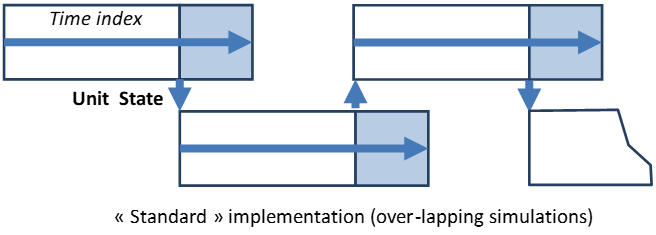

# Miscellaneous

## Antares at one glance

This section gives a summary of the whole simulation process followed by Antares in Economy simulations (Adequacy and Draft simulations being simplified variants of it):

1. Load or Generate [stochastic generators] Time-series of every kind for all system areas

2. For each Monte-Carlo year, pick up at random or not [scenario builder] one time-series of each kind for each area

3. For each area and each reservoir:

    1. Split up the annual overall hydro storage inflows into monthly hydro storage generation, taking into account reservoir constraints, hydro management policy and operation conditions (demand, must-run generation, etc.) [heuristic + optimizer]

    2. For every day of each month, break down the monthly hydro energy into daily blocks, taking into account hydro management policy and operation conditions (demand, must-run generation, etc.) [heuristic + optimizer]. Aggregate daily blocks back into weekly hydro storage energy credits (used if the final optimization is run with full weekly 168-hour span)

    3. For each week of the year (daily/weekly hydro energy credits are now known in every area), run a three-stage 168-hour optimization cycle (or seven 24-hour optimizations, if the optimization preference is set to "daily"). This aim of this cycle is to minimize the sum of all costs throughout the optimization period. This sum may include regular proportional fuel costs, start-up and no-load heat costs, unsupplied and spilled energy costs, and hurdle costs on interconnection. The solution has to respect minimum and maximum limits on the power output of each plant, minimum up and down durations, as well as interconnection capacity limits and "binding constraints" at large (which may be technical – e.g. DC flow rules – or commercial – e.g. contracts). Note that an accurate resolution of this problem requires mixed integer linear programming (because of dynamic constraints on thermal units). A simplified implementation of this approach is used when the advanced parameter "Unit commitment" is set on "accurate". This high quality option may imply long calculation times. This is why, when "Unit commitment" is set on "fast", Antares makes further simplifications that save a lot of time (starting costs are not taken into account within the optimization step but are simply added afterwards, units within a thermal cluster are subject to starting up/shutting down constraints more stringent than the minimum up/down durations). In both cases, the general optimization sequence is as follows:

		i. Minimization of the overall system cost throughout the week in a continuous relaxed linear optimization. Prior to the optimization, an 8760-hourly vector of operating reserve R3 (see next section) may be added to the load vector (this will lead in step (ii) to identify plants that would not be called if there were no reserve requirements. Their actual output will be that found in step (iii), wherein the load used in the computations takes back its original value)
		
		ii. So as to accommodate the schedule resulting from (i), search for integer values of the on/off variables that satisfy the dynamic constraints with the smallest possible cost increase.
		
		iii. Take into account the integer variables found in (ii) and solve again the optimal schedule problem for the week.

## Operating reserves modeling

Many definitions may be encountered regarding the different operating reserves (spinning / non spinning, fast / delayed, primary-secondary-tertiary, frequency containment reserve – frequency restoration reserve – replacement reserve, etc.).

Besides, all of them need not be modeled with the same level of accuracy in a simulator such as Antares. Furthermore, the best way to use the concept is not always quite the same in pure Adequacy studies and in Economy studies.

Several classes of reserves may therefore be used in Antares; how to use them at best depend on the kind and quality of operational data at hand, and on the aim of the studies to carry out; though all kinds of reserves may always be defined in the INPUT dataset, the set of reserves that will effectively be used depends on the kind of simulations to run. Note that any or all classes of reserves may be ignored in a given simulation (without being removed from the INPUT dataset) by setting the matching "optimization preference" to "ignore reserve X":

- **Pre-allocated reserve on dispatchable thermal plants (R0)** <br/>
  This reserve (which corresponds to the parameter "spinning" attached to the thermal plants) is expressed as a percentage of the nominal capacity of the plants. It is simply used as a derating parameter: for instance, a 1000 MW plant with a 2.5% spinning parameter will not be able to generate more than 975 MW. It is important to notice that, if the plant is not scheduled on, it will NOT contribute to the spinning reserve (to be effectively available, the 25 MW of reserve would need the plant to be started). This first class of reserve is available for **Adequacy** as well as for **Economy** simulations but is not taken into account in **Draft** simulations.


- **Primary and strategic reserves (R1,R2):** <br/>
  These two reserves may be used in **Draft** simulations, with the following meaning:
    - Primary reserve must be supplied by local generation and has a higher priority than load: for instance, if overall load L=43.6 GW, overall generation G=44.0 GW, primary reserve = 0.7 GW, then an adequacy analysis will show 300 MW of unsupplied energy. The primary reserve is in essence a frequency containment reserve.
    - The strategic reserve is an amount of power that should remain available for balancing domestic load, i.e. cannot be exported regardless of the load/generation balance of the neighboring areas. For instance, if loads in area A and B are LA= 45 GW and LB= 50 GW, if available generations are GA= 49 GW and GB = 47 GW, and if there is a 1.5 GW strategic reserve to be kept in A, then an adequacy analysis will show 500 MW of unsupplied energy in B. The strategic reserve may include amounts of power known to be unavailable for actual exports (for instance, because of grid limitations not thoroughly modeled in the Antares study dataset).


- **Day-ahead reserve (R3):** <br/>
  This reserve is available in **Adequacy** and **Economy** simulations, with the following meaning:
  "For any day D, to be able to accommodate last-minute random variations of the expected demand and/or generation (as they were seen from day D -1), a certain amount of power (R3) should be ready to be available at short notice".
  <br/>
  In actual operating terms, R3 is a complex (spinning/non-spinning) mix as well as (hydro/thermal) mix. It may involve or not part of the primary and secondary power/frequency regulation reserves. R3 may represent as much as the overall amount of frequency containment reserve, frequency restoration reserve and replacement reserve required for operation on day D, as seen from day D-1.
  <br/>
  In the simulations, R3 is construed as a "virtual" increase of the load to serve, which influences the optimal unit commitment and dispatch (because of minimum stable power levels and minimum On / Down times).

**IMPORTANT:**

The optimization makes sure that, should the need arise, reserve R3 will actually be available where it is needed **BUT** there is no commitment regarding whether this service should be provided by an increase of local generation, a decrease of exports or even an increase of imports: the optimizer will choose the mix leading to the minimal cost for the system.

Note that this "standard" feature of Antares makes it possible to assess the potential value of keeping some headroom in interconnections for the purpose of transferring operating reserves, when "remote" reserves are less expensive than domestic ones.

The table below gives an overview of the different reserves available in Antares

| | _Economy_ | _Adequacy_ | _Draft_ |
|:---:|:---:|:---:|:---:|
| _R0_ | _Yes_ | _Yes_ | _No_ |
| _R1_ | _No_ | _No_ | _Yes_ |
| _R2_ | _No_ | _No_ | _Yes_ |
| _R3_ | _Yes_ | _Yes_ | _No_ |


## The heuristic for seasonal hydro pre-allocation


This heuristic, first introduced in broad terms in [Active windows](4-active_windows.md), chapter "hydro", is fully detailed in this paragraph.

Basically, the seasonal hydro pre-allocation process comprises two stages carried out two times
(first time: monthly scale; second time: daily scale).

- Stage 1: Definition of an allocation ideal modulation profile, which may be based (or not) on local and/or
  remote load profiles.
- Stage 2: Mitigation of the previous raw profile to obtain a feasible hydro ideal target,
  compatible as much as possible with reservoir rule curves.

The description given hereafter makes use of the following local notations,
not be confused with those of the document "optimization problem formulation"
(dedicated to the optimal hydro-thermal unit-commitment and dispatch problem):

- \\(Z\\) Number of Areas (zones \\(z\\)) in the system
- \\(M_{zh}\\) Hourly time-series of cumulated must-generation of all kinds for zone \\(z\\)
- \\(M_{zd}\\) Daily time-series of cumulated must-generation of all kinds for zone \\(z\\) (sum of \\(M_{zh}\\))
- \\(M_{zm}\\) Monthly time-series of cumulated must-generation of all kinds for zone \\(z\\) (sum of \\(M_{zh}\\))
- \\(M_{z.}\\) Either \\(M_{zd}\\) or \\(M_{zm}\\), relevant time index "." is defined by the context
- \\(L_{z.}\\) Time-series of "natural" load for zone \\(z\\)
- \\(A\\) Inter-area hydro-allocation matrix (dimension_ \\(x Z\\) ) \\(A_{uv}\\) is a weight given to the load
of area \\(u\\) in the definition of the monthly and daily primary hydro generation target of area \\(v\\)
	Extreme cases are:
	
	- **A is the identity matrix**  
	  The hydro storage energy monthly and weekly profiles of each zone \\(z\\) depend only on the local demand and
	  must-run generation in \\(z\\)
	- **A has a main diagonal of zeroes**  
	  The hydro storage energy monthly and weekly profiles of each zone \\(z\\) do not depend at all on the local
	  demand and must-run generation in \\(z\\)
- \\(L_{z.}^+\\) Time-series of "net" load for zone \\(z\\), defined as: \\(L{z.}^+ = L{z.} - M{z.}\\)
- \\(L_{z.}\\) Time-series of "weighted" load for zone \\(z\\), defined as:_ \\(L_{z.} = A^t L_{z.}^+\\)

<ins>All following parameters are related to the generic zone \\(z\\):</ins>

- \\(\alpha\\) "inter-monthly generation breakdown" parameter

- \\(\beta\\) "inter-daily generation breakdown" parameter

- \\(j\\) "follow-load" parameter

- \\(\mu\\) "reservoir-management" parameter

- \\(S\\) Reservoir size

- \\(\overline{S_d}\\) Reservoir maximum level at the end of day d, expressed as a fraction of \\(S\\) (rule curve)

- \\(\underline{S_d}\\) Reservoir minimum level at the end of day d, expressed as a fraction of \\(S\\) (rule curve)

- \\(S_0\\) Reservoir initial level at the beginning of the first day of the "hydro-year"

- \\(I_d\\) Natural inflow of energy to the reservoir during day d

- \\(I_m\\) Natural inflow of energy to the reservoir during month m (sum of \\(I_d\\)

- \\(\overline{W_d}\\) Maximum energy that can be generated on day d (standard credit)

<ins> All following variables, defined for both stages, are related to the generic zone: </ins>

- \\(S_d^k\\) Reservoir level at the end of day d, at the end of stage k of pre-allocation

- \\(S_m^k\\) Reservoir level at the end of month m, at the end of stage k of pre-allocation

- \\(O_d^k\\) Overflow from the reservoir on day d, at the end of stage k of pre-allocation (inflow in excess to an already full reservoir)

- \\(W_d^k\\) Energy to generate on day d, at the end of stage k of pre-allocation

- \\(W_m^k\\) Energy to generate on month m, at the end of stage k of pre-allocation


Following variables and parameters are local to linear optimization problems \\(M\\) &amp; \\(D(m)\\)
solved within the heuristic. For the sake of clarity, the same generic index is used for all time steps,
knowing that in \\(M\\) there are 12 monthly time-steps, while in \\D(m)t\\) there are from 28 to 31 daily
time-steps. Costs \\(\gamma_{Var}\\) given to these variables are chosen to enforce a logical hierarchy
of penalties (letting the reservoir overflow is worse than violating rule curves, which is worse than deviating
from the generation objective assessed in stage 1, etc.)

- \\(Y\\) Generation deficit at the end of the period, as compared to the objective aimed at

- \\(O_t\\) Overflow from the reservoir on time step \\(t\\)

- \\(G_t, \overline{G_t}\\) Optimal generation and maximum generation on time step \\(t\\)

- \\(T_t\\) Generation objective assessed in the first stage, for time step t ( \\(W_m^1\\) or \\(W_d^1\\))

- \\(S_t, \overline{S_t}, \underline{S_t}\\) Optimal stock level, maximum level, minimum level at the end of time step \\(t\\)

- \\(I_t\\) Natural inflow on time step \\(t\\)

- \\(D_t\\) Deviation (absolute difference) between target reached and initial aim

- \\(\Delta\\) Maximum deviation throughout the period

- \\(V_t^+\\) Amplitude of the violation of the upper rule curve at time step \\(t\\)

- \\(V_t^-\\) Amplitude of the violation of the lower rule curve at time step \\(t\\)

- \\(Y\\) Maximum violation of lower rule curve throughout the period


**General heuristic for each zone**

_Begin_

$$if (not.\mu) : \{ S \leftarrow \infty ; \underline{S_d} \leftarrow 0; \overline{S_d}; S_0 \leftarrow S/2 \}$$

_M1:_

$$if (j \text{ and } \mu) : \text{for } m\in [1, 12]: \{ W_m^1 \leftarrow L_m^{\alpha}. (\sum_{m}{I_m}) \over (\sum_{m}{L_m^{\alpha}}) \}$$

$$else: \text{for } m\in [1, 12]: \{W_m^1 \leftarrow I_m\}$$


_M2:_

_$$\text{for } m\in [1, 12]: W_m^2 \leftarrow \text{Solution of linear problem M}$$_

_D1:_

$$if (j): \text{for } d\in [1, 31]: \{ W_d^1 \leftarrow L_d^{\beta}. (W_m^2) \over (\sum_{d\in m}{L_d^{\beta}}) \}$$

$$else: \text{for } d\in [1, 31]: \{ W_d^1 \leftarrow I_d . (W_m^2) \over (\sum_{d\in m}{I_d}) \}$$

_D2:_

$$\text{for } m \in [1, 12]: W_{d\in m}^2 \leftarrow \text{Solution of linear problem D(m)}$$

_End_

Note: In the formulation of the optimal hydro-thermal unit-commitment and dispatch problem (see dedicated document), the reference hydro energy __HIT__ used to set the right hand sides of hydro- constraints depends on the value chosen for the optimization preference "simplex range" and is defined as follows:

- Daily : for each day **d** of week \\(\omega\\) : \\(HIT = W_d^2\\)
- Weekly : for week \\(\omega\\): \\(HIT = \sum_{d\in \omega}{W_d^2}\\)

**Optimization problem M**

$$\min_{G_t, S_t, ...}{\gamma_{\Delta}\Delta + \gamma_Y Y + \sum_{t}{(\gamma_D D_t + \gamma_{V+} V_t^+ + \gamma_{V-} V_t^-)}}$$

s.t

$$S_t \geq 0$$

$$S_t \leq S$$

<center> \\(S_t + G_t - S_{t-1} = I_t\\) (see note [^monthly_allocation]) </center>

$$\sum_{t}{G_t} = \sum_{t}{T_t}$$

$$G_t - D_t \leq T_t$$

$$G_t + D_t \geq T_t$$

$$V_t^- + S_t \geq \underline{S_t}$$

$$V_t^+ - S_t \geq -\overline{S_t}$$

$$Y - V_t^- \geq 0$$


**Optimization problems \\(D(m)\\)**

$$\min_{G_t, S_t, ...}{\gamma_{\Delta}\Delta + \gamma_Y Y + \sum_{t}{(\gamma_D D_t + \gamma_{V-} V_t^- + \gamma_{O} O_t + \gamma_S S_t)}}$$
s.t

$$S_t \geq 0$$

$$S_t \leq S$$

$$G_t \geq 0$$

$$G_t \leq \overline{G_t}$$

<center>\\(S_t + G_t + O_t - S_{t-1} = I_t\\) (see note [^daily_allocation])</center>

<center> \\(\sum_{t}{G_t + Y} = \sum_{t}{T_t} + Y_{m-1}\\) (value of Y previously found in solving **\\(D(m-1)\\)**) </center>

$$G_t - D_t \leq T_t$$

$$G_t + D_t \geq T_t$$

$$\Delta - D_t \geq 0$$

$$V_t^- + S_t \geq \underline{S_t}$$

$$Y - V_t^- \geq 0$$

## Conventions regarding colors and names

- Names for areas, thermal plants, etc.
  Name length should not exceed 256 characters.
  Characters must belong to:
  { A-Z , a-z , 0-9 , - , \_ , ( , ) , &amp; , comma , space }


- Colors:
  After being entered in the GUI, some numeric fields can see their color change. The meaning of that is:
    - Turn to red: invalid value. Saving the study in this state is possible, but the field will have to be corrected at some point in the future. Should the simulator be launched on the dataset, it will detect an error and stop.

    - Turn to orange: value is valid, though unusual (user may want to double-check data).


- Abbreviations :  
	  - Fields requiring to be filled out with "YES" or "NO" can alternatively accept "Y" , "1" or "N" , "0"  
	  - Fields requiring to be filled out with "ON" or " OFF" can alternatively accept "true", "1" or "false", "0"  
	  - Fields requiring to be filled out with "annual" or "monthly" can alternatively accept "a" or "m"  
	  - Fields requiring to be filled out with: "Raw" ,"Detrended"," Beta", "Normal", "Uniform", " Gamma", " Weibull" can alternatively accept: "R", "D", " B", "N", "U", "G", "W"


## Definition of regional districts

Typical uses of the "district" feature are:

1) On a large system, define an "all system" zone to get an overall synthesis on all the system nodes

2) In a study involving different countries modeled by different regions, define "country" macro-nodes to aggregate regional results to the national level.

3) In a study using some specific modeling such as PSP modeling with fake nodes, define a local cluster involving all the relevant real and fake nodes to simplify the edition of results.

Hereafter is described the process to follow to bypass the GUI for the definition of districts. <br/>
It is based on the edition of a special "sets.ini" file.

**IMPORTANT :**
- Make sure that the sets.ini file is ready for use before opening the Antares study. Attempts to update the sets.ini file while the study is opened will not be effective.
- Definition of meaningless districts (references to nodes that do not exist,…) will generate warnings in the GUI log files.

**HOW TO UPDATE / CREATE the file** : Use Notepad (or equivalent)

**WHERE TO FIND / STORE THE FILE** : INPUT/areas/sets.ini

**PRINCIPLE:**

The file is divided in consecutive sections, one for each district to define.

A section contains:

a) A header line that gives its name to the district. The header syntax is: `[district_name]`   
	To avoid confusion with the real area names, the results regarding this macro-area will later be found in the OUTPUT files under a name bearing the prefix "@", i.e. `@district_name`

b) A list of parametrized building rules to be processed in their apparition order.  
	The different elementary rules are:  
	+= area\_name : add the area "area\_name" to the district <br/>
	-= area\_name : remove the area "area\_name" from the district <br/>
	apply-filter = add-all : add all areas to the district <br/>
	apply-filter = remove-all : remove all areas (clear the district)

c) A special "output" parameter that defines whether the results for the district will actually be computed or not
(this latter option allows inactivating parts of the sets.ini without altering the file).  
	The syntax is: `output=false` or `output= true`.

**EXAMPLES OF SETS.INI FILES**

a) File defining a single district named "set1" involving three areas named "area1, area3, area42":

```ini
[set1]
+ = area1
+ = area3 <br/>
+ = area42
output = true
```

b) File defining a district gathering all areas but five:

```ini
[most of the system
apply-filter = add-al
- = country 
- = neighbour 
- = fake antenna 1
- = region 
- = region 3
output = true
```
c) File defining two districts, the current simulation will ignore the second one:

```ini
[All countries]
apply-filter= add-all
output=true


[All but one]
apply-filter = add-all
-= special region 12
output=false
```

## The Annual System Cost Output file

In addition to the general files introduced in [Output Files](5-output_files.md), the Output folder of each economic or adequacy simulation includes, at its root, a file "Annual\_System\_Cost.txt" It presents the metrics of a global Monte-Carlo variable further denoted ASC.

The value of ASC for any given simulated year is defined as the sum, over all areas and links, of the annual values of the area-variable "OV.COST" and of the link-variable "HURD. COST".

The metrics displayed in the "Annual system cost" file take the form of four values:

- Expectation EASC

- Standard deviation SASC

- Minimum LASC

- Maximum UASC

As with all other random variables displayed in the Antares Output section, the computed standard deviation of the variable can be used to give a measure of the confidence interval attached to the estimate of the expectation. For a number of Monte-Carlo years N, the law of large numbers states for instance that there is a 95 % probability for the actual expectation of ASC to lie within the interval:

<center>**EASC +/- 1.96 (SASC / sqrt(N))**</center>

There is also a 99.8 % probability that it lies within the interval:

<center>**EASC +/- 3 (SASC / sqrt(N))**</center>

## The "export mps" optimization preference

This preference can be set either on "false" or "true". Choosing either value does not influence the way calculations are carried out, nor does it change their results.

The effect of this preference is that, if the "true" value is selected, Antares will produce and store in the simulation output folder two files for every linear problem solved in the whole simulation.

The first file ("problem" file) contains a standardized description of the mathematical problem solved by Antares' built-in linear solver. The format standard used in this file is known as "mps".

The second file ("criterion" file) contains the value of the optimal (minimum) value found for the objective function of the optimization problem (overall system cost throughout a day or a week).

All commercial as well as Open Source linear solvers are able to process mps files. As a consequence, tests aiming at comparing Antares' solver with other commercial solutions can be easily carried out: all that has to be done is to submit the mps problem to the solver at hand and measure its performances (calculation time, criterion value) with those of Antares.

Note that this kind of comparisons brings no information regarding the quality of the physical modelling on which the simulation is based. It is useful, however, to gather evidence on mathematical grounds.

File names are structured as follows:

- When the optimization preference "simplex range" is set on "week": <br/>
  Problem-MC year-week number-date-time.mps <br/>
  Criterion-MC year-week number-date-time.txt

- When the optimization preference "simplex range" is set on "day": <br/>
  Problem-MC year-week number-date-time-day number.mps <br/>
  Criterion-MC year-week number-date-time-day number.txt

Besides, each economic problem generally demands to be solved through two successive optimization problems. Files related to these two problems will bear almost the same name, the only difference being the "time" suffix. The files related to the second optimization (final Antares results) are those that bear the latest tag.

Finally, it is possible that, on special occasions (very small files), the files attached to the two optimization rounds begin to be printed within the same second. In that case, an additional suffix is added before the mps or txt extension.

**Note that:**

- _The disk space used to store mps file is not included in the disk resources assessment displayed in the resources monitor menu._

- _The extra runtime and disk space resulting from the activation of the "mps" option may be quite significant. This option should therefore be used only when a comparison of results with those of other solvers is actually intended._

## The "Unfeasible Problems Behavior" optimization preference

This preference can take any of the four values:

Error Dry, Error Verbose, Warning Dry, Warning Verbose

If "Error Dry" or "Error Verbose" is selected, the simulation will stop right after encountering the first mathematically unfeasible optimization (daily or weekly) problem. No output will be produced beyond this point. Should the dataset contain several unfeasible problems (i.e. regarding different weeks of different MC years), it is possible that successive runs of the same simulation stop at different points (if parallel computation is used, the triggering problem may differ from one run to the other).

If "Warning Dry" or "Warning Verbose" is selected, the simulation will skip all mathematically unfeasible optimization (daily or weekly) problems encountered, fill out all results regarding these problems with zeroes and resume the simulation. The hydro reservoir levels used for resuming the simulation are those reached at the end of the last successful week.

With "Dry" options no specific data are printed regarding the faulty problem(s). With "Verbose" options, the full expression of the faulty problem(s) is printed in the standard "mps" format, thus allowing further analysis of the infeasibility issue.

## The "Reservoir Level Initialization" advanced parameter

This parameter can take the two values "cold start" or "hot start". [default: cold start]. Simulations results may in some circumstances be heavily impacted by this setting, hence proper attention should be paid to its meaning before considering changing the default value.

**General:**

This parameter is meant to define the initial reservoir levels that should be used, in each system area, when processing data related to the hydro-power storage resources to consider in each specific Monte-Carlo year (see [Active windows](4-active_windows.md)).

As a consequence, Areas which fall in either of the two following categories are not impacted by the value of the parameter:
- No hydro-storage capability installed
- Hydro-storage capability installed, but the "reservoir management" option is set to "False"

Areas that have some hydro-storage capability installed and for which explicit reservoir management is required are concerned by the parameter. The developments that follow concern only this category of Areas.

**Cold Start:**

On starting the simulation of a new Monte-Carlo year, the reservoir level to consider in each Area on the first day of the initialization month (see [Active windows](#active-windows)) is randomly drawn between the extreme levels defined for the Area on that day.

More precisely:

- The value is drawn according to the probability distribution function of a "Beta" random variable, whose four internal parameters are set so as to adopt the following behavior:  
  Lower bound: Minimum reservoir level.  
  Upper bound: Maximum reservoir level  
  Expectation: Average reservoir level  
  Standard Deviation: (1/3) (Upper bound-Lower bound)

- The random number generator used for that purpose works with a dedicated seed that ensures that results can be reproduced
  [^17] from one run to another, regardless of the simulation runtime mode (sequential or parallel)
  and regardless of the number of Monte-Carlo years to be simulated [^18].

**Hot Start:**

On starting the simulation of a new Monte-Carlo year, the reservoir level to consider in each Area on the first day of the initialization month is set to the value reached at the end of the previous simulated year, if three conditions are met:

- The simulation calendar is defined throughout the whole year, and the simulation starts on the day chosen for initializing the reservoir levels of all Areas.

- The Monte-Carlo year considered is not the first to simulate, or does not belong to the first batch of years to be simulated in parallel. In sequential runtime mode, that means that year #N may start with the level reached at the end of year #(N-1). In parallel runtime mode, if the simulation is carried out with batches of B years over as many CPU cores, years of the k-th batch
  [^19] may start with the ending levels of the years processed in the (k-1)-th batch.

- The parallelization context (see [System requirements](#9-system-requirements)) must be set so as to ensure that the M Monte-Carlo years to simulate will be processed in a round number of K consecutive batches of B years in parallel (i.e. M = K\*B and all time-series refresh intervals are exact multiple of B).

The first year of the simulation, and more generally years belonging to the first simulation batch in parallel mode, are initialized as they would be in the cold start option.

**Note that:**

- _Depending on the hydro management options used, the amount of hydro-storage energy generated throughout the year may either match closely the overall amount of natural inflows of the same year, or differ to a lesser or greater extent. In the case of a close match, the ending reservoir level will be similar to the starting level. If the energy generated exceeds the inflows (either natural or pumped), the ending level will be lower than the starting level (and conversely, be higher if generation does not reach the inflow credit). Using the "hot start" option allows to take this phenomenon into account in a very realistic fashion, since the consequences of hydro decisions taken at any time have a decisive influence on the system's long term future._

- _When using the reservoir level "hot start" option, comparisons between different simulations make sense only if they rely on the exact same options, i.e. either sequential mode or parallel mode over the same number of CPU cores._

- _More generally, it has to be pointed out that the "hydro-storage" model implemented in Antares can be used to model "storable" resources quite different from actual hydro reserves: batteries, gas subterraneous stocks, etc._

## The "Hydro Heuristic policy" advanced parameter

This parameter can take the two values "Accommodate rule curves" or "Maximize generation". [default: Accommodate rule curves].

**General:**

This parameter is meant to define how the reservoir level should be managed throughout the year, either with emphasis put on the respect of rule curves or on the maximization of the use of natural inflows.

**Accommodate rule curves:**

Upper and lower rule curves are accommodated in both monthly and daily heuristic stages (described page 58). In the second stage, violations of the lower rule curve are avoided as much as possible (penalty cost on \\(\Psi\\). higher than penalty cost on Y).  This policy may result in a restriction of the overall yearly energy generated from the natural inflows.

**Maximize generation:**

Upper and lower rule curves are accommodated in both monthly and daily heuristic stages (described page 58). In the second stage, incomplete use of natural inflows is avoided as much as possible (penalty cost on Y higher than penalty cost on \\(\Psi\\)). This policy may result in violations of the lower rule curve.

## The "Hydro Pricing mode" advanced parameter

This parameter can take the two values "fast" or "accurate". [default: fast].

Simulations carried out in "accurate" mode yield results that are theoretically optimal as far as the techno-economic modelling of hydro (or equivalent) energy reserves is concerned. It may, however, require noticeably longer computation time than the simpler "fast" mode.

Simulations carried out in "fast" mode are less demanding in computer resources. From a qualitative standpoint, they are expected to lead to somewhat more intensive (less cautious) use of stored energy.

**General:**

This parameter is meant to define how the reservoir level difference between the beginning and the end of an optimization week should be reflected in the hydro economic signal (water value) used in the computation of optimal hourly generated /pumped power during this week.

**Fast:**

The water value is taken to remain about the same throughout the week, and a constant value equal to that found at the date and for the level at which the week_ **begins** _is used in the course of the optimization. A value interpolated from the reference table for the exact level reached at each time step within the week is used ex-post in the assessment of the variable "H.COST" (positive for generation, negative for pumping) defined in [Output Files](5-output_files.md). This option should be reserved to simulations in which computation resources are an issue or to simulations in which level-dependent water value variations throughout a week are known to be small.

**Accurate:**

The water value is considered as variable throughout the week. As a consequence, a different cost is used for each "layer" of the stock from/to which energy can be withdrawn/injected, in an internal hydro merit-order involving the 100 tabulated water-values found at the date at which the week **ends**. A value interpolated from the reference table for the exact level reached at each time step within the week is used ex-post in the assessment of the variable "H.COST" (positive for generation, negative for pumping) defined in [Output Files](5-output_files.md). This option should be used if computation resources are not an issue and if level-dependent water value variations throughout a week must be accounted for.

## The "Unit Commitment mode" advanced parameter

This parameter can take the two values "fast" or "accurate". [default: fast].

Simulations carried out in "accurate" mode yield results that are expected to be close to the theoretical optimum as far as the techno-economic modelling of thermal units is concerned. They may, however, require much longer computation time than the simpler "fast" mode.

Simulations carried out in "fast" mode are less demanding in computer resources. From a qualitative standpoint, they are expected to lead to a more costly use of thermal energy. This potential bias is partly due to the fact that in this mode, start-up costs do not participate as such to the optimization process but are simply added ex post.

**General:**

In its native form [^20], the weekly optimization problem belongs to the MILP (Mixed Integer Linear Program) class. The Integer variables reflect, for each time step, the operational status (running or not) of each thermal unit. Besides, the amount of power generated from each unit can be described as a so-called semi-continuous variable (its value is either 0 or some point within the interval [Pmin , Pmax]). Finally, the periods during which each unit is either generating or not cannot be shorter than minimal (on- and off-) thresholds depending on its technology.

The Unit Commitment mode parameter defines two different ways to address the issue of the mathematical resolution of this problem. In both cases, two successive so-called "relaxed" LP global optimizations are carried out. In-between those two LPs, a number of local IP (unit commitment of each thermal cluster) are carried out.

Besides, dynamic thermal constraints (minimum on- and off- time durations) are formulated on time-indices rolling over the week; this simplification brings the ability to run a simulation over a short period of time, such as one single week extracted from a whole year, while avoiding the downside (data management complexity, increased runtime) of a standard implementation based on longer simulations tiled over each other (illustration below).




**Fast:**

In the first optimization stage, integrity constraints are removed from the problem and replaced by simpler continuous constraints.

For each thermal cluster, the intermediate IP looks simply for an efficient unit-commitment compatible with the operational status obtained in the first stage, with the additional condition (more stringent than what is actually required) that on- and off- periods should be exact multiple of the higher of the two thresholds specified in the dataset.

In the second optimization stage, the unit commitment set by the intermediate IPs is considered as a context to use in a new comprehensive optimal hydro-thermal schedule assessment. The amount of day-ahead (spinning) reserve, if any, is added to the demand considered in the first stage and subtracted in the second stage. Start-up costs as well as No-Load Heat costs are assessed in accordance with the unit-commitment determined in the first stage and are added ex post.

**Accurate:**

In the first optimization stage, integrity constraints are properly relaxed. Integer variables describing the start-up process of each unit are given relevant start-up costs, and variables attached to running units are given No-Load Heat costs (if any), regardless of their generation output level. Fuel costs / Market bids are attached to variables representing the generation output levels.

For each thermal cluster, the intermediate IP looks for a unit-commitment compatible with the integrity constraints in the immediate neighborhood of the relaxed solution obtained in the first stage. In this process, the dynamic thresholds (min on-time, min off-time) are set to their exact values, without any additional constraint.

In the second optimization stage, the unit commitment set by the intermediate IP is considered as a context to use in a new comprehensive optimal hydro-thermal schedule assessment. The amount of day-ahead (spinning) reserve, if any, is added to the demand considered in the first stage and subtracted in the second stage.

## The "Renewable Generation modeling" advanced parameter

This parameter can take the two values “aggregated” or “cluster”. For a new study, it will default to cluster. For a legacy (Antares version <8.1.0) study it will default to aggregated.

If the parameter is set to "aggregated”, the user will have access to the Wind & Solar windows, but not the Renewable window. When the parameter is set to “cluster", the Renewable window will be available, but not the Wind nor the Solar windows. The data stored in the windows that are not available will always be conserved. However, only Renewable data (and not the wind and solar data) will be considered for the calculations when the parameter is set to “cluster”. And only the wind and solar data (and not the renewable data) will be considered for the calculations when the parameter is set to “aggregated”.

The Renewable window can be filled out with the different renewable clusters inside each node. Each renewable cluster needs to have a group specified or will default to the «Other RES 1» group. Production Timeseries can be filled out much like the Thermal production ones. Note that unlike thermal clusters, negative production values are allowed. The Renewable window is described in more details in the “4. Active Windows” section. In the Simulation window, only “Ready-made” timeseries can be selected for renewables for now. This should be modified in a future release. The MC scenario builder for Renewables works the same way as for Thermal Clusters.

[^monthly_allocation]: In the first equation, \\(S_{t-1}\\) is either the initial stock \\(S_0\\) or the final stock of the previous year (hydro hot start)

[^daily_allocation]: In the first equation, \\(S_{t-1}\\) is either the initial stock used in M or the final stock of the previous month (\\(D(m-1)\\)

[^17]: As long as the System's list of Areas does not change

[^18]:E.g. : if three playlists A,B,C are defined over 1000 years (A: years 1 to 1000, B: years 1 to 100, C: Years 13,42,57,112), initial reservoir levels in each Area are identical in the playlists' intersection (years 13,42,57)

[^19]: If the playlist is full, these years have numbers # (k-1)B+1 ,…., #kB

[^20]: Described in the note "Optimization Problems Formulation"
