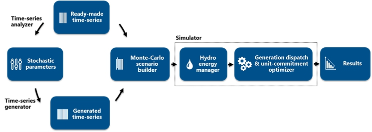
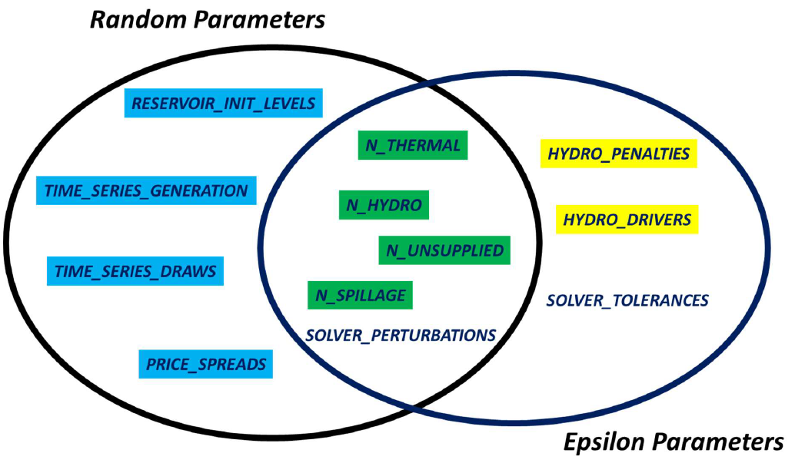

# Optimization model

[//]: # (TODO: update this page)
_**This section is under construction**_

**Document available on : [https://antares-simulator.org](https://antares-simulator.org/)**

## Introduction

The purpose of this document is to give every user of the **Antares\_Simulator** model (regardless of its version number), a detailed and comprehensive formulation of the main optimization problems solved by the application's inner optimization engine.

The aim of the information presented hereafter is to provide a transparent access to the inner workings of the software from a **formal** standpoint. Note that, aside from this conceptual transparency, the software itself offers an option that makes it possible for the user to print, in a standardized format, any or all of the optimization problems actually solved in the course of an **Antares\_Simulator** session [^1].

Used together with the elements developed in the next pages, this **practical** access to the internal model implemented the tool allows fair and open benchmarking with comparable software. Besides, another important issue regarding transparency is addressed by the release of **Antares\_Simulator** as an Open Source Gnu GPL 3.0 application, now changed to MPL-2.0.

So as to delimit the scope of the present document with as much clarity as possible, it is important to notice that a typical **Antares\_Simulator** session involves different steps that are usually run in sequence, either automatically or with some degree of man-in-the-loop control, depending on the kind of study to perform.

These steps most often involve:

1. GUI session dedicated to the initialization or to the updating of various input data sections (load time-series, grid topology, wind speed probability distribution, etc.)
2. GUI session dedicated to the definition of simulation contexts (definition of the number and consistency of the "Monte-Carlo years" to simulate)
3. Simulation session producing actual numeric scenarios following the directives defined in (2)
4. Optimization session aiming at solving all of the optimization problems associated with each of the scenarios produced in (3).
5. GUI session dedicated to the exploitation of the detailed results yielded by (4)

The scope of this document is exclusively devoted to step (4). Note that equivalent information regarding the other steps may be found in other documents made available either:

- Within the application itself, in the "?" menu
- On the **Antares\_Simulator** [^2] website (download section) : [https://antares-simulator.org](https://antares-simulator.org/)
- In technical publications referenced in the bibliography section of the website

The following picture gives a functional view of all that is involved in steps (1) to (5). In this illustration, Step (4), whose goal is to solve the problems introduced in this document, is materialized by the red box.

The number and the size of the individual problems to solve (a least-cost hydro-thermal unit-commitment and power schedule, with an hourly resolution and throughout a week, over a large interconnected system) make optimization sessions often computer-intensive. Note that the content of the blue "hydro energy manager" box appearing on the previous figure, whose purpose is to deal with energy storage issues at the seasonal scale, is not detailed in the present document but in the ["Miscellaneous"](../reference-guide/08-miscellaneous.md#the-heuristic-for-seasonal-hydro-pre-allocation) section.

Depending on user-defined results accuracy requirements, various practical options allow to simplify either the formulation of the weekly UC & dispatch problems (e.g. do not account for constraints associated with operational reserves) or their resolution (i.e. find, for the native MILP, an approximate solution based on two successive LPs). For the sake of simplicity and clarity, the way these options are used to revise the primary problem formulation is not detailed hereafter. Likewise, many simplifications are introduced to keep notations as light as possible. This is why, for instance, the overall sum of load, wind power generation, solar power generation, run of the river generation, and all other kinds of so-called "must-run" generation is simply denoted "load" in the present document.

## Typology of the problems solved

In terms of power studies, the different fields of application Antares has been designed for are the following:

- **Generation adequacy problems :** assessment of the need for new generating plants so as to keep the security of supply above a given critical threshold

What is most important in these studies is to survey a great number of scenarios that represent well enough the random factors that may affect the balance between load and generation. Economic parameters do not play as much a critical role as they do in the other kinds of studies, since the stakes are mainly to know if and when supply security is likely to be jeopardized (detailed costs incurred in more ordinary conditions are of comparatively lower importance). In these studies, the default Antares option to use is the "Adequacy" simulation mode.

- **Transmission project profitability :** assessment of the savings brought by a specific reinforcement of the grid, in terms of decrease of the overall system generation cost (using an assumption of fair and perfect market) and/or improvement of the security of supply (reduction of the loss-of-load expectation).

In these studies, economic parameters and the physical modeling of the dynamic constraints bearing on the generating units are of paramount importance. Though a thorough survey of many "Monte-Carlo years" is still required, the number of scenarios to simulate is not as large as in generation adequacy studies. In these studies, the default Antares option to use is the "Economy" simulation mode.

- **Generation and/or Transmission expansion planning:** rough assessment of the location and consistency of profitable reinforcements of the generating fleet and/or of the grid at a given horizon, on the basis of relevant reference costs and taking into account feasibility local constraints (bounds on the capacity of realistic reinforcements).

These long term studies clearly differ from the previous ones in the sense that the generation and transmission assets that define the consistency of the power system are no longer passive parameters but are given the status of active problem variables. In the light of both the nature and the magnitude of the economic stakes, there is comparatively a lesser need than before for an accurate physical modeling of fine operational constraints or for an intensive exploration of a great many random scenarios. The computer intensiveness of expansion studies is, however, much higher than that of the other types because the generic optimization problem to address happens to be much larger.

The common rationale of the modeling used in all of these studies is, whenever it is possible, to decompose the general issue (representation of the system behavior throughout many years, with a time step of one hour) into a series of standardized smaller problems.

In **Antares\_Simulator**, the "elementary" optimization problem resulting from this approach is that of the minimization of the overall system operation cost over a week, taking into account all proportional and non-proportional generation costs, as well as transmission charges and "external" costs such as that of the unsupplied energy (generation shortage) or, conversely, that of the spilled energy (generation excess).

In this light, carrying out generation adequacy studies or transmission projects studies means formulating and solving a series of a great many week-long operation problems (one for each week of each Monte-Carlo year ), assumed to be independent. This generic optimization problem will be further denoted $\mathcal{P}^k$, where $k$ is an index encompassing all weeks of all Monte-Carlo years.

Note that this independency assumption may sometimes be too lax, because in many contexts weekly problems are actually coupled to some degree, as a result of energy constraints (management of reservoir-type hydro resources, refueling of nuclear power plants, etc.). When appropriate, these effects are therefore dealt with before the actual decomposition in weekly problems takes place, this being done[^3] either of the following way (depending on simulation options):

1. Use of an economic signal (typically, a shadow "water value") yielded by an external preliminary stochastic dynamic programming optimization of the use of energy-constrained resources.
2. Use of heuristics that provide an assessment of the relevant energy credits that should be used for each period, fitted so as to accommodate with sufficient versatility different operational rules.

Quite different is the situation that prevails in expansion studies, in which weekly problems cannot at all be separated from a formal standpoint, because new assets should be paid for all year-long, regardless of the fact that they are used or not during such or such week : the generic expansion problem encompasses therefore all the weeks of all the Monte-Carlo years at the same time. It will be further denoted $\mathcal{P}$.

The next sections of this document develop the following subjects:

- Notations used for $\mathcal{P}^k$

- Formulation of $\mathcal{P}^k$

- Complements to the standard problems (how to make **Antares\_Simulator** work as a SCOPF )

- Miscellaneous complements to the standard problems

## Notations

### General notations

| Notation              | Explanation                                                                                                         |
|-----------------------|---------------------------------------------------------------------------------------------------------------------|
| $k \in  K$            | optimization periods (weeks) over which $P$ and $P^k$ are defined (omitted for simplicity)                          |
| $t \in T$             | individual time steps of any optimization period $ k\in K$ (hours of the week)                                      |
| $G(N,L)$              | undirected graph of the power system (connected)                                                                    |
| $n \in N$             | vertices of $G$, $N$ is an ordered set                                                                              |
| $l \in L$             | edges of $G$                                                                                                        |
| $A$                   | incidence matrix of $G$, dimension $N\times L$                                                                      |
| $g$                   | spanning tree of $G$                                                                                                |
| $C_g$                 | cycle basis associated with $g$, dimension $L\times (L+1-N)$                                                        |
| $L_n^+\subset L$      | set of edges for which $n$ is the upstream vertex                                                                   |
| $L_n^-\subset L$      | set of edges for which $n$ is the downstream vertex                                                                 |
| $u_l \in N$           | vertex upstream from $l$                                                                                            |
| $d_l \in N$           | vertex downstream from $l$                                                                                          |
| $u \cdot v$           | inner product of vectors $u$ and $v$                                                                                |
| $u_\uparrow^p$        | vector resulting from the permutation on $u \in \mathbb{R}^s$ : $ u\_\uparrow^p(i)=u(i+p\, \mathrm{mod}\,s)$        |

Problems $P^k$ and $P$ call for the definition of many parameters and variables further described.

The power system is supposed to be operated so as to be able to face some amount of unexpected demand increase with redispatching actions only (no change in the unit commitment). Two operating states are therefore modelled:

- **nominal**: Actual conditions match exactly all standard forecast. Demand is supplied by optimal generation dispatch (variable notation: _Var_).

- **uplifted**: Additional demand increases are applied to the nominal state and call for redispatch (activation of security reserves; variable notation: _$Var^s$_).

Note: Almost all variables of the system are defined twice (one value per state). For clarity's sake, only the definition of the nominal variables (_Var_) are given hereafter, the definition of variables _$Var^s$_ are implicit.

### Grid

| Notation                                       | Explanation                                                                                             |
|------------------------------------------------|---------------------------------------------------------------------------------------------------------|
| $C_l^+ \in \mathbb{R}^T_+$                     | initial transmission capacity from $u_l$ to $d_l$ (variable of $P$ and $P^k$)                           |
| $ \overline{C}\_l^+ \in \mathbb{R}^T\_+ $      | maximum transmission capacity from $u_l$ to $d_l$ (variable of $P$, not used in $P^k$)                  |
| $C_l^- \in \mathbb{R}^T_+$                     | initial transmission capacity from $d_l$ to $u_l$ (variable of $P$ and $P^k$)                           |
| $ \overline{C}^{-}\_l\in \mathbb{R}^T\_{+} $   | maximum transmission capacity from $d_l$ to $u_l$ (variable of $P$, not used in $P^k$)                  |
| $\Psi_l \in \mathbb{R}_+$                      | weekly cost of a maximum capacity investment                                                            |
| $x_l \in [0,1]$                                | transmission capacity investment level                                                                  |
| $F_l^+ \in \mathbb{R}^T_+$                     | power flow through $l$, from $u_l$ to $d_l$                                                             |
| $F_l^- \in \mathbb{R}^T_+$                     | power flow through $l$, from $d_l$ to $u_l$                                                             |
| $F_l\in \mathbb{R}^T$                          | total power flow through $l$, $F_l=F_l^+-F_l^-$                                                         |
| $\tilde{F}_t \in \mathbb{R}^T$                 | system flow snapshot at time $t$                                                                        |
| $\gamma_l^+\in \mathbb{R}^T$                   | transmission cost through $l$, from $u_l$ to $d_l$. Proportional to the power flow                      |
| $\gamma_l^-\in \mathbb{R}^T$                   | transmission cost through $l$, from $d_l$ to $u_l$. Proportional to the power flow                      |
| $Z_l \in \mathbb{R}\_+$                        | overall impedance of $l$                                                                                |

### Thermal units

| Notation                                                       | Explanation                                                                             |
|----------------------------------------------------------------|-----------------------------------------------------------------------------------------|
| $\theta \in \Theta_n$                                          | thermal clusters (sets of identical units) installed in node $n$                        |
| $\Theta$                                                       | set of all thermal clusters of the power system $\Theta = \cup_{n\in N} \Theta_n$       |
| $\overline{P}\_\theta \in \mathbb{R}^T_+$                      | maximum power output from cluster $\theta$, depends on units availability               |
| $\underline{P}\_\theta \in \mathbb{R}^T_+$                     | mimimum power output from cluster $\theta$, units availability allowing                 |
| $P_\theta \in \mathbb{R}^T_+$                                  | power output from cluster $\theta$                                                      |
| $\chi_\theta \in \mathbb{R}^T$                                 | power output from cluster $\theta$                                                      |
| $\sigma_\theta^+ \in \mathbb{R}^T$                             | startup cost of a single unit in cluster $\theta$                                       |
| $\tau_\theta \in \mathbb{R}^T$                                 | running unit in $\theta$ : cost independent from output level (aka NoLoadHeatCost)      |
| $l_\theta \in \mathbb{R}_+$                                    | unit in $\theta$ : minimum stable power output when running                             |
| $u_\theta \in \mathbb{R}_+$                                    | unit in $\theta$ : maximum net power output when running                                |
| $\Delta_\theta^+ \in \lbrace 1,\dots, \|T\|\rbrace$            | unit in $\theta$ : minumum on time when running                                         |
| $\Delta_\theta^- \in \lbrace 1,\dots, \|T\|\rbrace$            | unit in $\theta$ : minumum off time when not running                                    |
| $\Delta_\theta = \max(\Delta_\theta^-, \Delta_\theta^+) $      | duration above which both state changes are allowed                                     |
| $M_\theta \in \mathbb{N}^T$                                    | number of running units in cluster $\theta$                                             |
| $\overline{M}_\theta \in \mathbb{N}^T$                         | maximum number of running units in cluster $\theta$                                     |
| $\underline{M}_\theta \in \mathbb{N}^T$                        | minimum number of running units in cluster $\theta$                                     |
| $M_\theta^+ \in \mathbb{N}^T$                                  | number of units in cluster changing from state off to state on in cluster $\theta$      |
| $M_\theta^- \in \mathbb{N}^T$                                  | number of units in cluster changing from state on to state off in cluster $\theta$      |
| $M_\theta^{--} \in \mathbb{N}^T$                               | number of units in cluster changing from state on to state outage cluster $\theta$      |

### Reservoir-type hydropower units (or other power storage facilities)

| Notation                                          | Explanation                                                                                                                                                                        |
|---------------------------------------------------|------------------------------------------------------------------------------------------------------------------------------------------------------------------------------------|                
| $\lambda \in \Lambda_n$                           | reservoirs connected to node $n$                                                                                                                                                   |
| $\Sigma_\lambda \in \mathbb{R}_+$                 | size of reservoir $\lambda$ : amount of energy that can be stored in $\lambda$                                                                                                     |
| $Q\in \mathbb{N}$                                 | number of discrete levels defined in reservoir                                                                                                                                     |
| $\overline{W}\_\lambda \in \mathbb{R}_+$          | maximum energy output from $\lambda$ throughout the optimization period                                                                                                            |
| $\underline{W}\_\lambda \in \mathbb{R}_+$         | minimum energy output from $\lambda$ throughout the optimization period                                                                                                            |
| $\overline{H}\_\lambda \in \mathbb{R}_+^T$        | maximum power output from reservoir $\lambda$. Note : $\sum_{t\in T} \overline{H}\_{\lambda\_t} \geq \underline{W}\_\lambda$                                                       |
| $\underline{H}\_\lambda \in \mathbb{R}_+^T$       | minimum power output from reservoir $\lambda$. Note : $\sum_{t\in T} \underline{H}\_{\lambda\_t} \leq \overline{W}\_\lambda$                                                       |
| $H\_\lambda \in \mathbb{R}_+^T$                   | power output from reservoir $\lambda$                                                                                                                                              |
| $r\_\lambda \in \mathbb{R}_+$                     | maximum ratio between output power daily peak and daily average ($1 \leq r\_\lambda \leq 24$)                                                                                      |
| $\varepsilon\_\lambda \in \mathbb{R}$             | reference water value associated with the reservoir's initial state (date, level)                                                                                                  | $\eta\_\lambda \in \mathbb{R}^Q$             | reference water value associated with the reservoir's final state (date)   if _hydro pricing option := fast_ then : $\eta\_\lambda \leftarrow 0$                                                    if _hydro pricing option := accurate_ then : $v_\lambda \leftarrow 0$ |
| $\epsilon\_\lambda^1 \in \mathbb{R}$              | penalty fee on hydro generation variations (dispatch smoothing effect)   if _hydro power fluctuations option := free modulations_ then $\epsilon_\lambda^1 \leftarrow O $       |
| $\epsilon\_\lambda^2 \in \mathbb{R}$              | penalty fee on hydro generation maximum varition (dispatch smoothing effect)   if _hydro power fluctuations option := free modulations_ then $\epsilon_\lambda^2 \leftarrow O $ |
| $\omega\_\lambda \in \mathbb{R}$                  | overflow value (value of energy impossible to store in reservoir $\lambda$                                                                                                         |           |
| $\varepsilon^*\_\lambda \in \mathbb{R}$           | random component added to the water value (dispatch smoothing effect)                                                                                                              |
| $\eta\_\lambda \in \mathbb{R}^Q$                  | reference water value associated with the reservoir's final state (date)                                                                                                           |
| $\rho\_\lambda \in \mathbb{R}_+$                  | efficiency ratio of pumping units (or equivalent devices) available in reservoir $\lambda$                                                                                         |
| $\overline{\Pi}\_\lambda \in \mathbb{R}_+^T$      | maximum power absorbed by pumps of reservoir $\lambda$                                                                                                                             |
| $\Pi\_\lambda \in \mathbb{R}_+^T$                 | power absorbed by pumps of reservoir $\lambda$                                                                                                                                     |
| $I\_\lambda \in \mathbb{R}^T_+$                   | natural power inflow to reservoir $\lambda$                                                                                                                                        |
| $O\_\lambda \in \mathbb{R}_+^T$                   | power overflowing from reservoir $\lambda$ : part of inflow that cannot be stored                                                                                                  |
| $\overline{R}\_\lambda \in \mathbb{R}_+^T$        | upper bound of the admissible level in reservoir $\lambda$                                                                                                                         |
| $\underline{R}\_\lambda \in \mathbb{R}_+^T$       | lower bound of the admissible level in reservoir $\lambda$                                                                                                                         |
| $R\_\lambda \in \mathbb{R}^T_+$                   | stored energy level in reservoir $\lambda$                                                                                                                                         |
| $\mathfrak{R}\_{\lambda_q} \in \mathbb{R}_+$      | filling level of reservoir layer $q$ at time $T$ (end of the week)                                                                                                                 |

### Binding constraints

In problems $\mathcal{P}^k$, the need for a versatile modelling of the power system calls for the introduction of an arbitrary number of linear binding constraints between system's variables throughout the grid, expressed either in terms of hourly power, daily energies or weekly energies.
These constraints may bind together synchronous flows as well as thermal units power outputs. They may be related to synchronous values or bear on different times.
Herebelow, the generic notation size is used for the relevant dimension of the set to which parameters belong.

These dimensions stand as follow

$\mathrm{size}=T=168$ : applicable to lower and upper bounds of constraints between hourly powers
$\mathrm{size}=\frac{T}{7}=24$ : applicable to lower and upper bounds of constraints between daily energies
$\mathrm{size}=\frac{T}{168}=1$ : applicable to lower and upper bounds of constraints between weekly energies

Generic notations for binding constraints :

| Notation                                  | Explanation                                                                                                  |
|-------------------------------------------|--------------------------------------------------------------------------------------------------------------|
| $e \in E$                                 | set of all grid interconnections and thermal clusters. $E = L \cup \Theta$                                   |
| $b \in B$                                 | binding constraints                                                                                          |
| $B_h \subset B$                           | subset of $B$ containing the binding constraints between hourly powers                                       |
| $B_d \subset B$                           | subset of $B$ containing the binding constraints between daily energies                                      |
| $B_w \subset B$                           | subset of $B$ containing the binding constraints between weekly energies                                     |
| $\alpha_e^b \in \mathbb{R}$               | weight of $e$ (flow within $e$ or output from $e$) in the expression of constraint $b$                       |
| $o_e^b \in \mathbb{N}$                    | time offset of $e$ (flow within $e$ or output from $e$) in the expression of constraint $b$                  |
| $u^b \in \mathbb{R}^{\mathrm{size}}$      | upper bound of binding constraint $b$                                                                        |
| $l^b \in \mathbb{R}^{\mathrm{size}}$      | lower bound of binding constraint $b$                                                                        |

### Demand, security uplift, unsupplied and spilled energies

| Notation                      | Explanation                                                                        |
|-------------------------------|------------------------------------------------------------------------------------|
| $D_n \in \mathbb{R}^T$        | net power demand expressed in node $n$, including must-run generation              |
| $S_n \in \mathbb{R}^T_+$      | demand security uplift to be faced in node $n$, by activation of security reserves |
| $\delta_n^+ \in \mathbb{R}^T$ | normative unsupplied energy value in node $n$. Value of lost load - VOLL           |
| $G_n^+ \in \mathbb{R}^T_+$    | unsupplied power in the nominal state                                              |
| $\delta_n^- \in \mathbb{R}^T$ | normative spilled energy value in node $n$ (value of wasted energy)                |
| $G_n^- \in \mathbb{R}^T_+$    | spilled power in the nominal state                                                 |

## Formulation of problem $\mathcal{P}^k$

Superscript k is implicit in all subsequent notations of this section (omitted for simplicity's sake)

## Objective
$$
\min\_{M\_\theta \in \mathrm{Argmin} \Omega\_{\mathrm{unit com}}}(\Omega\_{\mathrm{dispatch}})
$$

with

$$
\Omega\_{\mathrm{dispatch}} = \Omega\_{\mathrm{transmission}}+\Omega\_{\mathrm{hydro}}+\Omega\_{\mathrm{thermal}}+\Omega\_{\mathrm{unsupplied}}+\Omega\_{\mathrm{spillage}}
$$

$$
\Omega\_{\mathrm{transmission}}=\sum_{l \in L} \gamma_l^+ \cdot F_l^+ + \gamma_l^- \cdot F_l^-
$$

$$
\Omega\_{\mathrm{hydro}} = \sum\_{n \in N} \sum\_{\lambda in \Lambda\_n} (\varepsilon\_\lambda + \varepsilon^*\_\lambda)\cdot(H\_\lambda - \rho\_\lambda \Pi\_\lambda + O\_\lambda) - \sum\_{n \in N} \sum\_{\lambda \in \Lambda\_n}\sum\_{q=1}^Q \eta\_{\lambda\_q} \mathfrak{R}\_{\lambda_q}
$$

$$
\Omega\_{\mathrm{thermal}}=\sum\_{n \in N} \sum\_{\theta \in \Theta\_n} \chi\_\theta \cdot P\_\theta + \sigma\_\theta^+ \cdot M\_\theta^+ + \tau\_\theta \cdot M\_\theta
$$

$$
\Omega\_{\mathrm{unsupplied}}=\sum\_{n \in N} \delta_n^+ \cdot G_n^+
$$

$$
\Omega\_{\mathrm{spillage}}=\sum\_{n \in N} \delta_n^- \cdot G_n^-
$$

$\Omega\_{\mathrm{unit com}}$ is the expression derived from $\Omega\_{\mathrm{dispatch}}$ by replacing all variables that depend on the system's state by their equivalent in the uplifted state.

## Constraints related to the nominal system state

### Balance between load and generation:

First Kirchhoff's law:

$$
\forall n \in N, \sum\_{l \in L\_n^+} F_l - \sum\_{l \in L\_n^-} F_l = \left( G\_n^+ + \sum\_{\lambda \in \Lambda\_n}(H\_\lambda - \Pi\_\lambda) + \sum\_{\theta \ \in \Theta\_n} P\_\theta\right)-(G\_n^-+D\_n)
$$

On each node, the unsupplied power is bounded by the net positive demand:

$$
\forall n \in N, 0 \leq G\_n^+ \leq \max(0, D_n)
$$

On each node, the spilled power is bounded by the overall generation of the node (must-run + dispatchable power):

$$
\forall n \in N, 0 \leq G_n^- \leq -\min(0, D_n) + \sum\_{\lambda \in \Lambda\_n}H\_\lambda + \sum\_{\theta \ \in \Theta\_n} P\_\theta
$$

Flows on the grid:

$$
\forall l \in L, 0 \leq F\_l^+ \leq C\_l^+ +(\overline{C}^{+}\_l - C\_l^+)x\_l
$$

$$
\forall l \in L, 0 \leq F\_l^- \leq C\_l^- +(\overline{C}^{-}\_l - C\_l^-)x\_l
$$

$$
\forall l \in L, F\_l = F\_l^+ - F\_l^-
$$

Flows are bounded by the sum of an initial capacity and of a complement brought by investment

Binding constraints :

$$
\forall b \in B\_h, l^b \leq \sum\_{e \in E} \alpha\_e^b (F\_e)\_{\uparrow}^{o\_e^b} \leq u^b
$$

$$
\forall b \in B\_d, \forall k \in \lbrace 0,\dots,6\rbrace, l^b \leq \sum\_{e \in E} \alpha\_e^b \sum\_{t \in \lbrace 1,\dots,24\rbrace} (F\_e)\_{\uparrow {24k+t}}^{o\_e^b} \leq u^b
$$

$$
\forall b \in B\_w, l^b \leq \sum\_{e \in E} \alpha\_e^b \sum\_{t \in T} F\_{e\_t} \leq u^b
$$

### Binding constraints:

$$
\forall n \in N, \forall \lambda \in \Lambda\_n, \underline{W}\_{\lambda} \ leq \sum\_{t\in T} H\_{\lambda\_t} \leq \overline{W}\_{\lambda}
$$

FIXME : RHS
$$
\forall n \in N, \forall \lambda \in \Lambda\_n, \sum\_{t\in T} H\_{\lambda\_t} - \sum\_{t\in T} \rho\_t \Pi\_{\lambda\_t} = \overline{W}\_{\lambda}
$$

Instantaneous generating power is bounded

$$
\forall n \in N, \forall \lambda \in \Lambda\_n, \underline{H}\_{\lambda} \leq H\_{\lambda} \leq \overline{H}\_{\lambda}
$$

Intra-daily power modulations are bounded and power fluctuations may be subject to penalty fees [^12]

$$
\forall n \in N, \forall \lambda \in \Lambda\_n, \forall k \in \lbrace 1, \ldots, 6 \rbrace, \frac{\max\_{t \in \lbrace 24k+1,\ldots, 24k+24 \rbrace} H\_{\lambda\_t}}{\sum\_{t \in \lbrace 24k+1,\ldots, 24k+24 \rbrace} H\_{\lambda\_t}} \leq r\_{\lambda}
$$

Instantaneous pumping power is bounded

$$
\forall n \in N, \forall \lambda \in \Lambda\_n, 0 \leq \Pi\_{\lambda} \leq \overline{\Pi}\_{\lambda}
$$

Reservoir level evolution depends on generating power, pumping power, pumping efficiency, natural inflows and overflows

$$
(14)(a) \forall n \in N, \forall \lambda \in \Lambda\_n, \forall t \in T, R_{\lambda_t} - R_{\lambda_{t-1}} = \rho_\lambda \Pi_{\lambda_t} - H_{\lambda_t} + I_{\lambda_t} - O_{\lambda_t}
$$

$$
(14)(b) \forall n \in N, \forall \lambda \in \Lambda\_n, R_{\lambda T} = \sum_{q=1,Q} \mathfrak{R}_{\lambda_q}
$$

$$
(14)(c) \forall n \in N, \forall \lambda \in \Lambda\_n, q=1,Q, \mathfrak{R}\_{\lambda_q} \leq \sum\_{\lambda} \frac{1}{Q}
$$

Reservoir level is bounded by admissible lower and upper bounds (rule curves)

$$
(15) \forall n \in N, \forall \lambda \in \Lambda\_n, \underline{R}\_\lambda \leq R_\lambda \leq \overline{R}_\lambda
$$

### Thermal units : [^8]

Power output is bounded by must-run commitments and power availability

$$
(16) \forall n \in N, \forall \theta \in \Theta\_n, \underline{P_\theta} \leq P_\theta \leq \overline{P_\theta}
$$

The number of running units is bounded

$$
(17) \forall n \in N, \forall \theta \in \Theta\_n, \underline{M_\theta} \leq M_\theta \leq \overline{M_\theta}
$$

Power output remains within limits set by minimum stable power and maximum capacity thresholds

$$
(18) \forall n \in N, \forall \theta \in \Theta\_n, l_\theta M_\theta \leq M_\theta \leq u_\theta M_\theta
$$

Minimum running and not-running durations contribute to the unit-commitment plan. Note that this modeling requires[^9] that one at least of the following conditions is met: $\Delta_\theta^- \leq \Delta_\theta^+$ or $\overline{M}_\theta \leq 1_T$

$$
(19) \forall n \in N, \forall \theta \in \Theta\_n, \forall t \in T, M_{\theta_t} = M_{\theta_{t-1}} + M_{\theta_t}^+ - M_{\theta_t}^-
$$

$$
(20) \forall n \in N, \forall \theta \in \Theta\_n, \forall t \in T, {M_\theta^{- -}}_t \leq {M _ \theta^{-}}_t
$$

$$
(21) \forall n \in N, \forall \theta \in \Theta\_n, \forall t \in T, {M_\theta^{- -}}\_t \leq \max(0, \overline{M}\_{\theta_{t-1}} - \overline{M}\_{\theta_t})
$$

$$
(22) \forall n \in N, \forall \theta \in \Theta\_n, \forall t \in T, M_{\theta_ t} \geq \sum_{k=t+1-\Delta_\theta^+}^{k=t}(M_{\theta_k}^+ - {M_\theta^{- -}}_k)
$$

$$
(23) \forall n \in N, \forall \theta \in \Theta\_n, \forall t \in T, M_{\theta_t} \leq \overline{M}\_{\theta_{t - \Delta_\theta^-}} + \sum_{k=t+1-\Delta_\theta^+}^{k=t} \max(0, \overline{M}\_{\theta_k} - \overline{M}\_{\theta_{k-1}}) - \sum_{k=t+1-\Delta_\theta^+}^{k=t}(M_{\theta_k}^-)
$$

### Constraints related to the uplifted system state (activation of security reserves)

All constraints (1) to (23) previously defined for regular operation conditions are repeated with replacement of all variables _Var_ by their twins _$Var^s$_ when they exist.

Besides, in the expression of constraints , all occurrences of are replaced by $D_n + S_n$

## Antares as a SCOPF ("flow-based model")

When problems $\mathcal{P}^k$ do not include any instance of so-called "binding constraints" and if no market pools are defined, the flows within the grid are only committed to meet the bounds set on the initial transmission capacities, potentially reinforced by investments (problem ).In other words, there are no electrical laws enforcing any particular pattern on the flows, even though hurdles costs and may influence flow directions through an economic signal.

In the general case, such a raw backbone model is a very simplified representation of a real power system whose topology and consistency are much more complex. While the full detailed modeling of the system within Antares is most often out of the question, it may happen that additional data and/or observations can be incorporated in the problems solved by the software.

In a particularly favorable case, various upstream studies, taking account the detailed system characteristics in different operation conditions (generating units outages and/or grid components outages N, N-1 , N-k,…) may prove able to provide a translation of all relevant system limits as a set of additional linear constraints on the power flowing on the graph $G(N,L)$ handled by Antares.

These can therefore be readily translated as "hourly binding constraints", without any loss of information. This kind of model will be further referred to as a "flow-based model"[^FB]. Its potential downside is the fact that data may prove to be volatile in short-term studies and difficult to assess in long-term studies.

## Antares as a SCOPF ("KL model")

When a full flow-based model cannot be set up (lack of robust data for the relevant horizon), it remains possible that classical power system studies carried on the detailed system yield sufficient information to enrich the raw backbone model. An occurrence of particular interest is when these studies show that the physics of the active power flow within the real system can be valuably approached by considering that the edges $l$ of $G(N,L)$ behave as simple impedances $Z_l$.This model can be further improved if a residual (passive) loop flow is to be expected on the real system when all nodes have a zero net import and export balance (situation typically encountered when individual nodes actually represent large regions of the real system). This passive loop flow should therefore be added to the classical flow dictated by Kirchhoff's rules on the basis of impedances $Z_l$. This model will be further referred to as a "KL model"[^KL]. Different categories of binding constraints, presented hereafter, make it possible to implement this feature in $\mathcal{P}^k$ and $\mathcal{P}$.

### Implementation of Kirchhoff's second law

The implementation ofKirchhoff's second law for the reference state calls for the following additional hourly binding $L+1-N$ constraints:

$$
\forall t \in T, C\_{g}^t Diag(Z\_{l}) \tilde{F}\_{t} = 0
$$

### Implementation of a passive loop flow

In cases where a residual passive loop flow $\tilde{\phi}\_{t}$ should be incorporated in the model to complete the enforcement of regular Kirchhoff's rules, the binding constraints mentioned in 7.1 should be replaced by:

$$
\forall t \in T, C\_{g}^t Diag(Z\_{l}) \tilde{F}\_{t} = C\_{g}^t Diag(Z\_{l}) \tilde{\phi}\_{t}
$$

### Modelling of phase-shifting transformers

In cases where the power system is equipped with phase-shifting transformers whose ratings are known, ad hoc classical power studies can be carried out to identify the minimum and maximum flow deviations and phase-shift that each component may induce on the grid. The following additional notations are in order:

| Notation                                | Explanation                                                                                     |
|-----------------------------------------|-------------------------------------------------------------------------------------------------|
| $\Pi\_{l}^{+shift} \in \mathbb{R}\_{+}$ | Maximum positive shifting ability of a device equipping link $l$                                |
| $\Pi^{+shift} \in \mathbb{R}^{L}$       | Snapshots formed by all positive synchronous deviations $\Pi\_{l}^{+shift} \in \mathbb{R}\_{+}$ |
| $\Pi\_{l}^{+shift} \in \mathbb{R}\_{-}$ | Maximum negative shifting ability of a device equipping link $l$                                |
| $\Pi^{-shift} \in \mathbb{R}^{L}$       | Snapshots formed by all negative synchronous deviations $\Pi\_{l}^{-shift} \in \mathbb{R}\_{-}$ |

The enhancement of the model with a representation of the phase-shifting components of the real system then requires to re-formulate as follows the binding constraints defined in 7.2:

$$
\forall t \in T, C\_{g}^t Diag(Z\_{l}) \tilde{\phi}\_{t} - \Pi^{-shift} \leq C\_{g}^t Diag(Z\_{l}) \tilde{F}\_{t} \leq C\_{g}^t Diag(Z\_{l}) \tilde{\phi}\_{t} + \Pi^{+shift}
$$

### Modelling of DC components

When the power system graph contains edges that represent DC components, additional notations need be defined:

| Notation              | Explanation                                                                                                         |
|-----------------------|---------------------------------------------------------------------------------------------------------------------|
| $L^* \subset L$       | subset of edges representing AC components                                                                          |
| $G^*(N,L^*)$          | subgraph of $G(N,L)$                                                                                                |
| $g^*$                 | spanning tree of $G^*(N,L^*)$                                                                                       |
| $C^*_{g^*}$           | cycle matric of $G^*(N,L^*)$ associated with $g^*$                                                                  |

The proper modeling of the system then requires that all "load flow" constraints defined previously be formulated using notations $(L^*, G^*(N,L^*), C^*\_{g^*})$ instead of $(L, G(N,L), C_{g})$.

### Implementation of security rules N-1,..., N-k

It is assumed here that upstream power system classical calculations on the detailed system are assumed to have provided appropriate estimates for line outage distribution factors (LODFs) for all components involved in the contingency situations to consider. The following additional notations can therefore be introduced:

| Notation                             | Explanation                                                                                                         |
|--------------------------------------|---------------------------------------------------------------------------------------------------------------------|
| $O \subset PL$                       | set of situations (single or multiple outages) considered in the contingency analysis                               |
| $Q \in O$                            | situation (incident) considered in the contingency analysis                                                         |
| ${}^Qp_l^m \in [-1,1]$               | LODFs from component $m$ (involved in $Q$) on component $l$ if $Q$ occurs                                           |
| $\underline{F}_l^Q \in \mathbb{R}^T$ | lower bound of the power flow through $l$ if $Q$ occurs                                                             |
| $\overline{F}_l^Q \in \mathbb{R}^T$  | upper bound of the power flow through $l$ if $Q$ occurs                                                             |

The implementation of security rules for the chosen situations requires the following $|L||O|$ additional binding constraints:

$$
\forall Q \in O, \forall l \in L, \underline{F}\_l^Q \leq F_l + \sum_{m \in Q} {}^Qp_l^m F_m \leq \overline{F}_l^Q
$$

## Random and Epsilon parameters in Antares

The description given beforehand of the standard optimization problem solved each week within an Antares simulation session does not address some numeric issues that are of great importance in the operational value of simulation outputs. This paragraph gives therefore some details about the role played in Antares by several kinds of parameters that represent neither regular costs nor physical limits of the power system components.

The first general category of such numbers is a ”low-level” one, which is not actually dealt with by Antares, since it involves only parameters defined and used by the software called by Antares to solve the problems once they are completely defined. These numbers, out of reach of the Antares user[^user], mainly include numeric accuracy requirements (various deterministic tolerance thresholds) and perturbations which aim either at
speeding up the walk toward an optimal solution (counter-measures against degeneracy) or at discovering more than one optimal solution, when such multiple optima do exist.

Within this set of parameters, random numbers are normally generated by an appropriate algorithm using deterministic seeds that do not depend on the state of the machine at runtime. As a result, successive resolutions of the same problem on different machines, by the same solver, should yield exactly the same
solutions[^solutions]. Unfortunately, this does not imply at all that successive resolutions of the same problem with different solvers would produce the same solutions.

Even more importantly, there is absolutely no guarantee that different weekly problems that look very much alike[^alike] will not lead to optimal solutions that are unrealistically close though they are mathematically valid. The risk exists indeed that the solver’s outputs show repetitive patterns that may be wrongly taken for meaningful economic invariants.

To address both the issues of stability (no dependency to either the solver or the machine used) and diversity (variables that play identical roles should contribute with equal shares to the long-run simulation statistics), sets of “high level” random epsilons are incorporated by Antares to the description of the optimization problem defined by the raw power system input data.

These numbers take the form of numeric noises on thermal generation costs, hydro generation costs, unsupplied energy costs and spilled energy costs[^costs]. They are generated by several instances of the “Mersenne Twister” algorithm (MT19937), whose seeds are made accessible through the standard user interface.

Aside from these random epsilons, there is in Antares a need for a large set of other random numbers that are required to define in detail the consistency of each Monte-Carlo scenarios. This includes the setting up of the initial (hydro) reservoir levels, the automatic generation of several kinds of time-series (if the built-in timeseries generators are activated), the draws of time-series (either ready-made or generated on the spot) and, possibly, random deviations from the standard costs prescribed by the user (spreads). All of these numbers are, again, generated by dedicated instances of MT19937.

For the sake of exhaustiveness, it has to be noted that there is, aside from random epsilons, a handful of deterministic epsilons that help define the way hydro or other storable resources should be managed. In the course of the simulation, these auxiliary parameters take the form of penalties that may be put or not on hydro hourly power fluctuations (two types of penalties may be used for that purpose, they appear explicitly in the problem formulation with notations $\epsilon_\lambda^1$ and $\epsilon_\lambda^2$).

Finally, upstream of the proper optimization, there is a last set of hydro-related parameters that help drive the hydro heuristic engine (this code is deemed to provide a way for Antares to use storable resources when no actual stock value is available). Note that, since the heuristic stage is completely independent from the actual optimization, the absolute magnitude of the hydro-drivers has absolutely no influence on the output of the weekly problem (large numbers could be used instead of epsilons, provided their relative scale is preserved).

The following diagram summarizes the situation regarding both random and epsilon numbers defined and used within Antares. They are meant to build up, along with the regular description of the power system (physical limits and standard costs), an optimization framework that is up to the complex tasks at hand: balanced Monte- Carlo draws, reproducible simulations exploring the whole span of optimal operating configurations.

| Random Epsilons | Minimum absolute value  | Maximum absolute value   |
|-----------------|-------------------------|--------------------------|
| N_THERMAL       | $5 \cdot 10^{-4}$ €/MWh | $6 \cdot 10^{-4}$ €/MWh  |
| N_UNSUPPLIED    | $5 \cdot 10^{-4}$ €/MWh | $6 \cdot 10^{-4}$ €/MWh  |
| N_SPILLAGE      | $5 \cdot 10^{-4}$ €/MWh | $6 \cdot 10^{-4}$ €/MWh  |
| N_HYDRO         | $5 \cdot 10^{-4}$ €/MWh | $10 \cdot 10^{-4}$ €/MWh |

It can be noted that, in absolute value, all random epsilons are smaller than the lower bound of the (non-zero) actual 
costs that can be defined through the user interface (CLB – cost lower bound : $5 \cdot 10^{-3}$ €/MWh)

[^1]: User guide , section « optimization preferences : "export mps problems"

[^2]: For the sake of simplicity, the **Antares\_Simulator** application will be further denoted « Antares »

[^3]: See «hydro» sections of the General User guide ("hydro" standing as a generic name for all types of energy storage facilities)

Copyright © RTE 2007-2023 – Version 8.6.0

Last Rev : M. Doquet - 25 JAN 2023

[^10]: Contraints 10(a) are not implemented if the "heuristic" mode is used without any leeway and if there are no pumping capacities.   Contraints 10(b) are implemented if the "heuristic" mode is used without any leeway.   Contraints 10(c) are implemented if there are pumping capacities.

[^12]: Contraints 12(a) are implemented only if the "heuristic" mode is used.   Contraints 12(b) are implemented only if the "power fluctuations" option is set to "minimize ramping".   Contraints 12(c) are implemented only if the "power fluctuations" option is set to "minimize excursion".

[^14]: Constraints 14(a) are not implemented if the "heuristic" mode is used without any leeway and if there are no pumping capacities.   Constraints 14(b) and 14(c) are implemented only if the option "hydro pricing mode" is set to "accurate".

[^14a]: In the equation attached to the first time slot t, $R_{\lambda_{t-1}}$ is not a variable but a parameter (reservoir initial level)

[^8]: The constraints implemented depend on the option selected for unit commitment. In "fast" mode, implementation is restricted to (16), whereas "accurate" mode involved modelling of constraints (16) to (23). Note that in both cases, a heuristic stage takes place between the "uplifted" and "nominal" optimization runs to deal with integrity issues.

[^9]: This does not actually limit the model's field of application: all datasets can easily be put in a format that meets this commitment.

[^FB]: FB stands for "flow-based", denomination used in the framework given to the internal electricity market of western Europe.

[^KL]: KL stands for "Kirchhoff-and-Loop". Such a model was used in the European [E-Highway project](http://www;e-highwy2050.eu).

[^user]: And sometimes out of reach of the solver user as well (if the code is in closed form and if the user is not given access to the parameters by the solver’s interface)

[^solutions]: Provided that the code be compiled with hardware-independent floating point-related options (IEEE754 arithmetic and micro-coding of math library functions).

[^alike]: Consider for instance a case where a fleet of ten exactly identical plants, in a highly symmetric system, is expected to generate an overall amount of power roughly equivalent to the nominal capacity of two of them. Simulations results indicating that this power should exclusively be provided by a specific pair of units (the other eight remaining always idle, throughout all Monte Carlo scenarios), would appear heavily biased, though not mathematically wrong.

[^costs]: These random noises affect only cost-related parameters and not RHS parameters (such perturbations, which have not been implemented so far, might bring some benefits as regards degeneracy). It can also be noted that, in the special case of hydro, the random noise is present in the problem formulation given in this document, with notation $\epsilon_\lambda^0$.
