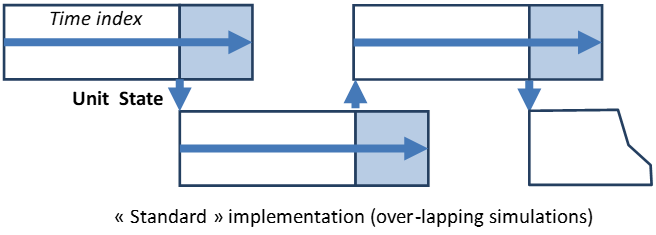
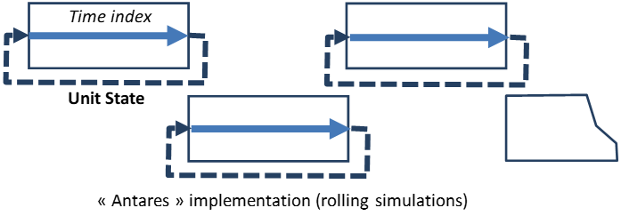

# Appendix 

[//]: # (TODO: the contents of this page may be dispatched in opther pages)

## Details on the "include-exportmps" parameter
[//]: # (TODO: specify where the MPS files are written)

This [parameter](04-parameters.md#include-exportmps) does not influence the way calculations are carried out, 
nor does it change their results.
The effect of this preference is that, if the parameter is activated, *Antares* will produce and store in the 
simulation output folder two files for every linear problem solved in the whole simulation.

- The first file ("problem" file) contains a standardized description of the mathematical problem solved by *Antares'* 
  built-in linear solver. The format standard used in this file is known as "MPS".
- The second file ("criterion" file) contains the value of the optimal (minimum) value found for the objective function 
  of the optimization problem (overall system cost throughout a day or a week).

All commercial as well as open-source linear solvers are able to process MPS files. As a consequence, tests aiming at 
comparing *Antares* solver with other commercial solutions can be easily carried out: all that has to be done is to 
submit the MPS problem to the solver at hand and measure its performances (calculation time, criterion value) 
with those of *Antares*.

Note that this kind of comparison brings no information regarding the quality of the physical modelling on which the 
simulation is based. It is useful, however, to gather evidence on mathematical grounds.

File names are structured as follows:
- When the optimization parameter [simplex-range](04-parameters.md#simplex-range) is set on `week`:  
  Problem-MC year-week number-date-time.mps  
  Criterion-MC year-week number-date-time.txt
- When the optimization parameter [simplex-range](04-parameters.md#simplex-range) is set on `day`:  
  Problem-MC year-week number-date-time-day number.mps  
  Criterion-MC year-week number-date-time-day number.txt

[//]: # (TODO: add link to "two successive optimization problems" doc)
Besides, each economic problem generally needs to be solved through two successive optimization problems. 
Files related to these two problems will bear almost the same name, the only difference being the "time" suffix. 
The files related to the second optimization (final *Antares* results) are those that bear the latest tag.

Finally, in some rare cases where the problems to solve are small and fast, the files attached to the two optimization 
rounds may begin to be printed within the same second. In these cases, an additional suffix is added before the mps or 
txt extension.

> _**Note:**_ The extra runtime and disk space resulting from the activation of the "mps" option may be quite significant. 
> This option should therefore be used only when a comparison of results with those of other solvers is actually intended.

## Details on the "include-unfeasible-problem-behavior" parameter

This [parameter](04-parameters.md#include-unfeasible-problem-behavior) can take one of the four values: 
`ERROR_DRY`, `ERROR_MPS`, `WARNING_DRY`, `WARNING_MPS`

If `ERROR_DRY` or `ERROR_MPS` is selected, the simulation will stop right after encountering the first mathematically 
unfeasible optimization (daily or weekly) problem. No output will be produced beyond this point. 
Should the dataset contain several unfeasible problems (i.e. regarding different weeks of different MC years), 
it is possible that successive runs of the same simulation stop at different points (if parallel computation is used, 
the triggering problem may differ from one run to the other).

If `WARNING_DRY` or `WARNING_MPS` is selected, the simulation will skip all mathematically unfeasible optimization 
(daily or weekly) problems encountered, fill out all results regarding these problems with zeroes and then resume the 
simulation. The hydro reservoir levels used for resuming the simulation are those reached at the end of the last successful week.

With `..._DRY` options, no specific data is printed regarding the faulty problem(s). 
With `..._MPS` options, the full expression of the faulty problem(s) is printed in the standard "MPS" format, 
thus allowing further analysis of the infeasibility issue.

## Details on the "initial-reservoir-levels" parameter (DEPRECATED since 9.2)

### version 9.2: The reservoir level is now always determined with cold start behavior.

This parameter can take the two values "cold start" or "hot start". [default: cold start]. Simulations results may in some circumstances be heavily impacted by this setting, hence proper attention should be paid to its meaning before considering changing the default value.

**General:**

This parameter is meant to define the initial reservoir levels that should be used, in each system area, when processing 
data related to the hydropower storage resources to consider in each specific Monte-Carlo year.

As a consequence, Areas which fall in either of the two following categories are not impacted by the value of the parameter:
- No hydro-storage capability installed
- Hydro-storage capability installed, but the "reservoir management" option is set to "False"

Areas that have some hydro-storage capability installed and for which explicit reservoir management is required are concerned by the parameter. The developments that follow concern only this category of Areas.

**Cold Start:**

On starting the simulation of a new Monte-Carlo year, the reservoir level to consider in each Area on the first day of 
the initialization month is randomly drawn between the extreme levels defined for the Area on that day.

More precisely:

- The value is drawn according to the probability distribution function of a "Beta" random variable, whose four internal parameters are set so as to adopt the following behavior:  
  Lower bound: Minimum reservoir level.  
  Upper bound: Maximum reservoir level  
  Expectation: Average reservoir level  
  Standard Deviation: (1/3) (Upper bound-Lower bound)

- The random number generator used for that purpose works with a dedicated seed that ensures that results can be reproduced
  [^17] from one run to another, regardless of the simulation runtime mode (sequential or parallel)
  and regardless of the number of Monte-Carlo years to be simulated [^18].

**Hot Start:**

On starting the simulation of a new Monte-Carlo year, the reservoir level to consider in each Area on the first day of the initialization month is set to the value reached at the end of the previous simulated year, if three conditions are met:

- The simulation calendar is defined throughout the whole year, and the simulation starts on the day chosen for initializing the reservoir levels of all Areas.

- The Monte-Carlo year considered is not the first to simulate, or does not belong to the first batch of years to be simulated in parallel. In sequential runtime mode, that means that year #N may start with the level reached at the end of year #(N-1). In parallel runtime mode, if the simulation is carried out with batches of B years over as many CPU cores, years of the k-th batch
  [^19] may start with the ending levels of the years processed in the (k-1)-th batch.

- The parallelization context (see [Multi-threading](optional-features/multi-threading.md)) must be set to ensure that the M Monte-Carlo years to simulate will be processed in a round number of K consecutive batches of B years in parallel (i.e. M = K\*B and all time-series refresh intervals are exact multiple of B).

The first year of the simulation, and more generally years belonging to the first simulation batch in parallel mode, are initialized as they would be in the cold start option.

**Note that:**

- _Depending on the hydro management options used, the amount of hydro-storage energy generated throughout the year may either match closely the overall amount of natural inflows of the same year, or differ to a lesser or greater extent. In the case of a close match, the ending reservoir level will be similar to the starting level. If the energy generated exceeds the inflows (either natural or pumped), the ending level will be lower than the starting level (and conversely, be higher if generation does not reach the inflow credit). Using the "hot start" option allows to take this phenomenon into account in a very realistic fashion, since the consequences of hydro decisions taken at any time have a decisive influence on the system's long term future._

- _When using the reservoir level "hot start" option, comparisons between different simulations make sense only if they rely on the exact same options, i.e. either sequential mode or parallel mode over the same number of CPU cores._

- _More generally, it has to be pointed out that the "hydro-storage" model implemented in Antares can be used to model "storable" resources quite different from actual hydro reserves: batteries, gas subterraneous stocks, etc._

## Details on the "hydro-heuristic-policy" parameter
[//]: # (TODO: update this paragraph)
_**This section is under construction**_

This parameter can take the two values "Accommodate rule curves" or "Maximize generation". [default: Accommodate rule curves].

**General:**

This parameter is meant to define how the reservoir level should be managed throughout the year, either with emphasis put on the respect of rule curves or on the maximization of the use of natural inflows.

**Accommodate rule curves:**

Upper and lower rule curves are accommodated in both monthly and daily heuristic stages (described page 58). In the second stage, violations of the lower rule curve are avoided as much as possible (penalty cost on $\Psi$. higher than penalty cost on Y).  This policy may result in a restriction of the overall yearly energy generated from the natural inflows.

**Maximize generation:**

Upper and lower rule curves are accommodated in both monthly and daily heuristic stages (described page 58). In the second stage, incomplete use of natural inflows is avoided as much as possible (penalty cost on Y higher than penalty cost on $\Psi$). This policy may result in violations of the lower rule curve.

## Details on the "hydro-pricing-mode" parameter
[//]: # (TODO: update this paragraph)
_**This section is under construction**_

This parameter can take the two values "fast" or "accurate". [default: fast].

Simulations carried out in "accurate" mode yield results that are theoretically optimal as far as the techno-economic modelling of hydro (or equivalent) energy reserves is concerned. It may, however, require noticeably longer computation time than the simpler "fast" mode.

Simulations carried out in "fast" mode are less demanding in computer resources. From a qualitative standpoint, they are expected to lead to somewhat more intensive (less cautious) use of stored energy.

**General:**

This parameter is meant to define how the reservoir level difference between the beginning and the end of an optimization week should be reflected in the hydro economic signal (water value) used in the computation of optimal hourly generated /pumped power during this week.

**Fast:**

The water value is taken to remain about the same throughout the week, and a constant value equal to that found at the date and for the level at which the week_ **begins** _is used in the course of the optimization. A value interpolated from the reference table for the exact level reached at each time step within the week is used ex-post in the assessment of the variable "H.COST" (positive for generation, negative for pumping) defined in [Output Files](03-outputs.md). This option should be reserved to simulations in which computation resources are an issue or to simulations in which level-dependent water value variations throughout a week are known to be small.

**Accurate:**

The water value is considered as variable throughout the week. As a consequence, a different cost is used for each "layer" of the stock from/to which energy can be withdrawn/injected, in an internal hydro merit-order involving the 100 tabulated water-values found at the date at which the week **ends**. A value interpolated from the reference table for the exact level reached at each time step within the week is used ex-post in the assessment of the variable "H.COST" (positive for generation, negative for pumping) defined in [Output Files](03-outputs.md). This option should be used if computation resources are not an issue and if level-dependent water value variations throughout a week must be accounted for.

## Details on the "unit-commitment-mode" parameter
[//]: # (TODO: update this paragraph)
_**This section is under construction**_

This parameter can take the two values "fast" or "accurate". [default: fast].

Simulations carried out in "accurate" mode yield results that are expected to be close to the theoretical optimum as far as the techno-economic modelling of thermal units is concerned. They may, however, require much longer computation time than the simpler "fast" mode.

Simulations carried out in "fast" mode are less demanding in computer resources. From a qualitative standpoint, they are expected to lead to a more costly use of thermal energy. This potential bias is partly due to the fact that in this mode, start-up costs do not participate as such to the optimization process but are simply added ex post.

**General:**

In its native form [^20], the weekly optimization problem belongs to the MILP (Mixed Integer Linear Program) class. The Integer variables reflect, for each time step, the operational status (running or not) of each thermal unit. Besides, the amount of power generated from each unit can be described as a so-called semi-continuous variable (its value is either 0 or some point within the interval [Pmin , Pmax]). Finally, the periods during which each unit is either generating or not cannot be shorter than minimal (on- and off-) thresholds depending on its technology.

The Unit Commitment mode parameter defines two different ways to address the issue of the mathematical resolution of this problem. In both cases, two successive so-called "relaxed" LP global optimizations are carried out. In-between those two LPs, a number of local IP (unit commitment of each thermal cluster) are carried out.

Besides, dynamic thermal constraints (minimum on- and off- time durations) are formulated on time-indices rolling over the week; this simplification brings the ability to run a simulation over a short period of time, such as one single week extracted from a whole year, while avoiding the downside (data management complexity, increased runtime) of a standard implementation based on longer simulations tiled over each other (illustration below).

**Fast:**

In the first optimization stage, integrity constraints are removed from the problem and replaced by simpler continuous constraints.

For each thermal cluster, the intermediate IP looks simply for an efficient unit-commitment compatible with the operational status obtained in the first stage, with the additional condition (more stringent than what is actually required) that on- and off- periods should be exact multiple of the higher of the two thresholds specified in the dataset.

In the second optimization stage, the unit commitment set by the intermediate IPs is considered as a context to use in a new comprehensive optimal hydro-thermal schedule assessment. The amount of day-ahead (spinning) reserve, if any, is added to the demand considered in the first stage and subtracted in the second stage. Start-up costs as well as No-Load Heat costs are assessed in accordance with the unit-commitment determined in the first stage and are added ex post.

**Accurate:**

In the first optimization stage, integrity constraints are properly relaxed. Integer variables describing the start-up process of each unit are given relevant start-up costs, and variables attached to running units are given No-Load Heat costs (if any), regardless of their generation output level. Fuel costs / Market bids are attached to variables representing the generation output levels.

For each thermal cluster, the intermediate IP looks for a unit-commitment compatible with the integrity constraints in the immediate neighborhood of the relaxed solution obtained in the first stage. In this process, the dynamic thresholds (min on-time, min off-time) are set to their exact values, without any additional constraint.

In the second optimization stage, the unit commitment set by the intermediate IP is considered as a context to use in a new comprehensive optimal hydro-thermal schedule assessment. The amount of day-ahead (spinning) reserve, if any, is added to the demand considered in the first stage and subtracted in the second stage.

## Details on the "renewable-generation-modelling" parameter
[//]: # (TODO: update this paragraph)
_**This section is under construction**_

This parameter can take the two values “aggregated” or “cluster”. For a new study, it will default to cluster. For a legacy (Antares version <8.1.0) study it will default to aggregated.

If the parameter is set to “aggregated”, the user will have access to the Wind & Solar windows, but not the Renewable window. When the parameter is set to “cluster”, the Renewable window will be available, but not the Wind nor the Solar windows. The data stored in the windows that are not available will always be conserved. However, only Renewable data (and not the wind and solar data) will be considered for the calculations when the parameter is set to “cluster”. And only the wind and solar data (and not the renewable data) will be considered for the calculations when the parameter is set to “aggregated”.

The Renewable window can be filled out with the different renewable clusters inside each node. Each renewable cluster needs to have a group specified or will default to the «Other RES 1» group. Production Timeseries can be filled out much like the Thermal production ones. Note that unlike thermal clusters, negative production values are allowed. The Renewable window is described in more details in the “4. Active Windows” section. In the Simulation window, only “Ready-made” timeseries can be selected for renewables for now. This should be modified in a future release. The MC scenario builder for Renewables works the same way as for Thermal Clusters.

[^17]: As long as the System's list of Areas does not change

[^18]:E.g. : if three playlists A,B,C are defined over 1000 years (A: years 1 to 1000, B: years 1 to 100, C: Years 13,42,57,112), initial reservoir levels in each Area are identical in the playlists' intersection (years 13,42,57)

[^19]: If the playlist is full, these years have numbers # (k-1)B+1 ,…., #kB

[^20]: Described in the note "Optimization Problems Formulation" 

