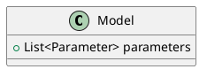

# Optimization model

_**This section is under construction**_

The new Antares optimization model is all about giving the user the power to define the mathematical model of every
physical element in the system. Elements of this model are described in this section.

## Models

A model defines the behavior of an element in the simulated system. Several elements can have the same behavior, and
therefore the same model.
For example, a "FlexibleLoad" model can define the behavior of a flexible demand.

The basic attributes of a model are:

- a list of parameters: these are the input data required by the model.  
  For example: the nominal power of the groups in a thermal cluster, the value of a load, etc.  
  A parameter can be time-step-dependent or not, and scenario-dependent or not.
- a list of potentially bounded variables: these are the quantities whose values the simulation will have to define.
  For example: the power produced by a thermal cluster, or the level of a stock.
- a list of constraints: these are equations that link parameters and model variables.
  For example, for a battery, we might have an equation of the following type:  
  level[t] - level[t-1] - efficiency * injection + withdrawal = inflows
- a contribution to system cost, defined on the basis of model parameters and variables.  
  For example, for a thermal cluster, the contribution might look like this:  
  time_sum(cost * generation)

