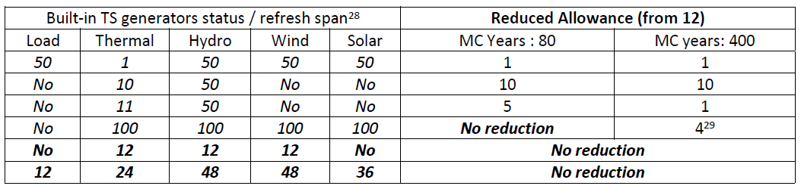

---
hide:
 - toc
---

# Multi-threading

[//]: # (TODO: update this page if needed)
_**This section is under construction**_

Multi-threading is also available on the proper calculation side, on a user-defined basis.

Provided that hardware resources are large enough, this mode may reduce significantly the overall runtime of heavy simulations.

To benefit from multi-threading, the simulation must be run in the following context:

- The [parallel](../08-command-line.md#simulation) option must be enabled (it is disabled by default)
- The simulation [mode](../04-parameters.md#mode) must be either `Adequacy` or `Economy`

When the "parallel" solver option is used, each Monte-Carlo year is dispatched in an individual process on the available CPU cores.
The number of such individual processes depends on the characteristics of the local hardware and on the value given to
the study-dependent [number-of-cores-mode](../04-parameters.md#number-of-cores-mode) advanced parameter.
This parameter can take five different values (Minimum, Low, Medium, High, Maximum).
The number of independent processes resulting from the combination (local hardware + study settings) is given in the
following table, which shows the CPU allowances granted in the different configurations.

| _Minimum_ |   _Low_   | _Medium_  |   _High_   | _Maximum_ |
|:---------:|:---------:|:---------:|:----------:|:---------:|
|     1     | Ceil(S/4) | Ceil(S/2) | Ceil(3S/4) |     S     |

**Note**: The number of independent threads actually launched by Antares in parallel mode may appear smaller than that shown in the table above. In this case, the resources monitor menu and the dashboard displayed on starting the simulation indicates:

simulation cores: **nn** reduced to **pp**

**nn** is the regular allowance and **pp** is the practical value that the solver has to work with. Allowance reduction may occur if the built-in Time-Series generators are activated, their "refresh" status is set to "Yes" and the values given to the "refresh span" parameters are not appropriate (parallel execution demand that refresh operations do not take place within a bundle of parallel years). Optimal use of the "parallel" execution mode is obtained when all activated built-in time –series generators are set up in either of the two following ways:
- Refresh status : **No**
- Refresh status : **Yes**, refresh span = **Ki \* (CPU allowance)** , with **Ki &gt;= 1**

Examples of reduction from an initial allowance of 12 cores are given hereafter. The reduced allowance is the size of the **smallest** bundle of parallel years between two consecutive "refresh" (it indicates the slowest point of the simulation [^23]). Note that RAM requirements displayed in the resources monitor are, contrariwise, assessed on the basis on the **largest** bundle of parallel years encountered in the simulation).

The Table indicates either the refresh status (No) or the refresh span (the associated refresh status "yes" is implicit).

## Formula for CPU cores

Starting from 9.2 we changed the formula for the number of cores to simplify. Here's the old values and the new ones.

### Starting from 9.2

-| _Available CPU Cores_ | _Minimum_ |   _Low_   | _Medium_  |   _High_   | _Maximum_ |
-|:---------------------:|:---------:|:---------:|:---------:|:----------:|:---------:|
-|          _1_          |     1     |     1     |     1     |     1      |     1     |
-|          _2_          |     1     |     1     |     1     |     2      |     2     |
-|          _3_          |     1     |     1     |     2     |     3      |     3     |
-|          _4_          |     1     |     1     |     2     |     3      |     4     |
-|          _5_          |     1     |     2     |     3     |     4      |     5     |
-|          _6_          |     1     |     2     |     3     |     5      |     6     |
-|          _7_          |     1     |     2     |     4     |     6      |     7     |
-|          _8_          |     1     |     2     |     4     |     6      |     8     |
-|          _9_          |     1     |     3     |     5     |     7      |     9     |
-|         _10_          |     1     |     3     |     5     |     8      |    10     |
-|         _11_          |     1     |     3     |     6     |     9      |    11     |
-|         _12_          |     1     |     3     |     6     |     9      |    12     |
-|      _S &gt; 12_      |     1     | Ceil(S/4) | Ceil(S/2) | Ceil(3S/4) |     S     |

### Before 9.2

-| _Available CPU Cores_ | _Minimum_ |   _Low_   | _Medium_  |   _High_   | _Maximum_ |
-|:---------------------:|:---------:|:---------:|:---------:|:----------:|:---------:|
-|          _1_          |     1     |     1     |     1     |     1      |     1     |
-|          _2_          |     1     |     1     |     1     |     2      |     2     |
-|          _3_          |     1     |     2     |     2     |     2      |     3     |
-|          _4_          |     1     |     2     |     2     |     3      |     4     |
-|          _5_          |     1     |     2     |     3     |     4      |     5     |
-|          _6_          |     1     |     2     |     3     |     4      |     6     |
-|          _7_          |     1     |     2     |     3     |     5      |     7     |
-|          _8_          |     1     |     2     |     4     |     6      |     8     |
-|          _9_          |     1     |     3     |     5     |     7      |     8     |
-|         _10_          |     1     |     3     |     5     |     8      |     9     |
-|         _11_          |     1     |     3     |     6     |     8      |    10     |
-|         _12_          |     1     |     3     |     6     |     9      |    11     |
-|      _S &gt; 12_      |     1     | Ceil(S/4) | Ceil(S/2) | Ceil(3S/4) |    S-1    |

[^23]: When the number of MC years to run is smaller than the allowance, the parallel run includes all of these years in a single bundle and there is no "reduced allowance" message

[^24]:
The smallest bundle in this case is the ninth (year number 97 to year number 100).The first 8 bundles involve 12 MC years each.
